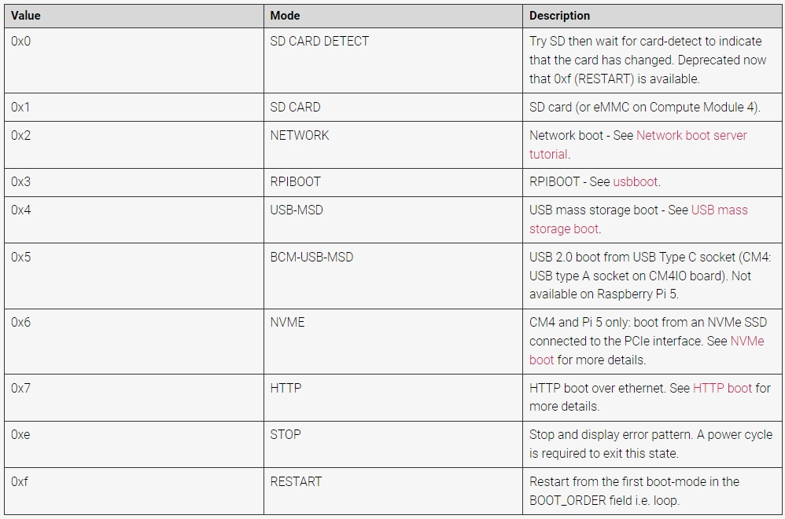

.. note::

    Hallo und willkommen in der SunFounder Raspberry Pi & Arduino & ESP32 Enthusiasten-Gemeinschaft auf Facebook! Tauchen Sie tiefer ein in die Welt von Raspberry Pi, Arduino und ESP32 mit anderen Enthusiasten.

    **Warum beitreten?**

    - **Expertenunterstützung**: Lösen Sie Nachverkaufsprobleme und technische Herausforderungen mit Hilfe unserer Gemeinschaft und unseres Teams.
    - **Lernen & Teilen**: Tauschen Sie Tipps und Anleitungen aus, um Ihre Fähigkeiten zu verbessern.
    - **Exklusive Vorschauen**: Erhalten Sie frühzeitigen Zugang zu neuen Produktankündigungen und exklusiven Einblicken.
    - **Spezialrabatte**: Genießen Sie exklusive Rabatte auf unsere neuesten Produkte.
    - **Festliche Aktionen und Gewinnspiele**: Nehmen Sie an Gewinnspielen und Feiertagsaktionen teil.

    👉 Sind Sie bereit, mit uns zu erkunden und zu erschaffen? Klicken Sie auf [|link_sf_facebook|] und treten Sie heute bei!

.. _boot_from_ssd:

Booten von NVMe SSD
=============================

1. PCIe aktivieren
-----------------------

Standardmäßig ist der PCIe-Anschluss nicht aktiviert.

* Um ihn zu aktivieren, öffnen Sie die Datei ``/boot/firmware/config.txt``.

  .. code-block:: shell
  
    sudo nano /boot/firmware/config.txt
  
* Fügen Sie dann die folgende Zeile in die Datei ein.

  .. code-block:: shell
  
    # Enable the PCIe External connector.
    dtparam=pciex1
  
* Es gibt einen einprägsameren Alias für ``pciex1``, daher können Sie alternativ ``dtparam=nvme`` in die Datei ``/boot/firmware/config.txt`` einfügen.

  .. code-block:: shell
  
    dtparam=nvme

* Die Verbindung ist für Gen 2.0-Geschwindigkeiten (5 GT/sec) zertifiziert, aber Sie können sie auf Gen 3.0 (10 GT/sec) erzwingen, indem Sie die folgenden Zeilen in Ihre Datei ``/boot/firmware/config.txt`` einfügen.

  .. code-block:: shell
  
    # Force Gen 3.0 speeds
    dtparam=pciex1_gen=3
  
  .. warning::
  
    Der Raspberry Pi 5 ist nicht für Gen 3.0-Geschwindigkeiten zertifiziert, und Verbindungen zu PCIe-Geräten bei diesen Geschwindigkeiten können instabil sein.

* Drücken Sie ``Ctrl + X``, ``Y`` und ``Enter``, um die Änderungen zu speichern.

2. Installieren Sie das Betriebssystem auf der SSD
-----------------------------------------------------------

Es gibt zwei Möglichkeiten, ein Betriebssystem auf der SSD zu installieren:

**Kopieren des Systems von der Micro-SD-Karte auf die SSD**

#. Schließen Sie ein Display an oder greifen Sie über VNC Viewer auf den Desktop des Raspberry Pi zu. Klicken Sie dann auf **Raspberry Pi Logo** -> **Zubehör** -> **SD-Kartenkopierer**.

    .. image:: img/ssd_copy.png
        :align: center
    
#. Stellen Sie sicher, dass Sie die richtigen Geräte für **Kopieren von** und **Kopieren nach** auswählen. Achten Sie darauf, sie nicht zu verwechseln.

    .. image:: img/ssd_copy_from.png
        :align: center
    
#. Nach der Auswahl klicken Sie auf **Start**.

    .. image:: img/ssd_copy_start.png
        :align: center
    
#. Sie werden darauf hingewiesen, dass der Inhalt auf der SSD gelöscht wird. Stellen Sie sicher, dass Sie Ihre Daten sichern, bevor Sie auf Ja klicken.

    .. image:: img/ssd_copy_erase.png
        :align: center
    
#. Warten Sie eine Weile, und der Kopiervorgang wird abgeschlossen.

**Installieren des Systems mit Raspberry Pi Imager**

Wenn Ihre Micro-SD-Karte eine Desktop-Version des Systems installiert hat, können Sie ein Imaging-Tool (wie Raspberry Pi Imager) verwenden, um das System auf die SSD zu brennen. Dieses Beispiel verwendet Raspberry Pi OS Bookworm, aber andere Systeme erfordern möglicherweise die vorherige Installation des Imaging-Tools.

#. Schließen Sie ein Display an oder greifen Sie über VNC Viewer auf den Desktop des Raspberry Pi zu. Klicken Sie dann auf **Raspberry Pi Logo** -> **Zubehör** -> **Imager**.

    .. image:: img/ssd_imager.png
        :align: center
    
#. Klicken Sie im Imager auf **Raspberry Pi Gerät** und wählen Sie das Modell **Raspberry Pi 5** aus der Dropdown-Liste aus.

    .. image:: img/ssd_pi5.png
        :align: center
    
#. Wählen Sie **Betriebssystem** und entscheiden Sie sich für die empfohlene Betriebssystemversion.

    .. image:: img/ssd_os.png
        :align: center
    
#. Wählen Sie in der Option **Speicher** Ihre eingelegte NVMe SSD aus.

    .. image:: img/nvme_storage.png
        :align: center
    
#. Klicken Sie auf **NEXT** und dann auf **EINSTELLUNGEN BEARBEITEN**, um Ihre Betriebssystemeinstellungen anzupassen.

    .. note::

        Wenn Sie einen Monitor für Ihren Raspberry Pi haben, können Sie die nächsten Schritte überspringen und auf 'Ja' klicken, um die Installation zu starten. Passen Sie andere Einstellungen später am Monitor an.

    .. image:: img/os_enter_setting.png
        :align: center

#. Definieren Sie einen **Hostname** für Ihren Raspberry Pi.

    .. note::

        Der Hostname ist der Netzwerkbezeichner Ihres Raspberry Pi. Sie können auf Ihren Pi über ``<hostname>.local`` oder ``<hostname>.lan`` zugreifen.

    .. image:: img/os_set_hostname.png
        :align: center

#. Erstellen Sie einen **Benutzernamen** und ein **Passwort** für das Administratorkonto des Raspberry Pi.

    .. note::

        Die Einrichtung eines eindeutigen Benutzernamens und Passworts ist wichtig, um Ihren Raspberry Pi zu sichern, der kein Standardpasswort hat.

    .. image:: img/os_set_username.png
        :align: center

#. Konfigurieren Sie das drahtlose LAN, indem Sie die **SSID** und das **Passwort** Ihres Netzwerks angeben.

    .. note::

        Stellen Sie das ``Wireless LAN country`` auf den zweistelligen `ISO/IEC alpha2 code <https://en.wikipedia.org/wiki/ISO_3166-1_alpha-2#Officially_assigned_code_elements>`_ ein, der Ihrem Standort entspricht.

    .. image:: img/os_set_wifi.png
        :align: center

#. Um remote auf Ihren Raspberry Pi zuzugreifen, **aktivieren Sie SSH** im Tab **Dienste**.

    * Für **Passwort-Authentifizierung** verwenden Sie den Benutzernamen und das Passwort aus dem Tab **Allgemein**.
    * Für die Authentifizierung mit öffentlichem Schlüssel wählen Sie "Nur öffentliche Schlüssel-Authentifizierung zulassen". Wenn Sie einen RSA-Schlüssel haben, wird dieser verwendet. Wenn nicht, klicken Sie auf "SSH-keygen ausführen", um ein neues Schlüsselpaar zu generieren.

    .. image:: img/os_enable_ssh.png
        :align: center

#. Das Menü **Optionen** ermöglicht die Konfiguration des Verhaltens des Imagers während des Schreibens, einschließlich Abspielen von Sounds bei Fertigstellung, Auswerfen von Medien bei Fertigstellung und Aktivierung der Telemetrie.

    .. image:: img/os_options.png
        :align: center

#. Wenn Sie mit der Eingabe der Betriebssystemanpassungseinstellungen fertig sind, klicken Sie auf **Speichern**, um Ihre Anpassungen zu speichern. Klicken Sie dann auf **Ja**, um sie beim Schreiben des Images anzuwenden.

    .. image:: img/os_click_yes.png
        :align: center

#. Wenn die NVMe SSD vorhandene Daten enthält, stellen Sie sicher, dass Sie sie sichern, um Datenverlust zu vermeiden. Fahren Sie fort, indem Sie auf **Ja** klicken, wenn keine Sicherung erforderlich ist.

    .. image:: img/nvme_erase.png
        :align: center

#. Wenn Sie das Popup "Schreiben erfolgreich" sehen, wurde Ihr Image vollständig geschrieben und verifiziert. Sie sind nun bereit, einen Raspberry Pi von der NVMe SSD zu booten!

    .. image:: img/nvme_install_finish.png
        :align: center

.. _configure_boot_ssd:

3. Konfigurieren Sie das Booten von der SSD
-------------------------------------------------

* Um die Firmware Ihres Raspberry Pi auf die neueste Version zu aktualisieren, verwenden Sie ``rpi-update``.

.. code-block:: shell

    sudo rpi-update

* Um die Boot-Unterstützung zu aktivieren, müssen Sie die ``BOOT_ORDER`` in der Bootloader-Konfiguration ändern. Bearbeiten Sie die EEPROM-Konfiguration durch:

.. code-block::
  
    sudo rpi-eeprom-config --edit
  
* Ändern Sie dann die Zeile ``BOOT_ORDER`` wie unten angegeben. ``0xf416``: Versuchen Sie zuerst NVMe SSD, gefolgt von SD-Karte und dann USB.

.. code-block:: shell
  
    BOOT_ORDER=0xf416

.. note::
    Ändern Sie nur die Reihenfolge, in der der Raspberry Pi startet, aber entfernen Sie keine anderen Startmöglichkeiten. Dies hilft sicherzustellen, dass er immer richtig startet.

* Die Einstellung ``BOOT_ORDER`` ermöglicht eine flexible Konfiguration der Priorität der verschiedenen Boot-Modi. Es wird als 32-Bit-unsigned Integer dargestellt, wobei jede Nibble einen Boot-Modus repräsentiert. Die Boot-Modi werden in der Reihenfolge von niedrigstem zu höchstem signifikanten Nibble versucht.
* Die Eigenschaft ``BOOT_ORDER`` definiert die Reihenfolge für die verschiedenen Boot-Modi. Sie wird von rechts nach links gelesen, und es können bis zu acht Ziffern definiert werden.

* ``0xf41``: Versuchen Sie zuerst SD, gefolgt von USB-MSD und dann wiederholen (Standard, wenn ``BOOT_ORDER`` leer ist)
* ``0xf14``: Versuchen Sie zuerst USB, gefolgt von SD und dann wiederholen

* Sobald das Update abgeschlossen ist, starten Sie Ihren Raspberry Pi neu, damit diese Änderungen wirksam werden.

.. code-block:: shell

    sudo reboot
