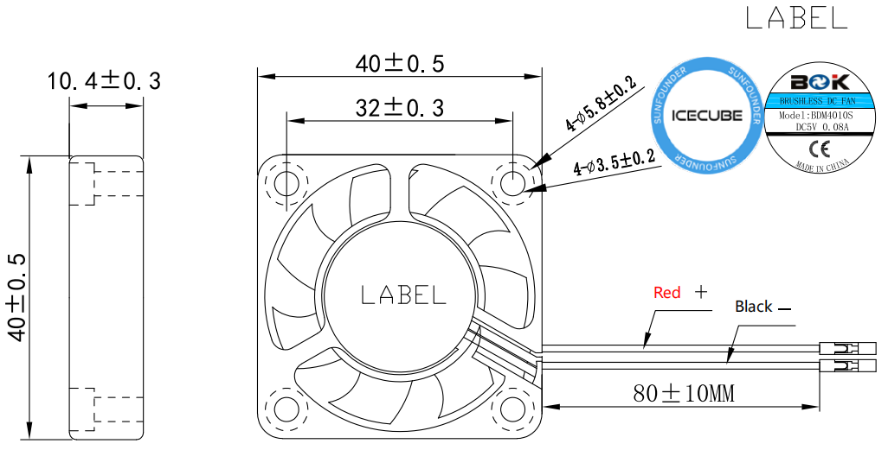

.. note::

    こんにちは、SunFounderのRaspberry Pi & Arduino & ESP32愛好家コミュニティへようこそ！Facebook上でRaspberry Pi、Arduino、ESP32についてもっと深く掘り下げ、他の愛好家と交流しましょう。

    **参加する理由は？**

    - **エキスパートサポート**：コミュニティやチームの助けを借りて、販売後の問題や技術的な課題を解決します。
    - **学び＆共有**：ヒントやチュートリアルを交換してスキルを向上させましょう。
    - **独占的なプレビュー**：新製品の発表や先行プレビューに早期アクセスしましょう。
    - **特別割引**：最新製品の独占割引をお楽しみください。
    - **祭りのプロモーションとギフト**：ギフトや祝日のプロモーションに参加しましょう。

    👉 私たちと一緒に探索し、創造する準備はできていますか？[|link_sf_facebook|]をクリックして今すぐ参加しましょう！

ファン
============

PWMファン
-----------

Pironman 5に搭載されているPWMファンは、Raspberry Piシステムによって制御されます。

Raspberry Pi 5の冷却ソリューションについては、特に高負荷時の冷却を目的として、Pironman 5はスマートな冷却システムを採用しています。主要なPWMファンと2つの補助RGBファンが特徴です。この冷却戦略は、Raspberry Pi 5の熱管理システムと密接に統合されています。

PWMファンの動作はRaspberry Pi 5の温度に基づいています：

* 50°C未満では、PWMファンはオフ状態（0％の速度）です。
* 50°Cに達すると、ファンは低速（30％の速度）で始動します。
* 60°Cに達すると、ファンは中速（50％の速度）に増速します。
* 67.5°Cになると、ファンは高速（70％の速度）に増速します。
* 75°C以上では、ファンは全速（100％の速度）で動作します。

この温度と速度の関係は、温度が下がる際にも適用され、5°Cのヒステリシスがあります。温度が各閾値よりも5°C低下するとファンの速度が下がります。

* PWMファンの状態を確認するコマンド：

  .. code-block:: shell
  
    cat /sys/class/thermal/cooling_device0/cur_state

* PWMファンの速度を表示するには：

  .. code-block:: shell

    cat /sys/devices/platform/cooling_fan/hwmon/*/fan1_input

 Pironman 5 では、PWMファンは特に集中的なタスクを実行中に最適な運用温度を維持するための重要なコンポーネントであり、Raspberry Pi 5が効率的かつ信頼性高く動作することを保証します。

RGBファン
-------------------

* **外形寸法**: 40*40*10MM
* **重量**: 13.5±5g/個
* **寿命**: 40,000時間（室温25°C）
* **最大風量**: 2.46CFM
* **最大風圧**: 0.62mm-H2O
* **音響音量**: 22.31dBA
* **定格入力電力**: 5V/0.1A
* **定格速度**: 3500±10%RPM
* **使用温度範囲**: -10℃～+70℃
* **保管温度範囲**: -30℃～+85℃

