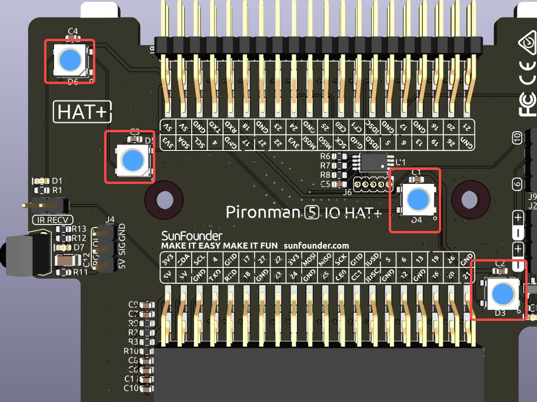
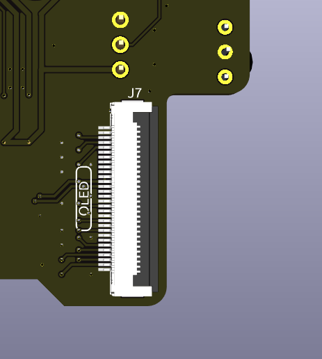
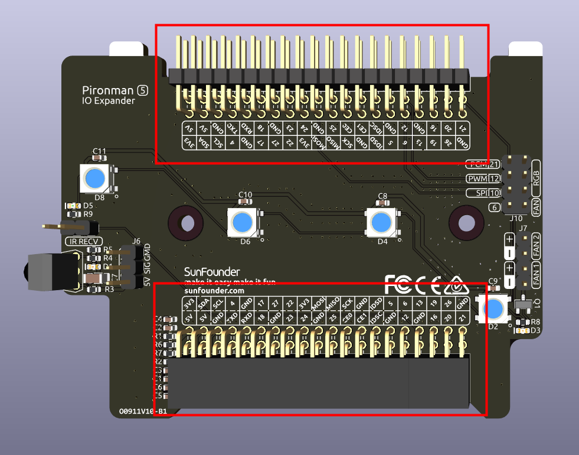

.. note::

    Hallo und willkommen in der SunFounder Raspberry Pi & Arduino & ESP32 Enthusiasten-Community auf Facebook! Tauchen Sie tiefer in Raspberry Pi, Arduino und ESP32 zusammen mit anderen Enthusiasten ein.

    **Warum mitmachen?**

    - **Fachkundige Unterstützung**: Lösen Sie nach dem Kauf auftretende Probleme und technische Herausforderungen mit Hilfe unserer Community und unseres Teams.
    - **Lernen & Teilen**: Tauschen Sie Tipps und Tutorials aus, um Ihre Fähigkeiten zu verbessern.
    - **Exklusive Vorschauen**: Erhalten Sie frühzeitigen Zugang zu neuen Produktankündigungen und Vorschauen.
    - **Sonderrabatte**: Genießen Sie exklusive Rabatte auf unsere neuesten Produkte.
    - **Festliche Aktionen und Verlosungen**: Nehmen Sie an Verlosungen und Feiertagsaktionen teil.

    👉 Bereit, mit uns zu entdecken und zu erschaffen? Klicken Sie auf [|link_sf_facebook|] und treten Sie noch heute bei!

IO-Expander
================

RGB-LEDs
------------

Das Board verfügt über 4 WS2812 RGB-LEDs, die individuell steuerbar sind. Benutzer können sie ein- oder ausschalten, die Farbe ändern, die Helligkeit anpassen, Anzeige-Modi wechseln und die Geschwindigkeit der Übergänge festlegen.

* Um den Ein- oder Ausschaltzustand der RGB-LEDs zu ändern, verwenden Sie ``true``, um die RGB-LEDs einzuschalten, und ``false``, um sie auszuschalten.

.. code-block:: shell

  pironman5 -re true

* Um die Farbe zu ändern, geben Sie den gewünschten Hexadezimal-Farbwert ein, z. B. ``fe1a1a``.

.. code-block:: shell

  pironman5 -rc fe1a1a

* Um die Helligkeit der RGB-LED zu ändern (Bereich: 0 ~ 100%):

.. code-block:: shell

  pironman5 -rb 100

* Um den Anzeigemodus der RGB-LED zu ändern, wählen Sie eine der Optionen: ``solid/breathing/flow/flow_reverse/rainbow/rainbow_reverse/hue_cycle``:

.. note::

  Wenn Sie den RGB-LED-Anzeigemodus auf ``rainbow``, ``rainbow_reverse`` oder ``hue_cycle`` einstellen, können Sie die Farbe nicht mit ``pironman5 -rc`` ändern.

.. code-block:: shell

  pironman5 -rs breathing

* Um die Geschwindigkeit der Übergänge anzupassen (Bereich: 0 ~ 100%):

.. code-block:: shell

  pironman5 -rp 80

RGB-Steuerungs-Pin
-------------------------

Die RGB-LED wird über SPI gesteuert und ist mit **GPIO10** verbunden, das auch der SPI-MOSI-Pin ist. Die beiden Pins oberhalb von J9 werden verwendet, um die RGB-LED an GPIO10 anzuschließen. Falls nicht benötigt, kann der Jumper entfernt werden.

  .. image:: img/io_board_rgb_pin.png

RGB-AUS-Pins
-------------------------

.. image:: img/io_board_rgb_out.png

Die WS2812 RGB-LEDs unterstützen serielle Verbindungen, wodurch ein externer RGB-LED-Streifen angeschlossen werden kann. Verbinden Sie den **SIG**-Pin mit dem **DIN**-Pin des externen Streifens für die Erweiterung.

Das Standard-Setup umfasst 4 RGB-LEDs. Schließen Sie zusätzliche LEDs an und aktualisieren Sie die Anzahl mit:

.. code-block:: shell

  pironman5 -rl 12

OLED-Bildschirmanschluss
----------------------------

Der OLED-Bildschirmanschluss, mit einer Adresse von 0x3C, ist eine wichtige Funktion.

Wenn der OLED-Bildschirm nichts anzeigt oder falsch anzeigt, können Sie diese Schritte zur Fehlerbehebung durchführen:

Überprüfen Sie, ob das FPC-Kabel des OLED-Bildschirms richtig angeschlossen ist.

#. Verwenden Sie den folgenden Befehl, um die Ausführungsprotokolle des Programms anzuzeigen und nach Fehlermeldungen zu suchen.

    .. code-block:: shell

        cat /opt/pironman5/log

#. Alternativ können Sie den folgenden Befehl verwenden, um zu überprüfen, ob die i2c-Adresse 0x3C des OLED erkannt wird:
    
    .. code-block:: shell
        
        sudo i2cdetect -y 1

#. Wenn die ersten beiden Schritte keine Probleme aufzeigen, versuchen Sie, den pironman5-Dienst neu zu starten, um zu sehen, ob das Problem dadurch behoben wird.

    .. code-block:: shell

        sudo systemctl restart pironman5.service

Infrarot-Empfänger
---------------------------

.. image:: img/io_board_receiver.png

* **Modell**: IRM-56384, arbeitet mit 38KHz.
* **Verbindung**: Der IR-Empfänger ist mit **GPIO13** verbunden.
* **D1**: Ein Infrarot-Empfangs-Indikator, der bei Signalerkennung blinkt.
* **J8**: Ein Pin zur Aktivierung der Infrarotfunktion. Standardmäßig ist eine Jumperkappe eingesetzt, um die Funktion sofort zu ermöglichen. Entfernen Sie die Kappe, um GPIO13 freizugeben, wenn der IR-Empfänger nicht verwendet wird.

Um den IR-Empfänger zu nutzen, überprüfen Sie die Verbindung und installieren Sie das erforderliche Modul:

* Überprüfen Sie die Verbindung:

  .. code-block:: shell

    sudo ls /dev |grep lirc

* Installieren Sie das Modul ``lirc``:

  .. code-block:: shell

    sudo apt-get install lirc -y

* Testen Sie nun den IR-Empfänger, indem Sie den folgenden Befehl ausführen.

  .. code-block:: shell

    mode2 -d /dev/lirc0

* Nachdem Sie den Befehl ausgeführt haben, drücken Sie eine Taste auf der Fernbedienung, und der Code dieser Taste wird angezeigt.

RGB-Lüfter-Pins
------------------

Das IO-Erweiterungsboard unterstützt bis zu zwei 5V-Lüfter ohne PWM-Steuerung. Beide Lüfter werden gemeinsam gesteuert.

**FAN1** und **FAN 2** sind zwei Lüfter-Pinsets. Sie müssen das rote Kabel des Lüfters mit "+" und das schwarze Kabel mit "-" verbinden.

.. image:: img/io_board_fan.png

Die beiden Pins unterhalb von J9 sind die Aktivierungspins für die RGB-Lüfter. Standardmäßig ist ein Jumper auf diesen Pins eingesetzt, der die Steuerung des Lüfterzustands über GPIO6 ermöglicht. Wenn der Lüfterbetrieb nicht gewünscht ist, kann der Jumper entfernt werden, um GPIO6 freizugeben.

.. image:: img/io_board_fan_j9.png

**D2** ist ein Lüfter-Signalanzeiger, der leuchtet, wenn der Lüfter aktiv ist.

.. image:: img/io_board_fan_d2.png

Sie können einen Befehl verwenden, um den Betriebsmodus der beiden RGB-Lüfter zu konfigurieren. Diese Modi bestimmen, unter welchen Bedingungen die RGB-Lüfter aktiviert werden.

Zum Beispiel werden im Modus **1: Leistung** die RGB-Lüfter bei 50°C aktiviert.

.. code-block:: shell

  pironman5 -gm 3

* **4: Leise**: Die RGB-Lüfter werden bei 70°C aktiviert.
* **3: Ausgewogen**: Die RGB-Lüfter werden bei 67,5°C aktiviert.
* **2: Kühl**: Die RGB-Lüfter werden bei 60°C aktiviert.
* **1: Leistung**: Die RGB-Lüfter werden bei 50°C aktiviert.
* **0: Immer an**: Die RGB-Lüfter sind immer eingeschaltet.

Wenn Sie den Steuerungs-Pin des RGB-Lüfters mit anderen Pins des Raspberry Pi verbinden, können Sie den folgenden Befehl verwenden, um die Pinnummer zu ändern.

.. code-block:: shell

  sudo pironman5 -gp 18

Pin-Header
--------------

Zwei rechtwinklige Header-Anschlüsse erweitern die GPIO des Raspberry Pi, jedoch beachten Sie, dass der IR-Empfänger, die RGB-LED und der Lüfter einige Pins belegen. Entfernen Sie die entsprechenden Jumper-Kappen, um diese Pins für andere Funktionen zu nutzen.

.. list-table:: 
  :widths: 25 25
  :header-rows: 1

  * - Pironman 5
    - Raspberry Pi 5
  * - IR-Empfänger(Optional)
    - GPIO13
  * - OLED SDA
    - SDA
  * - OLED SCL
    - SCL
  * - Lüfter(Optional)
    - GPIO6
  * - RGB(Optional)
    - GPIO10
  * - RGB(Optional)
    - GPIO12
  * - RGB(Optional)
    - GPIO21
