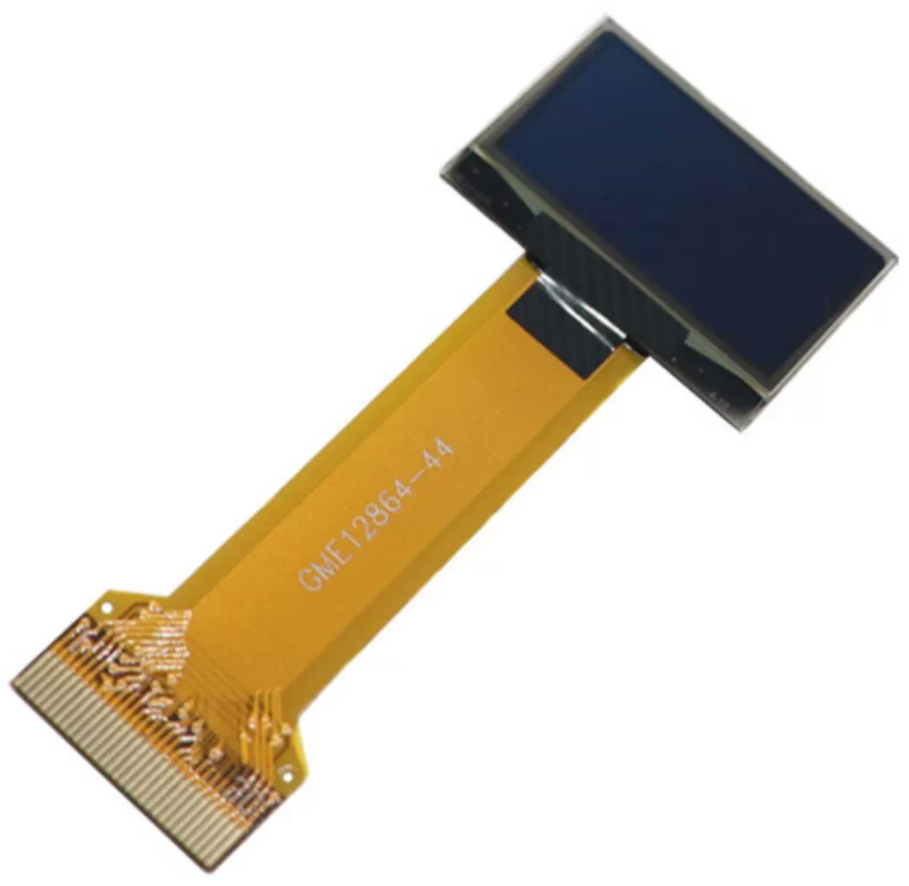

OLED屏幕
===================

    

* **尺寸**：0.96''
* **材质**：PM OLED
* **颜色**：白光
* **驱动芯片**：SSD1306
* **电压**：3.3V
* **分辨率**：128*64
* **显示区域**：21.74x10.86mm
* **面板尺寸**：26.70x19.26x1.42mm
* **像素间距**：0.17x0.17mm
* **像素大小**：0.154x0.154mm
* **视角**：全视角
* **工作温度**：-20~70°C
* **通信方式**：IIC/SPI/Parallel
* **连接方式**：0.5mm间距插入式FPC

