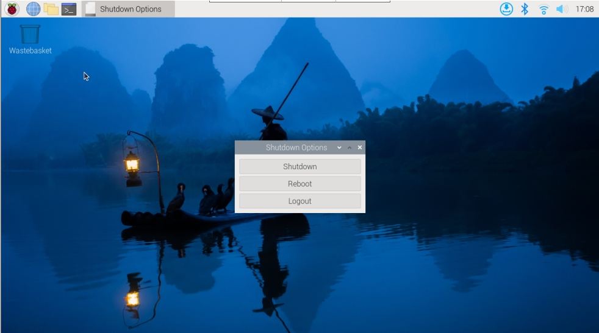

.. note::

    こんにちは、SunFounderのRaspberry Pi & Arduino & ESP32愛好家コミュニティへようこそ！Facebook上でRaspberry Pi、Arduino、ESP32についてもっと深く掘り下げ、他の愛好家と交流しましょう。

    **参加する理由は？**

    - **エキスパートサポート**：コミュニティやチームの助けを借りて、販売後の問題や技術的な課題を解決します。
    - **学び＆共有**：ヒントやチュートリアルを交換してスキルを向上させましょう。
    - **独占的なプレビュー**：新製品の発表や先行プレビューに早期アクセスしましょう。
    - **特別割引**：最新製品の独占割引をお楽しみください。
    - **祭りのプロモーションとギフト**：ギフトや祝日のプロモーションに参加しましょう。

    👉 私たちと一緒に探索し、創造する準備はできていますか？[|link_sf_facebook|]をクリックして今すぐ参加しましょう！

電源スイッチコンバータ
==============================

これは、Raspberry Pi 5の電源スイッチを外部に拡張するモジュールです。

**電源ボタンの追加** 

* Raspberry Pi 5には、RTCバッテリーコネクタとボードの端の間に位置する **J2** ジャンパーがあります。このブレイクアウトを利用して、2つのパッドにノーマリーオープン（NO）モーメンタリースイッチを接続することで、カスタム電源ボタンを追加できます。このスイッチを一瞬押すと、オンボードの電源ボタンと同様の機能が働きます。

    .. image:: img/pi5_j2.jpg

* Pironman 5 には、 **Power Switch Converter** があり、2つのPogoピンを使用して **J2** ジャンパーを外部の電源ボタンに拡張します。

    .. image:: img/power_switch_convertor.png

* これにより、Raspberry Pi 5は電源ボタンを使用して電源をオン・オフできます。

    .. image:: img/pironman_button.JPG

 **電源のサイクリング** 

最初にRaspberry Pi 5に電源を入れると、ボタンを押さずに自動的にオンになり、OSが起動します。

Raspberry Pi Desktopを実行している場合、電源ボタンを短く押すとクリーンシャットダウンプロセスが開始されます。メニューが表示され、シャットダウン、再起動、ログアウトのオプションが提供されます。オプションを選択するか、再度電源ボタンを押すと、クリーンシャットダウンが開始されます。

**シャットダウン** 

    * Raspberry Pi  **Bookworm Desktop** システムを実行している場合、電源ボタンを素早く2回押すとシャットダウンします。
    * デスクトップなしのRaspberry Pi  **Bookworm Lite** システムを実行している場合、電源ボタンを1回押すとシャットダウンが開始されます。
    * 強制シャットダウンを行うには、電源ボタンを押し続けます。

**電源オン** 

    * Raspberry Piボードがシャットダウンされているが、まだ電源が供給されている場合、1回押すとシャットダウン状態から電源がオンになります。

.. note::

    シャットダウンボタンをサポートしていないシステムを実行している場合、5秒間押し続けると強制シャットダウンが行われ、シャットダウン状態から1回押して電源をオンにできます。

