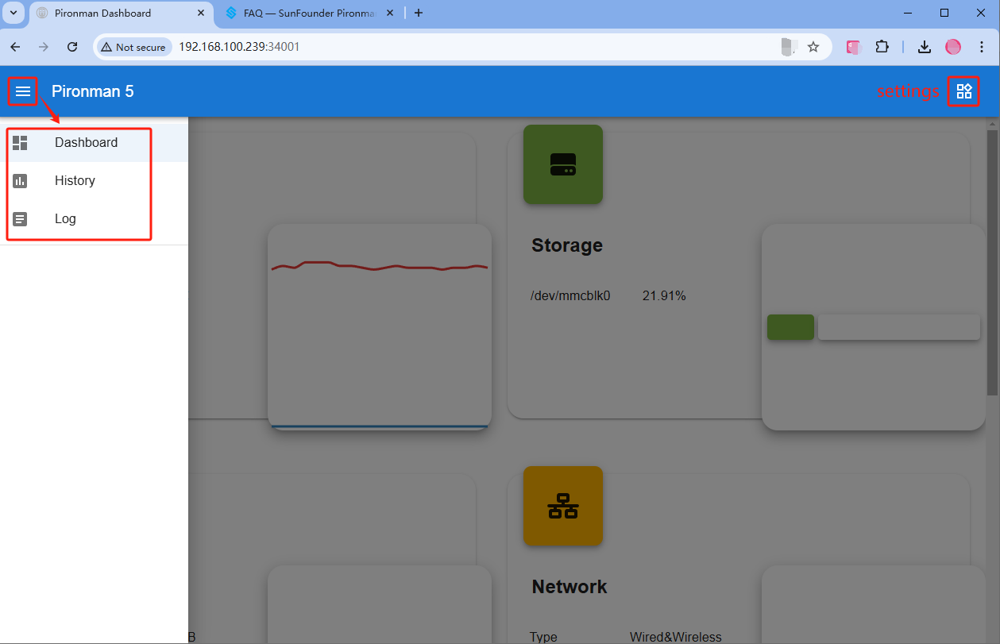
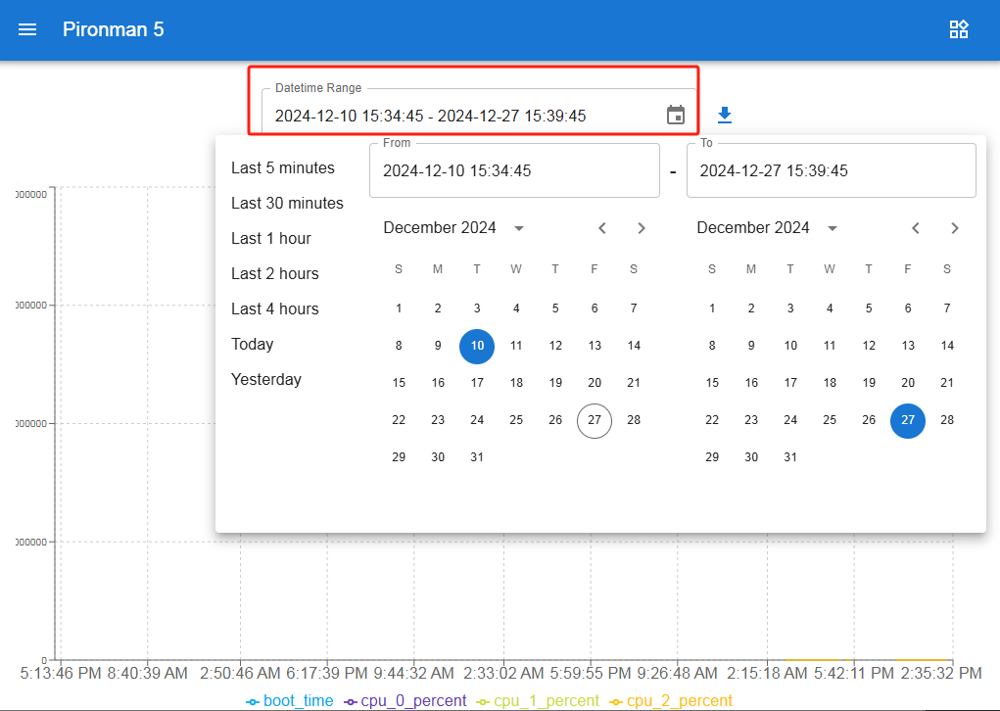
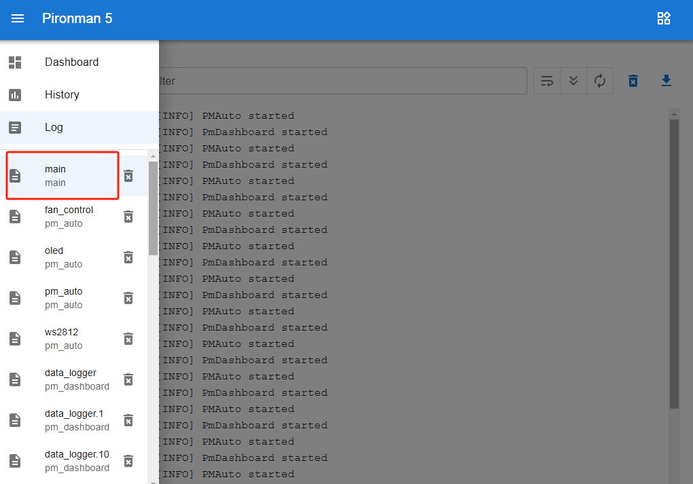
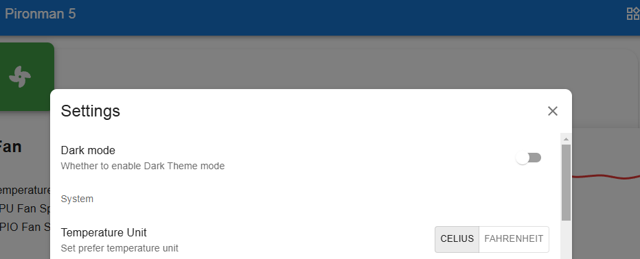
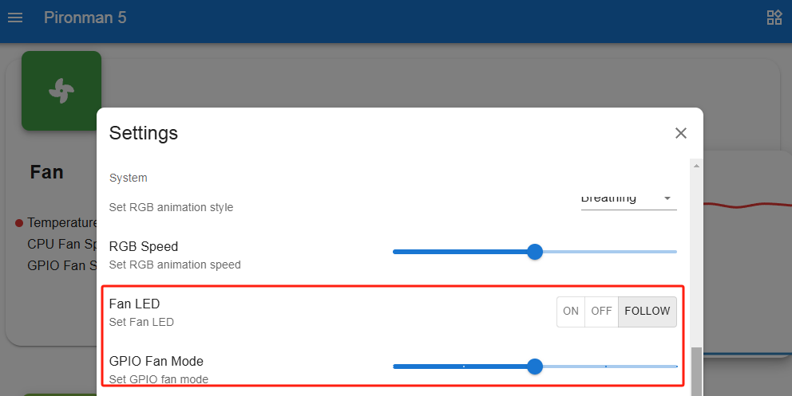

.. note::

    こんにちは！SunFounder Raspberry Pi & Arduino & ESP32 Enthusiasts Communityへようこそ。Facebook上のこのコミュニティで、Raspberry Pi、Arduino、ESP32について他の愛好家と一緒に深く学びましょう。

    **なぜ参加するのか？**

    - **専門的なサポート**: コミュニティとチームの助けを借りて、購入後の問題や技術的な課題を解決します。
    - **学びと共有**: スキル向上のためのヒントやチュートリアルを交換しましょう。
    - **限定プレビュー**: 新製品の発表や先行情報に早くアクセスできます。
    - **特別割引**: 最新製品に関する限定割引をお楽しみください。
    - **特別イベントとプレゼント**: プレゼント企画やホリデープロモーションに参加できます。

    👉 私たちと一緒に探索と創造を始める準備はできましたか？[|link_sf_facebook|]をクリックして、今すぐ参加しましょう！

.. _view_control_dashboard:

ダッシュボードからの表示と操作
=========================================

``pironman5`` モジュールを正常にインストールすると、再起動時に ``pironman5.service`` が自動的に起動します。

次に、ブラウザでモニタリングページを開き、Raspberry Piの情報を確認したり、RGBを設定したり、ファンを制御したりできます。このページのリンクは ``http://<ip>:34001`` です。

このページには、 **ダッシュボード** 、 **履歴** 、 **ログ** 、 **設定** ページがあります。

ダッシュボード
-----------------------

Raspberry Piの状態を確認できる複数のカードが用意されています：

* **ファン**: Raspberry PiのCPU温度とPWMファン速度を表示します。 **GPIO Fan State** は、2つの側面RGBファンの状態を示します。現在の温度では、2つのRGBファンはオフです。

  .. image:: img/dashboard_pwm_fan.png
    :width: 90%

* **ストレージ**: Raspberry Piのストレージ容量を表示し、使用済みと空き容量を各ディスクパーティションごとに示します。

  .. image:: img/dashboard_storage.png
    :width: 90%

* **メモリ**: Raspberry PiのRAM使用量と使用率を表示します。

  .. image:: img/dashboard_memory.png
    :width: 90%

* **ネットワーク**: 現在のネットワーク接続タイプ、アップロード速度、ダウンロード速度を表示します。

  .. image:: img/dashboard_network.png
    :width: 90%

* **プロセッサ**: Raspberry PiのCPUパフォーマンスを表示します。これには、4つのコアの状態、動作周波数、CPU使用率が含まれます。

  .. image:: img/dashboard_processor.png
    :width: 90%

履歴
--------------

履歴ページでは、過去のデータを表示できます。左のサイドバーで表示したいデータを選択し、時間範囲を指定すると、その期間のデータが表示されます。また、ダウンロードも可能です。

.. image:: img/dashboard_history1.png
  :width: 90%

ログ
------------

ログページでは、現在実行中のPironman5サービスのログを表示します。Pironman5サービスには複数のサブサービスが含まれており、それぞれが独自のログを持っています。表示したいログを選択すると、右側にログデータが表示されます。空白の場合、ログ内容が存在しない可能性があります。

* 各ログは10MBの固定サイズです。このサイズを超えると、2つ目のログが作成されます。
* 同じサービスのログ数は10個に制限されています。この制限を超えると、最も古いログが自動的に削除されます。ログを手動で削除することも可能です。
* 右上のログ領域にはフィルターツールがあります。ログレベルを選択したり、キーワードでフィルタリングしたり、 **行の折り返し** 、 **自動スクロール** 、 **自動更新** などの便利なツールを使用できます。
* ログはローカルにダウンロードすることも可能です。

.. image:: img/dashboard_log2.png
  :width: 90%

設定
-----------------

ページ右上にある設定メニューでは、好みに応じて設定をカスタマイズできます。変更を加えた後は、設定が自動的に保存されます。必要に応じて、下部のCLEARボタンをクリックして履歴データをクリアできます。

* **ダークモード** : 明るいテーマと暗いテーマを切り替えます。この設定はブラウザキャッシュに保存されます。ブラウザを変更したりキャッシュをクリアした場合、デフォルトの明るいテーマに戻ります。
* **温度単位** : システムに表示される温度単位を設定します。

**OLEDスクリーンについて**

.. image:: img/OLED_Sreens.jpg
  :width: 600

* **OLED有効化** : OLEDを有効にするかどうか。
* **OLEDディスク** : OLEDディスクを設定します。
* **OLEDネットワークインターフェース** : 

  * **all** : イーサネットIPとWi-Fi IPを順番に切り替えて表示します。
  * **eth0** : イーサネットIPのみを表示します。
  * **wlan0** : Wi-Fi IPのみを表示します。

* **OLED回転** : OLEDの回転を設定します。

**RGB LEDについて**

.. image:: img/RGB_LEDS.jpg
  :width: 600

* **RGB有効化** : RGB LEDを有効にするかどうか。
* **RGBカラー** : RGB LEDの色を設定します。
* **RGB明るさ** : スライダーでRGB LEDの明るさを調整できます。
* **RGBスタイル** : RGB LEDの表示モードを選択します。 **Solid** 、 **Breathing** 、 **Flow** 、 **Flow_reverse** 、 **Rainbow** 、 **Rainbow Reverse** 、 **Hue Cycle** が選択可能です。

  .. note::

     **Rainbow** 、 **Rainbow Reverse** 、 **Hue Cycle** を選択した場合、色を設定することはできません。

* **RGB速度**: RGB LEDの変化速度を設定します。

**RGBファンについて**

* **ファンLED**: ファンLEDをON、OFF、またはFOLLOWモードに設定できます。
* **ファンモード**: 2つのRGBファンの動作モードを設定します。これらのモードは、RGBファンが作動する条件を決定します。

    * **静音**: RGBファンは70°Cで作動します。
    * **バランス**: RGBファンは67.5°Cで作動します。
    * **冷却**: RGBファンは60°Cで作動します。
    * **高性能**: RGBファンは50°Cで作動します。
    * **常時オン**: RGBファンは常にオンになります。

例えば、 **高性能** モードに設定した場合、RGBファンは50°Cで作動を開始します。

保存後、CPU温度が50°Cを超えると、ダッシュボードの **GPIO Fan State** がONに変わり、側面のRGBファンが回転を開始します。

.. image:: img/dashboard_rgbfan_on.png
  :width: 300
