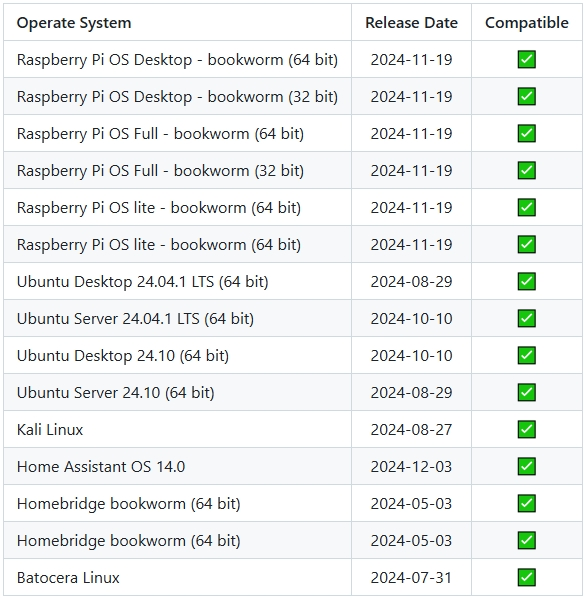
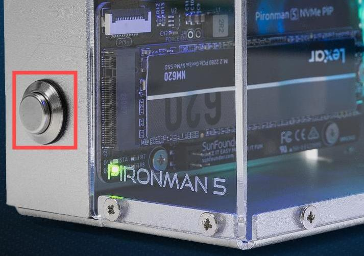

FAQ 
============

1. 关于兼容的系统
-------------------------------

通过 Raspberry Pi 5 测试的系统：

2. 关于电源按钮
--------------------------

电源按钮可以启用 Raspberry Pi 5 的电源按钮功能，操作方式与 Raspberry Pi 5 的电源按钮相同。

* **关机**

  * 如果你运行的是 Raspberry Pi **Bookworm Desktop** 系统，可以快速连续按下电源按钮两次进行关机。
  * 如果你运行的是 Raspberry Pi **Bookworm Lite** 系统，按一次电源按钮即可启动关机。
  * 若要强制关机，按住电源按钮不放。

* **开机**

  * 如果 Raspberry Pi 主板已关机，但仍有电源供应，单次按压即可从关机状态开机。

* 如果你运行的系统不支持关机按钮，可以按住电源按钮 5 秒钟来强制关机，单次按压即可从关机状态开机。

3. 关于气流方向
-------------------------------

Pironman 5 机箱的气流设计经过精心调整，以最大化散热效率。冷空气主要通过 GPIO 接口和其他小开口进入机箱，确保空气均匀流入。然后，空气通过配备高性能风扇的工具散热器，调节内部温度，最终通过侧面板上的两个 RGB 风扇排出。

详细演示请参考视频：

.. raw:: html

    

        <video center loop autoplay muted style="max-width:90%">
            <source src="_static/video/airflow_direction.mp4"  type="video/mp4">
            Your browser does not support the video tag.
        </video>
    

4. 关于塔式散热器
----------------------------------------------------------

#. 塔式散热器顶部的 U 形热管被压缩，以便铜管通过铝制散热片，这是铜管生产过程中正常的一部分。

   .. image::  img/tower_cooler1.png

#. 安装塔式散热器的注意事项：

**安装垫片**：在安装塔式散热器之前，确保将垫片贴在 Raspberry Pi 上，以防止损坏或刮伤。

 .. image::  img/tower_cooler_thermal.png

**正确方向**：注意塔式散热器的安装方向。将其与 Raspberry Pi 上的定位孔对齐后，再按下弹簧螺丝将其固定。

 .. image::  img/tower_cooler_place.jpg

**小心拆卸**：如果塔式散热器安装方向错误或未贴上垫片，请勿强行拆卸。

- 安全拆卸塔式散热器的步骤：

  使用镊子或钳子夹住弹簧螺母的尖端，轻轻向上推动以将其拆卸。

     .. raw:: html

       

           <video center loop autoplay muted style="max-width:90%">
               <source src="_static/video/remove_tower_cooler.mp4" type="video/mp4">
               Your browser does not support the video tag.
           </video>
       

5. 关于 Raspberry Pi AI HAT+
----------------------------------------------------------

Raspberry Pi AI HAT+ 与 Pironman 5 不兼容。

   .. image::  img/output3.png
        :width: 400

Raspberry Pi AI Kit 结合了 Raspberry Pi M.2 HAT+ 和 Hailo AI 加速模块。

   .. image::  img/output2.jpg
        :width: 400

你可以将 Hailo AI 加速模块从 Raspberry Pi AI Kit 中拆卸下来，并直接插入 Pironman 5 的 NVMe PIP 模块中。

   .. image::  img/output4.png
        :width: 800

6. Pironman 5 支持复古游戏系统吗？
------------------------------------------------------
是的，它是兼容的。然而，大多数复古游戏系统是精简版本，无法安装和运行额外的软件。这个限制可能导致 Pironman 5 上的一些组件（例如 OLED 显示屏、两个 RGB 风扇和 4 个 RGB LED）无法正常工作，因为这些组件需要安装 Pironman 5 的软件包。

.. note::

   Batocera.linux 系统现在完全兼容 Pironman 5。Batocera.linux 是一个开源且完全免费的复古游戏操作系统。

   * :ref:`install_batocera`
   * :ref:`set_up_batocera`

7. OLED 屏幕无法工作？
-----------------------------------

如果 OLED 屏幕没有显示或显示不正确，请按照以下步骤进行故障排除：

#. 确保 OLED 屏幕的 FPC 电缆连接牢固。建议重新连接 OLED 屏幕，然后重新启动设备。

   .. raw:: html

       

           <video center loop autoplay muted style="max-width:90%">
               <source src="_static/video/connect_oled_screen.mp4" type="video/mp4">
               Your browser does not support the video tag.
           </video>
       

#. 确认 Raspberry Pi 运行的是兼容的操作系统。Pironman 5 仅支持以下系统：

   .. image:: img/compitable_os.png  
      :width: 600  
      :align: center  

   如果你安装了不支持的系统，请按照指南安装兼容的操作系统： :ref:`install_the_os`。

#. 当 OLED 屏幕首次启动时，可能只会显示像素块。你需要按照 :ref:`set_up_pironman5` 中的说明完成配置，才能正常显示信息。

#. 使用以下命令检查 OLED 的 I2C 地址 ``0x3C`` 是否被检测到：

   .. code-block:: shell

      sudo i2cdetect -y 1

   * 如果检测到 I2C 地址 ``0x3C`` ，请使用以下命令重启 Pironman 5 服务：

     .. code-block:: shell

        sudo systemctl restart pironman5.service

   * 如果未检测到地址，请启用 I2C：

     * 编辑配置文件，执行以下命令：

       .. code-block:: shell

         sudo nano /boot/firmware/config.txt

     * 在文件末尾添加以下行：

       .. code-block:: shell

         dtparam=i2c_arm=on

     * 按 ``Ctrl+X`` 保存文件，然后按 ``Y`` 确认，退出。重启 Pironman 5，检查问题是否解决。

如果问题仍然存在，请发送电子邮件至 service@sunfounder.com，我们会尽快回复。

8. NVMe PIP 模块无法工作？
---------------------------------------

1. 确保将 NVMe PIP 模块与 Raspberry Pi 5 连接的 FPC 电缆连接牢固。

   .. raw:: html

       

           <video center loop autoplay muted style="max-width:90%">
               <source src="_static/video/connect_nvme_pip1.mp4" type="video/mp4">
               Your browser does not support the video tag.
           </video>
       

   .. raw:: html

       

           <video center loop autoplay muted style="max-width:90%">
               <source src="_static/video/connect_nvme_pip2.mp4" type="video/mp4">
               Your browser does not support the video tag.
           </video>
       

2. 确认 SSD 已正确固定在 NVMe PIP 模块上。

   .. raw:: html

       

           <video center loop autoplay muted style="max-width:90%">
               <source src="_static/video/connect_ssd.mp4" type="video/mp4">
               Your browser does not support the video tag.
           </video>
       

3. 检查 NVMe PIP 模块的 LED 状态：

   确认所有连接正确后，打开 Pironman 5，观察 NVMe PIP 模块上的两个指示灯：

   * **PWR LED**：应亮起。
   * **STA LED**：应闪烁，表示正常工作。

   .. image:: img/nvme_pip_leds.png

   * 如果 **PWR LED** 亮起但 **STA LED** 不闪烁，表示 Raspberry Pi 没有识别到 NVMe SSD。
   * 如果 **PWR LED** 不亮，请短接模块上的 "Force Enable" 引脚（J4）。如果 **PWR LED** 亮起，可能表示 FPC 电缆松动或系统配置不支持 NVMe。

     .. image:: img/nvme_pip_j4.png

4. 确认你的 NVMe SSD 已安装操作系统。参考 :ref:`install_the_os`。

5. 如果接线正确且操作系统已安装，但 NVMe SSD 仍无法启动，请尝试通过 Micro SD 卡启动，验证其他组件是否正常工作。确认后，请继续执行 :ref:`configure_boot_ssd`。

如果问题仍然存在，请发送电子邮件至 service@sunfounder.com，我们会尽快回复。

9. RGB LED 无法工作？
--------------------------

#. IO 扩展器上 J9 引脚的两个引脚用于将 RGB LED 连接到 GPIO10。确保这两个引脚上的跳线帽安装正确。

   .. image:: advanced/img/io_board_rgb_pin.png
      :width: 300
      :align: center

#. 验证 Raspberry Pi 是否运行兼容的操作系统。Pironman 5 仅支持以下操作系统版本：

   .. image:: img/compitable_os.png
      :width: 600
      :align: center

   如果你安装了不支持的操作系统，请参考指南安装兼容的操作系统： :ref:`install_the_os`。

#. 运行命令 ``sudo raspi-config`` 打开配置菜单。导航到 **3 Interfacing Options** -> **I3 SPI** -> **YES**，然后点击 **OK** 和 **Finish** 来启用 SPI。启用 SPI 后，重启 Pironman 5。

如果问题仍然存在，请发送电子邮件至 service@sunfounder.com，我们会尽快回复。

10. CPU 风扇无法工作？
----------------------------------------------

当 CPU 温度未达到设定的阈值时，CPU 风扇不会工作。

**根据温度控制风扇转速**

PWM 风扇会根据 Raspberry Pi 5 的温度动态调整转速：

* **低于 50°C**：风扇关闭（0% 转速）。
* **50°C**：风扇以低速运行（30% 转速）。
* **60°C**：风扇以中速运行（50% 转速）。
* **67.5°C**：风扇以高速运行（70% 转速）。
* **75°C 及以上**：风扇全速运行（100% 转速）。

更多详细信息请参考： :ref:`Fans`

11. 如何禁用网页控制面板？
------------------------------------------------------

完成 ``pironman5`` 模块的安装后，你将能够访问 :ref:`view_control_dashboard`。

如果不需要此功能并希望减少 CPU 和 RAM 使用，可以在安装 ``pironman5`` 时添加 ``--disable-dashboard`` 标志来禁用面板。

.. code-block:: shell

   cd ~/pironman5
   sudo python3 install.py --disable-dashboard

如果你已经安装了 ``pironman5`` ，可以移除 ``dashboard`` 模块和 ``influxdb`` ，然后重启 pironman5 以应用更改：

.. code-block:: shell

   /opt/pironman5/venv/bin/pip3 uninstall pm-dashboard influxdb
   sudo apt purge influxdb
   sudo systemctl restart pironman5

12. 如何使用 ``pironman5`` 命令控制组件
----------------------------------------------------------------------
你可以参考以下教程，使用 ``pironman5`` 命令来控制 Pironman 5 的组件。

* :ref:`view_control_commands`

13. 如何使用命令更改 Raspberry Pi 的启动顺序
-------------------------------------------------------------

如果你已登录 Raspberry Pi，可以使用命令更改启动顺序。详细说明如下：

* :ref:`configure_boot_ssd`

14. 如何使用 Raspberry Pi Imager 修改启动顺序？
---------------------------------------------------------------

除了修改 EEPROM 配置中的 ``BOOT_ORDER`` ，你还可以使用 **Raspberry Pi Imager** 来更改 Raspberry Pi 的启动顺序。

建议使用备用卡进行此步骤。

* :ref:`update_bootloader`

15. 如何将系统从 SD 卡复制到 NVMe SSD？
-------------------------------------------------------------

如果你有 NVMe SSD，但没有适配器将 NVMe 连接到计算机，可以先将系统安装到 Micro SD 卡上。一旦 Pironman 5 成功启动，你可以将系统从 Micro SD 卡复制到 NVMe SSD。详细说明如下：

* :ref:`copy_sd_to_nvme_rpi`

16. 如何移除亚克力板的保护膜
-----------------------------------------------------------------

包装中包含两个亚克力面板，两面都覆盖有黄色/透明保护膜，以防刮伤。保护膜可能有些难以移除。可以使用螺丝刀轻轻刮开角落，然后小心地撕掉整个保护膜。

.. _openssh_powershell:

17. 如何通过 Powershell 安装 OpenSSH？
----------------------------------------------

当你使用 ``ssh <username>@<hostname>.local``（或 ``ssh <username>@<IP address>``）连接 Raspberry Pi，但出现以下错误信息：

    .. code-block::

        ssh: The term 'ssh' is not recognized as the name of a cmdlet, function, script file, or operable program. Check the
        spelling of the name, or if a path was included, verify that the path is correct and try again.

这意味着你的计算机系统过于陈旧，未预装 `OpenSSH <https://learn.microsoft.com/en-us/windows-server/administration/openssh/openssh_install_firstuse?tabs=gui>`_，你需要按照以下教程手动安装。

#. 在 Windows 桌面上的搜索框中输入 ``powershell`` ，右键点击 ``Windows PowerShell``，从弹出的菜单中选择 ``以管理员身份运行`` 。

   .. image:: img/powershell_ssh.png
      :width: 90%

#. 使用以下命令安装 ``OpenSSH.Client`` 。

   .. code-block::

        Add-WindowsCapability -Online -Name OpenSSH.Client~~~~0.0.1.0

#. 安装完成后，会返回以下输出：

   .. code-block::

        Path          :
        Online        : True
        RestartNeeded : False

#. 使用以下命令验证安装：

   .. code-block::

        Get-WindowsCapability -Online | Where-Object Name -like 'OpenSSH*'

#. 现在，它会告诉你 ``OpenSSH.Client`` 已成功安装。

   .. code-block::

        Name  : OpenSSH.Client~~~~0.0.1.0
        State : Installed

        Name  : OpenSSH.Server~~~~0.0.1.0
        State : NotPresent

   .. warning:: 

        如果上述提示没有出现，说明你的 Windows 系统仍然过于陈旧，建议安装第三方 SSH 工具，如 |link_putty| 。

6. 现在重启 PowerShell，并继续以管理员身份运行。此时，你就可以使用 ``ssh`` 命令登录 Raspberry Pi，系统会提示你输入先前设置的密码。

   .. image:: img/powershell_login.png

18. 如何关闭/开启 OLED 屏幕？
----------------------------------------------------------

你可以选择通过控制面板或命令行关闭/开启 OLED 屏幕。

1. 通过控制面板关闭/开启 OLED 屏幕。

   .. note::

    在使用控制面板之前，你需要在 Home Assistant 上进行设置。请参考： :ref:`view_control_dashboard`。

- 设置完成后，你可以按照以下步骤打开、关闭或配置 OLED 屏幕。

   .. image::  img/set_up_on_dashboard.jpg
      :width: 90%

2. 通过命令行关闭/开启 OLED 屏幕。

- 使用以下五个命令中的任意一个来打开 OLED 屏幕。

.. code-block::

    sudo pironman5 -oe True/true/on/On/1

- 使用以下五个命令中的任意一个来关闭 OLED 屏幕。

.. code-block::

    sudo pironman5 -oe False/false/off/Off/0

.. note::

    你可能需要重启 pironman5 服务以使更改生效。你可以使用以下命令重启服务：

      .. code-block::

        sudo systemctl restart pironman5.service

