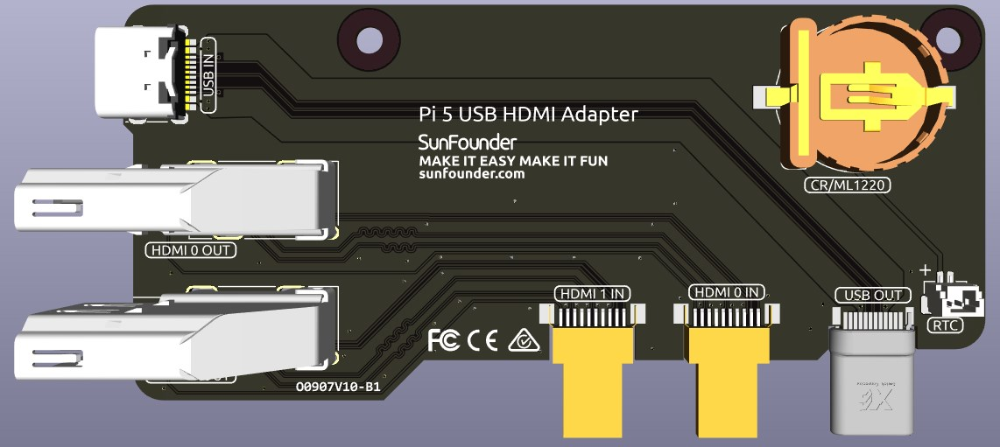

USB HDMI Adapter
==========================================

This USB HDMI adapter board is specifically designed for the Raspberry Pi 5. Its primary function is to reposition the USB and HDMI connections to align with the USB interface side of the Raspberry Pi, enhancing accessibility and cable management.

Additionally, the HDMI port is converted to a standard HDMI Type A interface, offering broader compatibility.

A 1220RTC battery holder is incorporated for convenient installation of an RTC battery. It connects to the Raspberry Pi's RTC interface via an SH1.0 2P reverse cable. The battery holder is compatible with both CR1220 and ML1220 batteries. If using an ML1220 (Lithium Manganese Dioxide battery), charging can be configured directly on the Raspberry Pi. Note that the CR1220 is not rechargeable.

**Enabling Trickle Charging**

By default, the trickle charging feature for the battery is disabled. The ``sysfs`` files indicate the current trickle charging voltage and limits:

.. code-block:: shell

    pi@raspberrypi:~ $ cat /sys/devices/platform/soc/soc:rpi_rtc/rtc/rtc0/charging_voltage
    0
    pi@raspberrypi:~ $ cat /sys/devices/platform/soc/soc:rpi_rtc/rtc/rtc0/charging_voltage_max
    4400000
    pi@raspberrypi:~ $ cat /sys/devices/platform/soc/soc:rpi_rtc/rtc/rtc0/charging_voltage_min
    1300000

To enable trickle charging, add ``rtc_bbat_vchg`` to ``/boot/firmware/config.txt``:

  * Open the ``/boot/firmware/config.txt``.
  
    .. code-block:: shell
    
      sudo nano /boot/firmware/config.txt
      
  * Add ``rtc_bbat_vchg`` to ``/boot/firmware/config.txt``.
  
    .. code-block:: shell
    
      dtparam=rtc_bbat_vchg=3000000
  
After rebooting, the system will display:

.. code-block:: shell

    pi@raspberrypi:~ $ cat /sys/devices/platform/soc/soc:rpi_rtc/rtc/rtc0/charging_voltage
    3000000
    pi@raspberrypi:~ $ cat /sys/devices/platform/soc/soc:rpi_rtc/rtc/rtc0/charging_voltage_max
    4400000
    pi@raspberrypi:~ $ cat /sys/devices/platform/soc/soc:rpi_rtc/rtc/rtc0/charging_voltage_min
    1300000

This confirms the battery is now under trickle charging. To disable this feature, simply remove the ``dtparam`` line from ``config.txt``.

