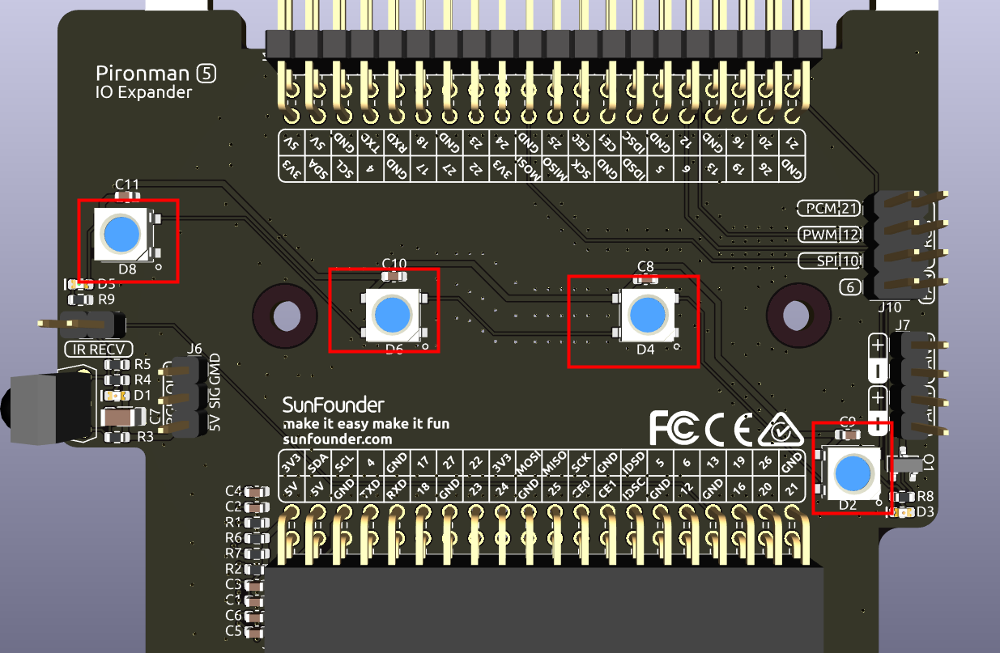
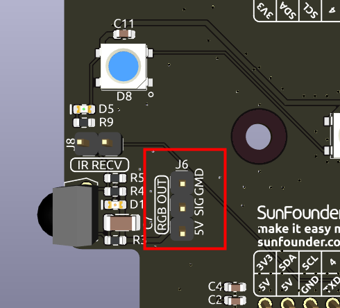
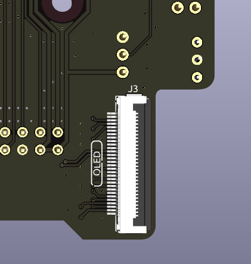
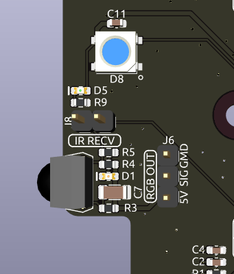
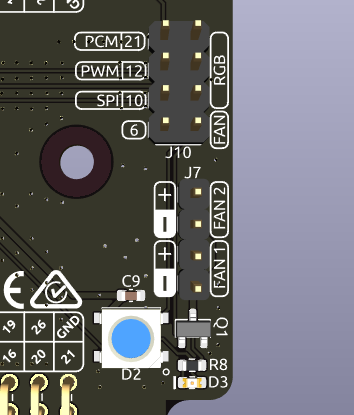

.. note::

    Hello, welcome to the SunFounder Raspberry Pi & Arduino & ESP32 Enthusiasts Community on Facebook! Dive deeper into Raspberry Pi, Arduino, and ESP32 with fellow enthusiasts.

    **Why Join?**

    - **Expert Support**: Solve post-sale issues and technical challenges with help from our community and team.
    - **Learn & Share**: Exchange tips and tutorials to enhance your skills.
    - **Exclusive Previews**: Get early access to new product announcements and sneak peeks.
    - **Special Discounts**: Enjoy exclusive discounts on our newest products.
    - **Festive Promotions and Giveaways**: Take part in giveaways and holiday promotions.

    👉 Ready to explore and create with us? Click [|link_sf_facebook|] and join today!

IO Expander
================

RGB LEDs
------------

The board features 4 WS2812 RGB LEDs, offering customizable control. Users can turn them on or off, change the color, adjust the brightness, switch display modes, and set the speed of changes.

* To modify the on and off state of the RGB LEDs, ``true`` to turn on the RGB LEDs, ``false`` to turn them off.

.. code-block:: shell

  pironman5 -re true

* To change their color, input the desired hexadecimal color values, such as ``fe1a1a``.

.. code-block:: shell

  pironman5 -rc fe1a1a

* To change the brightness of the RGB LED (range: 0 ~ 100%):

.. code-block:: shell

  pironman5 -rb 100

* To switch RGB LED display modes, choose from options: ``solid/breathing/flow/flow_reverse/rainbow/rainbow_reverse/hue_cycle``:

.. note::

  If you set the RGB LED display mode to ``rainbow``, ``rainbow_reverse``, or ``hue_cycle``, you will not be able to set the color using ``pironman5 -rc``.

.. code-block:: shell

  pironman5 -rs breathing

* To modify the speed of change (range: 0 ~ 100%):

.. code-block:: shell

  pironman5 -rp 80

RGB Control Pin
-------------------------

The RGB LED is driven by SPI and connected to **GPIO10**, which is also the SPI MOSI pin. The two pins above J9 are used to connect the RGB to GPIO10. If not needed, the jumper can be removed.

  .. image:: img/io_board_rgb_pin.png

RGB OUT Pins
-------------------------

The WS2812 RGB LEDs support serial connection, allowing for the attachment of an external RGB LED strip. Connect the **SIG** pin to the external strip's **DIN** pin for expansion.

The default setup includes 4 RGB LEDs. Connect additional LEDs and update the count using:

.. code-block:: shell

  pironman5 -rl 12

OLED Screen Connector
----------------------------

The OLED screen connector, with an address of 0x3C, is a key feature.

If the OLED Screen is not displaying or displaying incorrectly, you can follow these steps to troubleshoot the issue:

Check if the FPC cable of the OLED Screen is properly connected.

#. Use the following command to view the program's run logs and check for error messages.

    .. code-block:: shell

        cat /opt/pironman5/log

#. Alternatively, use the following command to check if the OLED's i2c address 0x3C is recognized:
    
    .. code-block:: shell
        
        sudo i2cdetect -y 1

#. If the first two steps don't reveal any issues, try restarting the pironman5 service to see if that resolves the problem.

    .. code-block:: shell

        sudo systemctl restart pironman5.service

Infrared Receiver
---------------------------

* **Model**: IRM-56384, operating at 38KHz.
* **Connection**: The IR receiver connects to **GPIO13**.
* **D1**: An infrared reception indicator that blinks upon signal detection.
* **J8**: A pin for enabling the infrared function. By default, a jumper cap is inserted for immediate functionality. Remove the cap to free GPIO13 if the IR receiver is not in use.

To utilize the IR receiver, verify its connection and install the necessary module:

* Test the connection:

  .. code-block:: shell

    sudo ls /dev |grep lirc

* Install the ``lirc`` module:

  .. code-block:: shell

    sudo apt-get install lirc -y

* Now, test the IR Receiver by running the following command. 

  .. code-block:: shell

    mode2 -d /dev/lirc0

* After running the command, press a button on the remote control, and the code of that button will be printed.

RGB Fan Pins
---------------

The IO expansion board supports up to two 5V non-PWM fans. Both fans are controlled together. 

**FAN1** and **FAN 2** are two sets of fan pins. You need to connect the fan's red wire to "+", and the black wire to "-".

The two pins below J9 are the enable pins for RGB fans. By default, a jumper is inserted on these pins, allowing control of the fans' on and off state using GPIO6. If fan operation is not desired, the jumper can be removed to free GPIO6.

.. image:: img/io_board_fan_j9.png

**D2** is a fan signal indicator that lights up when the fan is active.

.. image:: img/io_board_fan_d2.png

You can use command to configure the operating mode of the two RGB fans. These modes determine the conditions under which the RGB fans will activate.

For instance, if set to **1: Performance** mode, the RGB fans will activate at 50°C.

.. code-block:: shell

  pironman5 -gm 3

* **4: Quiet**: The RGB fans will activate at 70°C.
* **3: Balanced**: The RGB fans will activate at 67.5°C.
* **2: Cool**: The RGB fans will activate at 60°C.
* **1: Performance**: The RGB fans will activate at 50°C.
* **0: Always On**: The RGB fans will always on.

If you connect the control pin of the RGB fan to different pins on the Raspberry Pi, you can use the following command to change the pin number.

.. code-block:: shell

  sudo pironman5 -gp 18

Pin Headers
--------------

.. image:: img/io_board_pin_header.png

Two right-angle header connectors extend the Raspberry Pi's GPIO, but note that the IR receiver, RGB LED, and fan occupy some pins. Remove the corresponding jumper caps to utilize these pins for other functions.

.. list-table:: 
  :widths: 25 25
  :header-rows: 1

  * - Pironman 5
    - Raspberry Pi 5
  * - IR Receiver(Optional)
    - GPIO13
  * - OLED SDA
    - SDA
  * - OLED SCL
    - SCL
  * - FAN(Optional)
    - GPIO6
  * - RGB(Optional)
    - GPIO10
  * - RGB(Optional)
    - GPIO12
  * - RGB(Optional)
    - GPIO21
