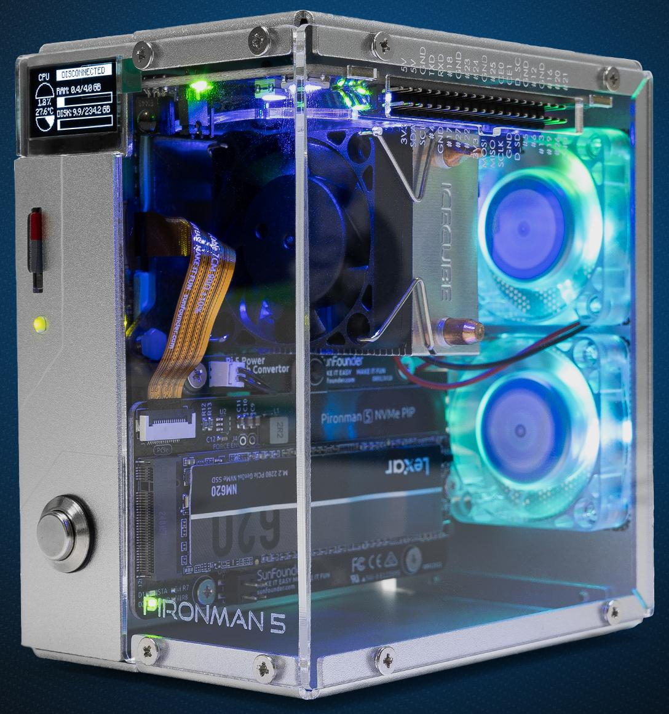

.. note::

    Ciao, benvenuto nella Community di appassionati di SunFounder Raspberry Pi & Arduino & ESP32 su Facebook! Approfondisci Raspberry Pi, Arduino ed ESP32 insieme agli altri appassionati.

    **Perché unirti a noi?**

    - **Supporto esperto**: Risolvi problemi post-vendita e sfide tecniche con l'aiuto della nostra community e del nostro team.
    - **Impara e condividi**: Scambia suggerimenti e tutorial per migliorare le tue competenze.
    - **Anteprime esclusive**: Ottieni accesso anticipato a nuovi annunci di prodotti e anteprime.
    - **Sconti speciali**: Godi di sconti esclusivi sui nostri prodotti più recenti.
    - **Promozioni festive e omaggi**: Partecipa a omaggi e promozioni speciali per le festività.

    👉 Sei pronto a esplorare e creare con noi? Clicca su [|link_sf_facebook|] e unisciti oggi stesso!

|link_pironman5| - Case Mini PC NVMe M.2 SSD PCIe per Raspberry Pi 5
================================================================================

Grazie per aver scelto il nostro |link_pironman5|.

.. note::
    Questo documento è disponibile nelle seguenti lingue.

        * |link_german_tutorials|
        * |link_jp_tutorials|
        * |link_en_tutorials|
        * |link_fr_tutorials|
        * |link_es_tutorials|
        * |link_it_tutorials|
    
    Clicca sui link corrispondenti per accedere al documento nella tua lingua preferita.

    

Eleva il tuo Raspberry Pi 5 con il |link_pironman5|, il nostro case di punta progettato per unire stile e funzionalità senza pari. È la perfetta combinazione di estetica e prestazioni:

* Raspberry Pi 5 mini PC
* Display OLED da 0,96" che mostra l'utilizzo della CPU, la temperatura, l'uso del disco, l'indirizzo IP, l'uso della RAM e altro del Raspberry Pi
* Il tower cooler mantiene il Pi con il 100% di carico della CPU a 39°C con una temperatura ambiente di 25°C
* 2 ventole RGB con controllo GPIO
* 1 ventola PWM sul Tower Cooler è controllata dal sistema Raspberry Pi
* Supporta quattro formati di NVMe M.2 SSD (PCIe Gen 2.0 / PCIe Gen 3.0): 2230, 2242, 2260 e 2280.
* 4 LED RGB indirizzabili WS2812 illuminano tutto il case con un effetto luce spettacolare
* Ricevitore IR per centri multimediali come Kodi o Volumio
* Pulsante di accensione retrò in metallo per uno spegnimento sicuro
* Estensore GPIO esterno con etichetta del nome del pin, per un facile accesso
* Equipaggiato con un socket a molla per una facile rimozione della scheda
* Corpo principale in alluminio con pannello laterale in acrilico trasparente
* Dispone di due porte HDMI standard

Il |link_pironman5| non è solo un case; è un aggiornamento che trasforma il tuo Raspberry Pi 5 in un dispositivo potente, efficiente e stiloso. Acquista il tuo ora e scopri il futuro dei case per Raspberry Pi!

.. note::

    Devi installare un sistema operativo compatibile con Raspberry Pi 5. Si consiglia di utilizzare l'ultima versione di Raspberry Pi Imager per l'installazione del sistema. I sistemi attualmente testati sono:

   .. image:: install/img/compitable_os.png

Se hai domande, invia un'email a service@sunfounder.com e ti risponderemo al più presto.

.. raw:: html

    

.. toctree::
    :maxdepth: 1

    About this Kit <self>
    what_do_we_need    
    assembly_instructions
    install/install_the_os
    set_up/set_up_pironman5
    control/control_pironman5
    advanced/advanced
    compitable_nvme_ssd
    assemble_camera
    faq

**Nota sul Copyright**

Tutti i contenuti inclusi, ma non limitati a testi, immagini e codice in questo manuale, sono di proprietà della SunFounder Company. L'uso è consentito solo per studio personale, ricerca, intrattenimento o altri scopi non commerciali o senza scopo di lucro, in conformità con le normative vigenti e le leggi sul copyright, senza violare i diritti legali dell'autore e dei titolari dei diritti. Per qualsiasi individuo o organizzazione che utilizzi questi contenuti per scopi commerciali senza autorizzazione, l'azienda si riserva il diritto di intraprendere azioni legali.

