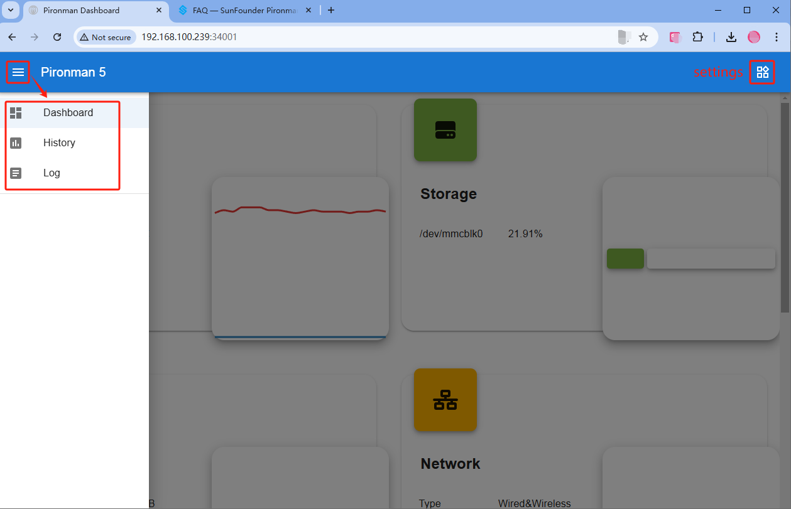
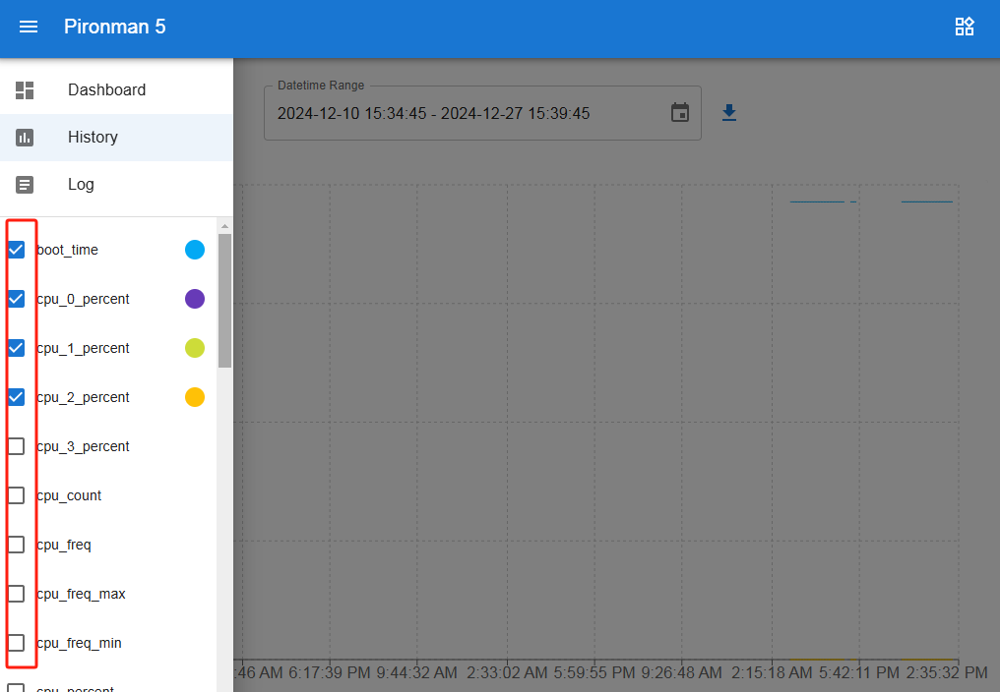
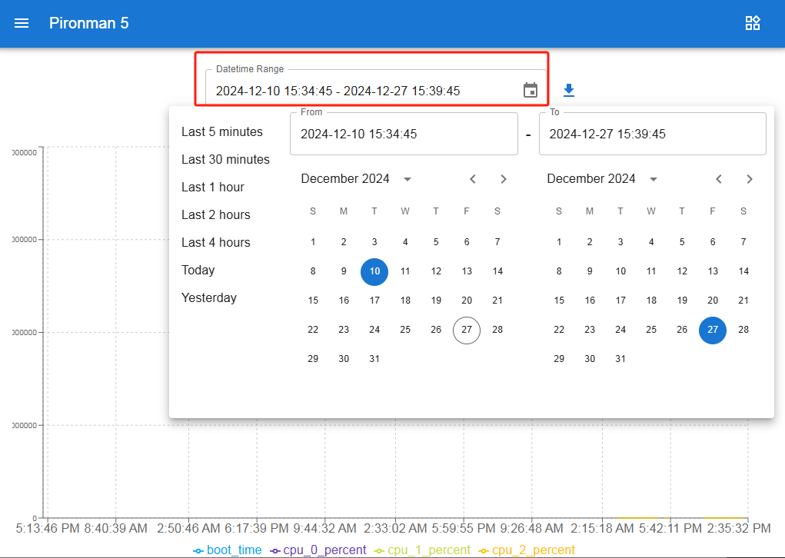
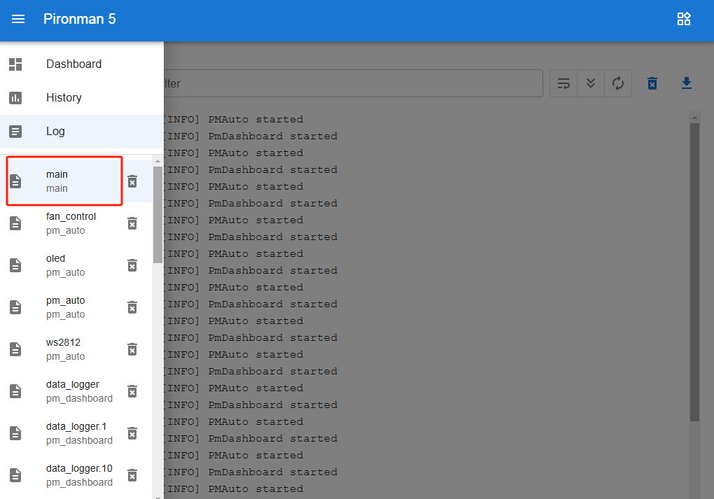
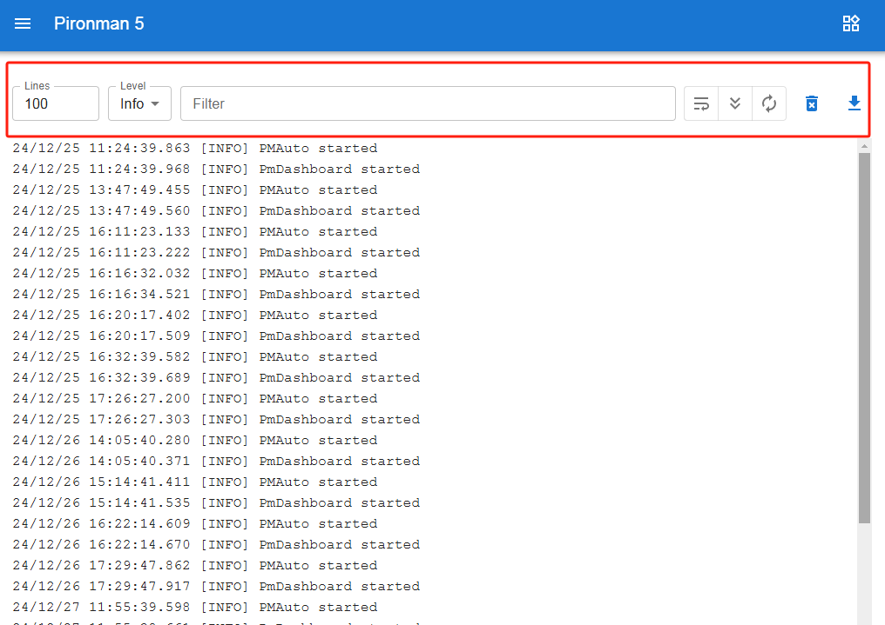
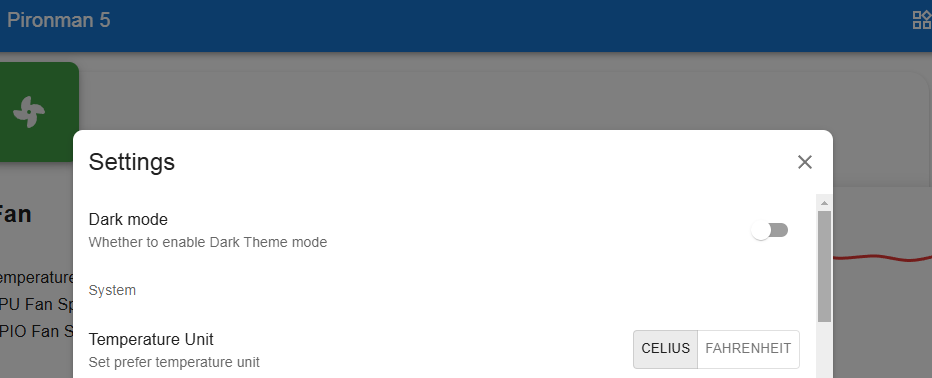
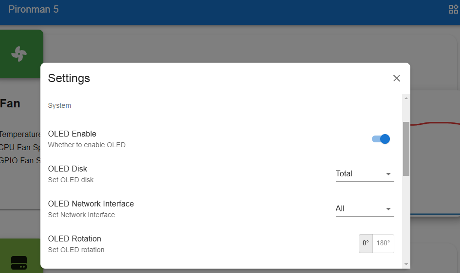
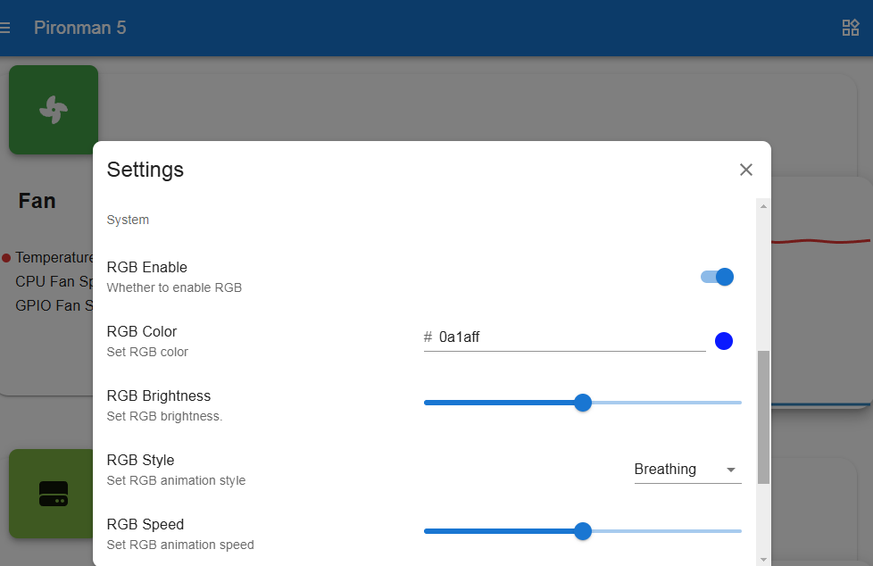
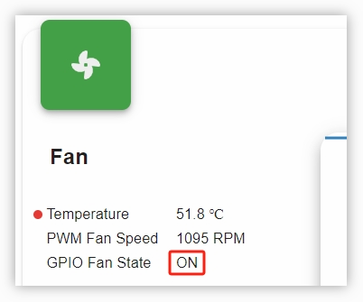

.. _view_control_dashboard:

通过控制面板查看与管理
=========================================

成功安装 ``pironman5`` 模块后，系统将在重启时自动启动 ``pironman5.service`` 服务。

此时，您可以在浏览器中打开监控页面，查看有关 Raspberry Pi 的各项信息，配置 RGB 灯效，控制风扇等。页面地址为： ``http://<ip>:34001`` 。

该页面包含 **Dashboard**、 **History**、 **Log** 和 **Settings** 四个子页面。

控制面板
-----------------------

控制面板中包含多个信息卡片，可用于查看 Raspberry Pi 的运行状态，包括：

* **Fan**：显示 Raspberry Pi 的 CPU 温度及 PWM 风扇的转速。 **GPIO Fan State** 表示两侧 RGB 风扇的当前状态。当前温度下，两颗 RGB 风扇处于关闭状态。

  .. image:: img/dashboard_pwm_fan.png
    :width: 90%

* **Storage**：显示 Raspberry Pi 的存储信息，包括各个磁盘分区的已用空间与可用空间。

  .. image:: img/dashboard_storage.png
    :width: 90%

* **Memory**：展示 Raspberry Pi 的内存使用情况及使用比例。

  .. image:: img/dashboard_memory.png
    :width: 90%

* **Network**：显示当前网络连接类型，以及上传与下载速率。

  .. image:: img/dashboard_network.png
    :width: 90%

* **Processor**：展示 Raspberry Pi 的 CPU 运行情况，包括四个核心的状态、运行频率及使用率。

  .. image:: img/dashboard_processor.png
    :width: 90%

历史数据
--------------

在“历史数据”页面中，您可以查看系统的历史运行数据。在左侧栏勾选要查看的数据项，选择时间范围，即可查看对应时间段的数据，还可点击按钮下载所选数据。

日志
------------

“日志”页面用于查看当前运行中的 Pironman5 服务日志。Pironman5 服务由多个子服务组成，每个服务都有独立的日志。选择要查看的日志后，右侧区域将显示相应内容；若为空，表示当前无日志内容。

* 每份日志大小固定为 10MB，超过后将自动创建新日志文件。
* 同一服务的日志文件最多保留 10 个，超过后最旧的日志将被自动删除。您也可以手动删除日志。
* 日志区域上方提供筛选工具，可按日志级别、关键词进行过滤，支持 **自动换行**、 **自动滚动** 和 **自动刷新** 等功能。
* 支持将日志下载到本地保存。

设置
-----------------

页面右上角提供设置菜单，您可根据个人偏好进行个性化配置，所有修改将自动保存。如需清除历史数据，可点击底部的 CLEAR 按钮。

* **Dark Mode**：切换明暗主题。该设置保存在浏览器缓存中，若更换浏览器或清除缓存，将恢复为默认的浅色主题。
* **Temperature Unit**：设置系统显示的温度单位。

**关于 OLED 显示屏**

* **OLED Enable**：是否启用 OLED 显示屏。
* **OLED Disk**：设置 OLED 显示的磁盘信息。
* **OLED Network Interface**：

  * **all**：循环显示以太网和 Wi-Fi 的 IP 地址。
  * **eth0**：仅显示以太网 IP。
  * **wlan0**：仅显示 Wi-Fi IP。

* **OLED Rotation**：设置 OLED 显示方向。

**关于 RGB 灯效**

* **RGB Enable**：是否启用 RGB 灯效。
* **RGB Color**：设置 RGB 灯的颜色。
* **RGB Brightness**：通过滑动条调整 RGB 灯的亮度。
* **RGB Style**：选择 RGB 灯的显示模式。可选项包括 **Solid**、 **Breathing**、 **Flow**、 **Flow_reverse**、 **Rainbow**、 **Rainbow Reverse** 和 **Hue Cycle** 。

  .. note::

     当 RGB 模式设置为 **Rainbow**、 **Rainbow Reverse** 或 **Hue Cycle** 时，RGB 颜色设置将不可用。

* **RGB Speed**：设置 RGB 灯效的切换速度。

**关于 RGB 风扇**

.. image:: img/RGB_FAN2.png
  :width: 600

* **GPIO Fan Mode**：设置两颗 RGB 风扇的工作模式。不同模式对应不同的启动温度阈值。

    * **Quiet**：风扇在温度达到 70°C 时启动。
    * **Balanced**：风扇在温度达到 67.5°C 时启动。
    * **Cool**：风扇在温度达到 60°C 时启动。
    * **Performance**：风扇在温度达到 50°C 时启动。
    * **Always On**：风扇始终开启。

例如，将模式设置为 **Performance** 后，当 CPU 温度超过 50°C，您将在控制面板中看到 **GPIO Fan State** 状态切换为 ON，两颗侧面 RGB 风扇开始运转。

