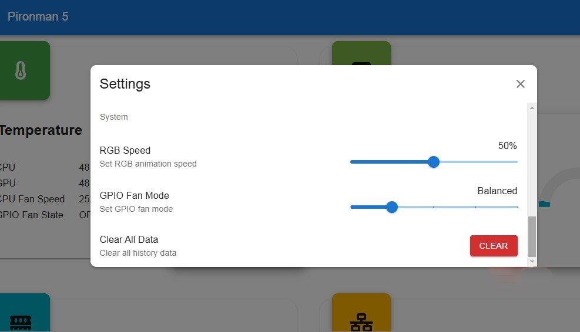

.. note::

    Hola, ¡bienvenido a la comunidad de entusiastas de SunFounder Raspberry Pi, Arduino y ESP32 en Facebook! Profundiza en el mundo de Raspberry Pi, Arduino y ESP32 con otros entusiastas.

    **¿Por qué unirse?**

    - **Soporte experto**: Resuelve problemas postventa y desafíos técnicos con la ayuda de nuestra comunidad y equipo.
    - **Aprender y compartir**: Intercambia consejos y tutoriales para mejorar tus habilidades.
    - **Avances exclusivos**: Accede anticipadamente a los anuncios de nuevos productos y a contenidos exclusivos.
    - **Descuentos especiales**: Disfruta de descuentos exclusivos en nuestros productos más recientes.
    - **Promociones y sorteos festivos**: Participa en sorteos y promociones de temporada.

    👉 ¿Listo para explorar y crear con nosotros? Haz clic en [|link_sf_facebook|] y únete hoy mismo.

.. _view_control_dashboard:

Visualizar y controlar desde el panel de control
====================================================

Una vez que hayas instalado correctamente el módulo ``pironman5``, el servicio ``pironman5.service`` se iniciará automáticamente al reiniciar.

Ahora puedes abrir la página de monitoreo en tu navegador para ver la información de tu Raspberry Pi, configurar las luces RGB y controlar el ventilador, entre otras funciones. El enlace de la página es: ``http://<ip>:34001``.

Esta página incluye **Panel de control**, **Historial**, **Registro** y una sección de **Configuración**.

.. image:: img/dashboard_tab_new.jpg

Panel de control
-------------------

En esta sección encontrarás varias tarjetas para visualizar el estado relevante de tu Raspberry Pi, incluyendo:

* **Ventilador**: Consulta la temperatura de la CPU del Raspberry Pi y la velocidad del ventilador PWM. **Estado del ventilador GPIO** indica el estado de los dos ventiladores RGB laterales. A la temperatura actual, ambos ventiladores RGB están apagados.

  .. image:: img/dashboard_pwm_fan.png
    :width: 90%

* **Almacenamiento**: Muestra la capacidad de almacenamiento del Raspberry Pi, con las particiones del disco y el espacio utilizado y disponible.

  .. image:: img/dashboard_storage.png
    :width: 90%

* **Memoria**: Indica el uso de RAM del Raspberry Pi y el porcentaje utilizado.

  .. image:: img/dashboard_memory.png
    :width: 90%

* **Red**: Muestra el tipo de conexión de red actual, así como las velocidades de carga y descarga.

  .. image:: img/dashboard_network.png
    :width: 90%

* **Procesador**: Ilustra el rendimiento de la CPU del Raspberry Pi, incluyendo el estado de sus cuatro núcleos, las frecuencias de operación y el porcentaje de uso de la CPU.

  .. image:: img/dashboard_processor.png
    :width: 90%

Historial
-----------

La página Historial te permite consultar datos históricos. Selecciona los datos que deseas ver en la barra lateral izquierda, elige un rango de tiempo para visualizarlos y también puedes descargarlos si es necesario.

.. image:: img/dashboard_history1.png
  :width: 90%
  
.. image:: img/dashboard_history2.png
  :width: 90%

Registro
----------

La página de Registro permite visualizar los registros del servicio Pironman5 en ejecución. Este servicio incluye múltiples subservicios, cada uno con su propio registro. Selecciona el registro que deseas consultar para visualizar sus datos.

* Cada registro tiene un tamaño fijo de 10 MB. Cuando se supera este tamaño, se crea un segundo archivo de registro.
* El número de registros para un mismo servicio está limitado a 10. Los registros más antiguos se eliminan automáticamente si se excede este límite.
* Hay herramientas de filtrado disponibles sobre la zona de registros: selección del nivel de registro, filtros por palabras clave y opciones como **Ajuste de línea**, **Desplazamiento automático** y **Actualización automática**.
* También puedes descargar los registros localmente.

.. image:: img/dashboard_log1.png
  :width: 90%
  
.. image:: img/dashboard_log2.png
  :width: 90%

Configuración
----------------

En la esquina superior derecha de la página, encontrarás un menú de configuración donde puedes personalizar los ajustes según tus preferencias. Los cambios se guardan automáticamente. Si lo necesitas, puedes hacer clic en el botón CLEAR en la parte inferior para borrar los datos históricos.

.. image:: img/Dark_mode_and_Temperature.jpg
  :width: 600

* **Modo oscuro**: Alterna entre los temas de modo claro y oscuro. Esta opción se guarda en la caché del navegador. Cambiar de navegador o borrar la caché restablecerá el tema predeterminado (claro).
* **Unidad de temperatura**: Configura la unidad de temperatura que muestra el sistema.

**Sobre la pantalla OLED**

.. image:: img/OLED_Sreens.jpg
  :width: 600

* **Activar OLED**: Activa o desactiva la pantalla OLED.
* **Disco OLED**: Configura el disco de la pantalla OLED.
* **Interfaz de red OLED**:

  * **todo**: Alterna entre mostrar la IP de Ethernet y la IP de Wi-Fi.
  * **eth0**: Muestra solo la IP de Ethernet.
  * **wlan0**: Muestra solo la IP de Wi-Fi.

* **Rotación OLED**: Configura la rotación de la pantalla OLED.

**Sobre las luces RGB**

.. image:: img/RGB_LEDS.jpg
  :width: 600

* **Activar RGB**: Activa o desactiva las luces RGB.
* **Color RGB**: Configura el color de las luces RGB.
* **Brillo RGB**: Ajusta el brillo de las luces RGB mediante un control deslizante.
* **Estilo RGB**: Selecciona el modo de visualización de las luces RGB. Las opciones incluyen **Estático**, **Respiración**, **Flujo**, **Flujo inverso**, **Arco iris**, **Arco iris inverso** y **Ciclo de tonalidad**.

  .. note::

     Si seleccionas el estilo **Arco iris**, **Arco iris inverso** o **Ciclo de tonalidad**, no podrás configurar el color.

* **Velocidad RGB**: Configura la velocidad de los cambios de las luces RGB.

**Sobre los ventiladores RGB**

.. * **LED del ventilador**: Configura los LEDs del ventilador en ON, OFF o SEGUIR.

* **Modo de ventilador**: Configura las condiciones de activación de los dos ventiladores RGB.

    * **Silencioso**: Los ventiladores RGB se activan a 70 °C.
    * **Equilibrado**: Los ventiladores RGB se activan a 67,5 °C.
    * **Fresco**: Los ventiladores RGB se activan a 60 °C.
    * **Rendimiento**: Los ventiladores RGB se activan a 50 °C.
    * **Siempre activo**: Los ventiladores RGB permanecen siempre encendidos.

Por ejemplo, si seleccionas el modo **Rendimiento**, los ventiladores RGB se activarán a 50 °C.

Después de guardar, si la temperatura del CPU supera los 50 °C, el estado **GPIO Fan** cambiará a ON en el panel de control y los ventiladores RGB laterales comenzarán a girar.

.. image:: img/dashboard_rgbfan_on.png
  :width: 300
