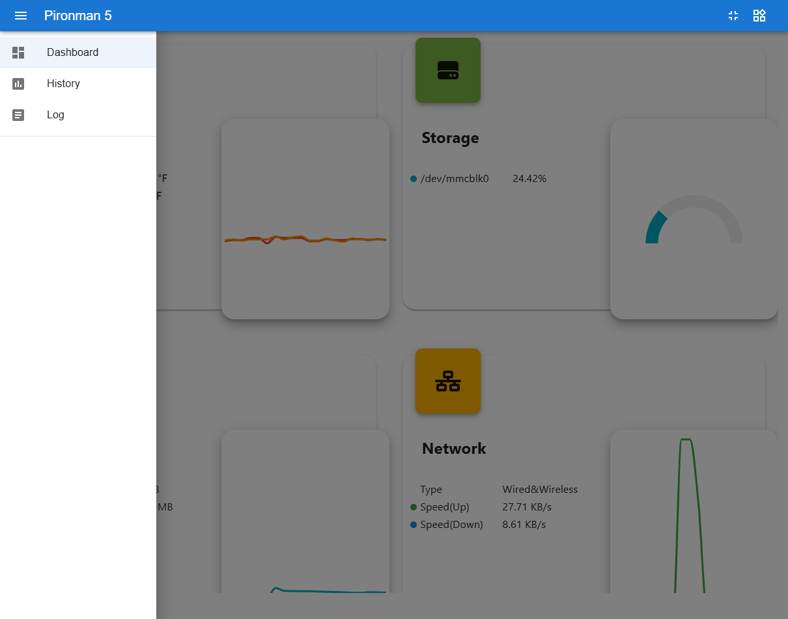
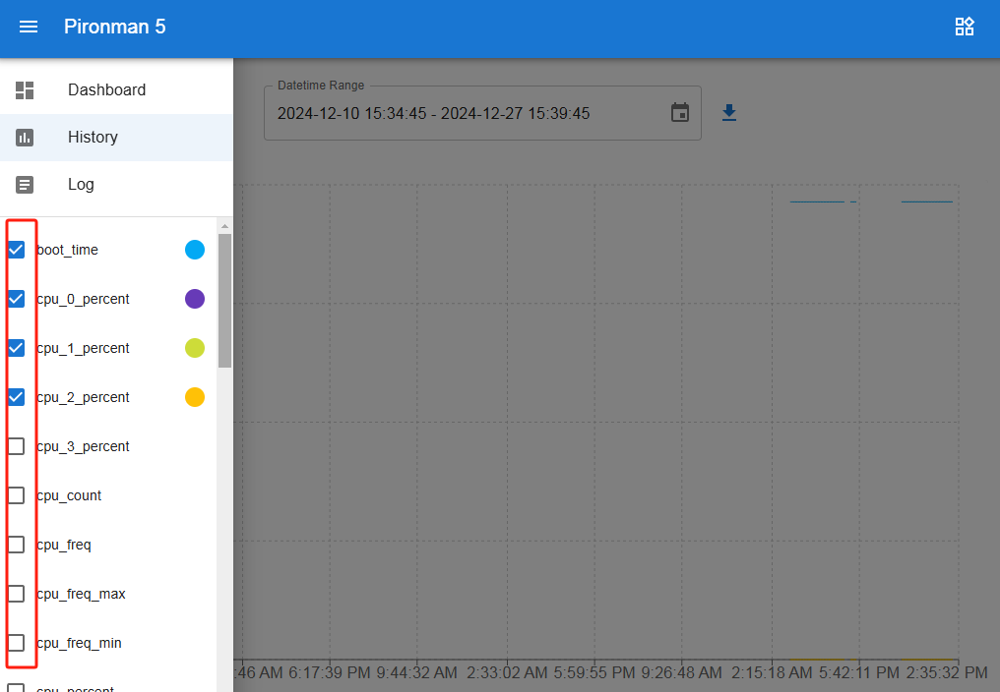
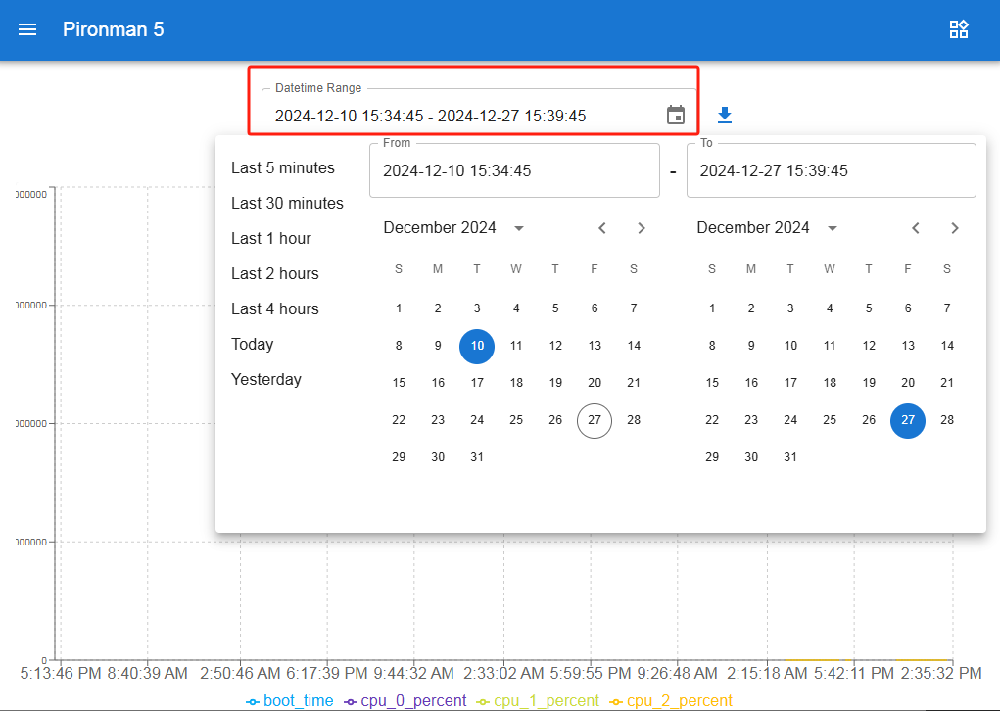
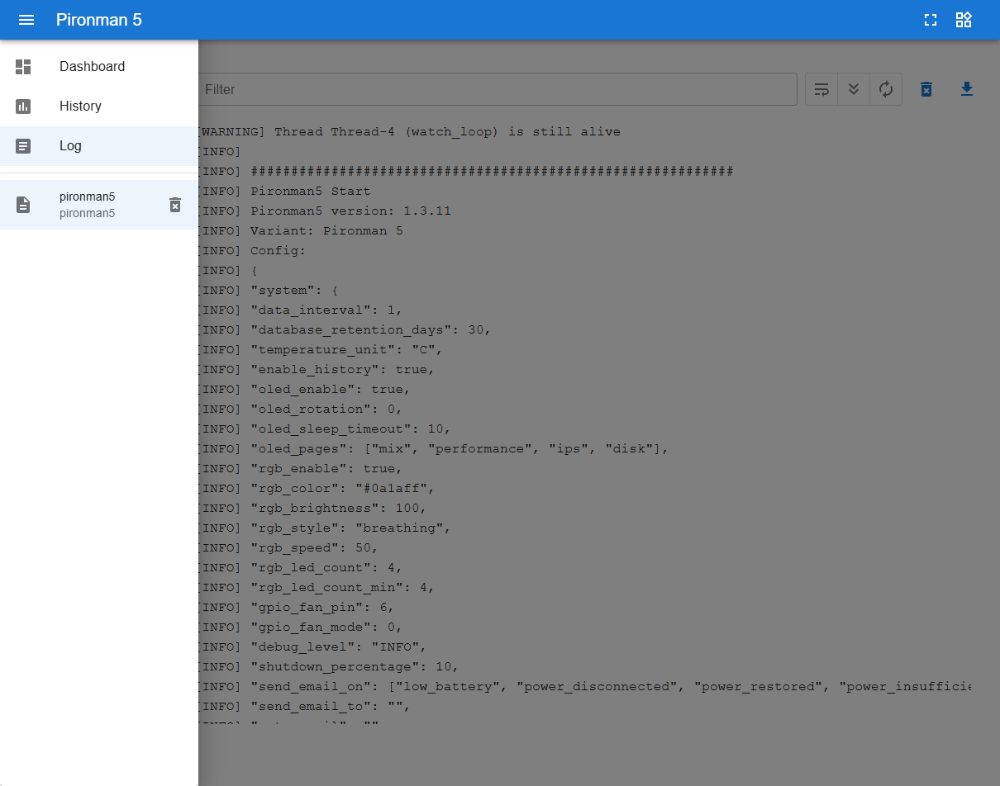

.. include:: /index.rst
   :start-after: start_hello_message
   :end-before: end_hello_message

.. _view_control_dashboard_5:

ダッシュボードでの表示と制御
=========================================

``pironman5`` モジュールが正常にインストールされると、再起動後に ``pironman5.service`` が自動的に起動します。

ブラウザでモニタリングページを開くと、Raspberry Piの情報の表示、RGBの設定、ファンの制御などが行えます。ページのリンクは次の通りです： ``http://<ip>:34001``。

このページには **ダッシュボード**、**履歴**、**ログ**、**設定** ページがあります。

ダッシュボード
-----------------------

Raspberry Piの関連ステータスを表示する複数のカードがあります：

* **温度**：Raspberry PiのCPU/GPU温度とCPUファン速度を表示します。 **GPIOファン状態** は2つのサイドGPIOファンのステータスを示します。

  .. image:: img/dashboard_tem.png
    :width: 90%

* **ストレージ**：Raspberry Piのストレージ容量を表示し、各ディスクパーティションの使用済みおよび利用可能な容量を示します。

  .. image:: img/dashboard_storage.png
    :width: 90%

* **メモリー**：Raspberry PiのRAM使用量とパーセンテージを表示します。

  .. image:: img/dashboard_memory.png
    :width: 90%

* **ネットワーク**：現在のネットワーク接続タイプ、アップロードおよびダウンロード速度を表示します。

  .. image:: img/dashboard_network.png
    :width: 90%

* **プロセッサー**：Raspberry PiのCPU性能を表示します。4つのコアのステータス、動作周波数、CPU使用率を含みます。

  .. image:: img/dashboard_processor.png
    :width: 90%

履歴
--------------

履歴ページでは、過去のデータを表示できます。左側のサイドバーで表示したいデータを選択し、時間範囲を指定してその期間のデータを確認できます。また、クリックしてダウンロードすることもできます。

ログ
------------

ログページには、Pironman5サービスの実行時ログが表示されます。

* ログエントリはレベル（Debug、Info、Warning、Error、Critical）でフィルタリングできます。
* ログファイルをローカルにダウンロードすることもできます。

設定
------------

設定ページでは、ダッシュボードの表示、システム設定、OLEDスクリーン、RGBライティング、ファンの動作をカスタマイズできます。また、MACアドレスやIPアドレスなどの基本ネットワーク情報も表示されます。

.. image:: img/dashboard_setting.png
    :width: 600

* **インターフェース**

  ダッシュボードの外観と表示動作を設定します。

  .. image:: img/dashboard_setting_interface.png
      :width: 600

  * **ダークモード**：ダークテーマの有効/無効を切り替えます。
  * **未マウントディスクを表示**：ストレージカードに未マウントのストレージデバイスを表示します。
  * **全コアを表示**：プロセッサーカードにすべてのCPUコアを表示します。
  * **カードレイアウト**：ダッシュボードのカードレイアウトをカスタマイズします。
  * **温度単位**：摂氏と華氏を切り替えます。
  * **Web UIバージョン**：現在のダッシュボードバージョンを表示します。

* **OLED**

  OLEDスクリーンの表示と動作を設定します。

  .. image:: img/dashboard_setting_oled.png
      :width: 600

  * **OLED有効**：OLEDスクリーンの有効/無効を切り替えます。
  * **OLED回転**：OLED表示を ``0°`` と ``180°`` の間で回転します。
  * **OLEDスリープタイムアウト**：OLEDスクリーンが自動消灯するまでの時間を設定します。
  * **OLEDページ**：OLEDスクリーンに表示するページを設定し、表示順序を調整します。

    利用可能なページ：

    * **IPアドレス**：すべての物理ネットワークインターフェースのIPアドレスを表示します。
    * **ディスク使用量**：すべてのディスクの使用状況を表示します。
    * **パフォーマンスメトリクス**：CPU使用率、CPU温度、RAM使用量、ファン速度を表示します。
    * **システム情報**：CPU使用率、CPU温度、IPアドレスを表示します。

* **RGB**

  RGB LEDのライティング効果と動作を設定します。

  .. image:: img/dashboard_setting_rgb.png
      :width: 600

  * **RGB有効**：RGB LEDの有効/無効を切り替えます。
  * **RGB色**：RGB LEDの色を設定します。
  * **RGB輝度**：RGB LEDの明るさを調整します。
  * **RGBスタイル**：RGBライティング効果を選択します。``None``、``Solid``、``Breathing``、``Flow``、``Flow Reverse``、``Rainbow``、``Rainbow Reverse``、``Hue Cycle`` から選択できます。
  * **RGB速度**：選択したRGBエフェクトのアニメーション速度を調整します。
  * **RGB LED数**：アクティブなRGB LEDの数を設定します。

* **GPIOファン**

  2つのGPIOファンの動作モードを設定します。

  .. image:: img/dashboard_setting_fan.png
      :width: 600

  選択したモードにより、GPIOファンが作動するタイミングが決まります。

  * **静音**：GPIOファンは70°Cで作動します。
  * **バランス**：GPIOファンは67.5°Cで作動します。
  * **冷却**：GPIOファンは60°Cで作動します。
  * **パフォーマンス**：GPIOファンは50°Cで作動します。
  * **常時オン**：GPIOファンは常に作動します。

* **システム**

  システム動作の設定とデバイス情報の表示を行います。

  .. image:: img/dashboard_setting_system.png
      :width: 600

  * **デバッグレベル**：Pironman 5サービスのログレベルを設定します。
  * **MACアドレス**：Raspberry PiのネットワークインターフェースのMACアドレスを表示します。
  * **IPアドレス**：Raspberry PiのネットワークインターフェースのIPアドレスを表示します。
  * **履歴保存期間**：履歴データを保存する日数を設定します。
  * **全データクリア**：記録されたすべての履歴データをクリアします。
  * **再起動**：ダッシュボードからRaspberry Piをリモート再起動します。
  * **シャットダウン**：ダッシュボードからRaspberry Piを安全にリモートシャットダウンします。
