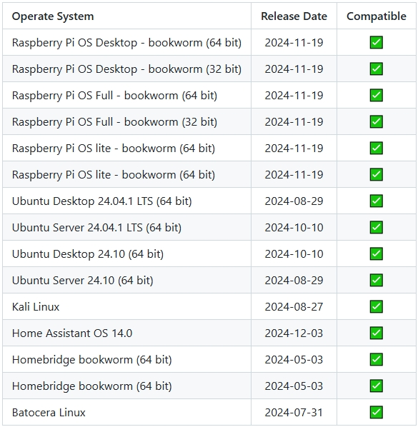
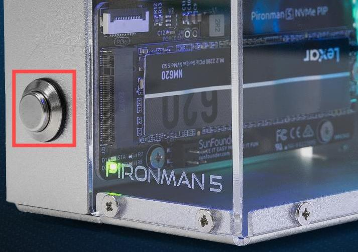

.. note::

    Hello, welcome to the SunFounder Raspberry Pi & Arduino & ESP32 Enthusiasts Community on Facebook! Dive deeper into Raspberry Pi, Arduino, and ESP32 with fellow enthusiasts.

    **Why Join?**

    - **Expert Support**: Solve post-sale issues and technical challenges with help from our community and team.
    - **Learn & Share**: Exchange tips and tutorials to enhance your skills.
    - **Exclusive Previews**: Get early access to new product announcements and sneak peeks.
    - **Special Discounts**: Enjoy exclusive discounts on our newest products.
    - **Festive Promotions and Giveaways**: Take part in giveaways and holiday promotions.

    👉 Ready to explore and create with us? Click [|link_sf_facebook|] and join today!

FAQ
============

1. About Compatible Systems
-------------------------------

Systems that passed the test on the Raspberry Pi 5:

2. About Power Button
--------------------------

The power button brings out the power button of the Raspberry Pi 5, and it functions just like the power button of the Raspberry Pi 5.

* **Shutdown**

  * If you run Raspberry Pi **Raspberry Pi OS Desktop** system, you can press the power button twice in quick succession to shutdown. 
  * If you run Raspberry Pi **Raspberry Pi OS Lite** system, press the power button a single time to initiate a shutdown.
  * To force a hard shutdown, press and hold the power button.

* **Power on**

  * If the Raspberry Pi board is shut down, but still powered, single-press to power on from a shutdown state.

* If you are running a system that does not support a shutdown button, you can hold it for 5 seconds to force a hard shutdown, and single-press to power on from a shutdown state.

3. About Airflow Direction
-------------------------------

The airflow in the Pironman 5 chassis is carefully engineered to maximize cooling efficiency. Cool air enters the case primarily through the GPIO interface and other small openings, ensuring an even intake. It then passes through the Tool Cooler, equipped with a high-performance fan to regulate internal temperatures, and is finally expelled through the two RGB fans on the side panel.

For a detailed demonstration, please refer to the video:

.. raw:: html

    

        <video center loop autoplay muted style="max-width:90%">
            <source src="../_static/video/airflow_direction.mp4"  type="video/mp4">
            Your browser does not support the video tag.
        </video>
    

4. About the Copper Pipe Ends of Tower Cooler
----------------------------------------------------------

The U-shaped heat pipes at the top of the tower cooler are compressed to facilitate the copper pipes passing through the aluminum fins, which is part of the normal production process for copper pipes.

   .. image::  img/tower_cooler1.png

5. About the Raspberry Pi AI HAT+
----------------------------------------------------------

The Raspberry Pi AI HAT+ is not compatible with the Pironman 5.

   .. image::  img/output3.png
        :width: 400

The Raspberry Pi AI Kit combines the Raspberry Pi M.2 HAT+ and the Hailo AI accelerator module.

   .. image::  img/output2.jpg
        :width: 400

You can detach the Hailo AI accelerator module from the Raspberry Pi AI Kit and directly insert it into the NVMe PIP module of the Pironman 5.

   .. image::  img/output4.png
        :width: 800

6. PI5 Fails to Boot (Red LED)?
-------------------------------------------

This issue may be caused by a system update, changes to the boot order, or a corrupted bootloader. You can try the following steps to resolve the problem:

#. Check USB-HDMI Adapter Connection

   * Please carefully check whether the USB-HDMI adapter is securely connected to the PI5.
   * Try unplugging and reconnecting the USB-HDMI adapter.
   * Then reconnect the power supply and check if the PI5 boots successfully.

#. Test PI5 Outside the Case

   * If reconnecting the adapter does not solve the problem:
   * Remove the PI5 from the Pironman 5 case.
   * Power the PI5 directly with the power adapter (without the case).
   * Check if it can boot normally.

#. Restore the Bootloader

   * If the PI5 still cannot boot, the bootloader may be corrupted. You can follow this guide: :ref:`update_bootloader_5` and choose whether to boot from SD card or NVMe/USB.
   * Insert the prepared SD card into the PI5, power it on, and wait at least 10 seconds. Once the recovery is complete, remove and reformat the SD card. 
   * Then, use Raspberry Pi Imager to flash the latest Raspberry Pi OS, insert the card back, and try booting again.

.. 6. Does the Pironman 5 support retro gaming systems?
.. ------------------------------------------------------
.. Yes, it is compatible. However, most retro gaming systems are streamlined versions that cannot install and run additional software. This limitation may cause some components on the Pironman 5, such as the OLED display, the two RGB fans, and the 4 RGB LEDs, to not function properly because these components require the installation of Pironman 5's software packages.

.. .. note::

..    The Batocera.linux system is now fully compatible with Pironman 5. Batocera.linux is an open-source and completely free retro-gaming distribution.

..    * :ref:`install_batocera`
..    * :ref:`set_up_batocera`

7. OLED Screen Not Working?
-----------------------------------

If the OLED screen is not displaying or displaying incorrectly, follow these troubleshooting steps:

#. Ensure the FPC cable of the OLED screen is securely connected. It is recommended to reconnect the OLED screen and then power on the device.  

   .. raw:: html

       

           <video center loop autoplay muted style="max-width:90%">
               <source src="../_static/video/connect_oled_screen.mp4" type="video/mp4">
               Your browser does not support the video tag.
           </video>
       

#. Confirm that the Raspberry Pi is running a compatible operating system. The Pironman 5 only supports the following systems:  

   .. image:: img/compitable_os.png  
      :width: 600  
      :align: center  

   If you have installed an unsupported system, follow the guide to install a compatible OS: :ref:`install_the_os`.

#. When the OLED screen is powered on for the first time, it may only display pixel blocks. You need to follow the instructions in :ref:`set_up_pironman5` to complete the configuration before it can display proper information.

#. Use the following command to check if the OLED's I2C address ``0x3C`` is detected:  

   .. code-block:: shell

      sudo i2cdetect -y 1

   * If the I2C address ``0x3C`` is detected, restart the Pironman 5 service using this command:

     .. code-block:: shell

        sudo systemctl restart pironman5.service

   * Enable I2C if the address is not detected:

     * Edit the configuration file by executing:

       .. code-block:: shell

         sudo nano /boot/firmware/config.txt

     * Add the following line at the end of the file:

       .. code-block:: shell

         dtparam=i2c_arm=on

     * Save the file by pressing ``Ctrl+X``, then ``Y``, and exit. Reboot the Pironman 5 and check if the issue is resolved.

If the problem persists after performing the above steps, please send an email to service@sunfounder.com. We will respond as soon as possible.

8. NVMe PIP Module Not Working?
---------------------------------------

1. Ensure the FPC cable connecting the NVMe PIP module to the Raspberry Pi 5 is securely attached.  

   .. raw:: html

       

           <video center loop autoplay muted style="max-width:90%">
               <source src="../_static/video/connect_nvme_pip1.mp4" type="video/mp4">
               Your browser does not support the video tag.
           </video>
       

   .. raw:: html

       

           <video center loop autoplay muted style="max-width:90%">
               <source src="../_static/video/connect_nvme_pip2.mp4" type="video/mp4">
               Your browser does not support the video tag.
           </video>
       

2. Confirm that your SSD is properly secured to the NVMe PIP module.  

   .. raw:: html

       

           <video center loop autoplay muted style="max-width:90%">
               <source src="../_static/video/connect_ssd.mp4" type="video/mp4">
               Your browser does not support the video tag.
           </video>
       

3. Check the status of the NVMe PIP Module's LEDs:

   After confirming all connections, power on the Pironman 5 and observe the two indicators on the NVMe PIP Module:  

   * **PWR LED**: Should be lit.  
   * **STA LED**: Should blink to indicate normal operation.  

   .. image:: img/nvme_pip_leds.png  

   * If the **PWR LED** is on but the **STA LED** is not blinking, it indicates the NVMe SSD is not recognized by the Raspberry Pi.  
   * If the **PWR LED** is off, short the "Force Enable" pins (J4) on the module. If the **PWR LED** lights up, it could indicate a loose FPC cable or unsupported system configuration for NVMe.

     .. image:: img/nvme_pip_j4.png  

     
4. Confirm that your NVMe SSD has a properly installed operating system. Refer to: :ref:`install_the_os`.

5. If the wiring is correct and the OS is installed, but the NVMe SSD still fails to boot, try booting from a Micro SD card to verify the functionality of other components. Once confirmed, proceed to: :ref:`configure_boot_ssd`.

If the problem persists after performing the above steps, please send an email to service@sunfounder.com. We will respond as soon as possible.

9. RGB LEDs Not Working?
--------------------------

#. The two pins on the IO Expander above J9 are used to connect the RGB LEDs to GPIO10. Ensure that the jumper cap on these two pins are properly in place.

   .. image:: hardware/img/io_board_rgb_pin.png
      :width: 300
      :align: center

#. Verify that the Raspberry Pi is running a compatible operating system. The Pironman 5 only supports the following OS versions:

   .. image:: img/compitable_os.png
      :width: 600
      :align: center

   If you have installed an unsupported OS, follow the guide to install a compatible operating system: :ref:`install_the_os`.

#. Run the command ``sudo raspi-config`` to open the configuration menu. Navigate to **3 Interfacing Options** -> **I3 SPI** -> **YES**, then click **OK** and **Finish** to enable SPI. After enabling SPI, restart the Pironman 5.

If the problem persists after performing the above steps, please send an email to service@sunfounder.com. We will respond as soon as possible.

10. CPU fan not working?
----------------------------------------------

When the CPU temperature has not reached the set threshold, the CPU fan will not working.

**Fan Speed Control Based on Temperature**  

The PWM fan operates dynamically, adjusting its speed according to the Raspberry Pi 5's temperature:  

* **Below 50°C**: Fan remains off (0% speed).  
* **At 50°C**: Fan operates at low speed (30% speed).  
* **At 60°C**: Fan increases to medium speed (50% speed).  
* **At 67.5°C**: Fan ramps up to high speed (70% speed).  
* **At 75°C and above**: Fan operates at full speed (100% speed).  

For more detail please refer to : :ref:`fan`

11. How to disable web dashboard?
------------------------------------------------------

Once you have completed the installation of the ``pironman5`` module, you will be able to access the :ref:`view_control_dashboard`.
      
If you do not need this feature and want to reduce CPU and RAM usage, you can disable the dashboard during the installation of ``pironman5`` by adding the ``--disable-dashboard`` flag.
      
.. code-block:: shell
      
   cd ~/pironman5
   sudo python3 install.py --disable-dashboard
      
If you have already installed ``pironman 5``, you can remove the ``dashboard`` module and ``influxdb``, then restart pironman5 to apply the changes:
      
.. code-block:: shell
      
   /opt/pironman5/env/bin/pip3 uninstall pm-dashboard influxdb
   sudo apt purge influxdb
   sudo systemctl restart pironman5

12. How to Control Components Using the ``pironman5`` Command
----------------------------------------------------------------------
You can refer to the following tutorial to control the components of the Pironman 5 using the ``pironman5`` command.

* :ref:`view_control_commands`

13. How to Change the Raspberry Pi Boot Order Using Commands
-------------------------------------------------------------

If you are already logged into your Raspberry Pi, you can change the boot order using commands. Detailed instructions are as follows:

* :ref:`configure_boot_ssd`

14. How to Modify the Boot Order with Raspberry Pi Imager?
---------------------------------------------------------------

In addition to modifying the ``BOOT_ORDER`` in the EEPROM configuration, you can also use the **Raspberry Pi Imager** to change the boot order of your Raspberry Pi.

It is recommended to use a spare card for this step.

* :ref:`update_bootloader_5`

15. How to Copy the System from the SD Card to an NVMe SSD?
-------------------------------------------------------------

If you have an NVMe SSD but do not have an adapter to connect your NVMe to your computer, you can first install the system on your Micro SD card. Once the Pironman 5 boots up successfully, you can copy the system from your Micro SD card to your NVMe SSD. Detailed instructions are as follows:

* :ref:`copy_sd_to_nvme_rpi`

16. How to Remove the Protective Film from the Acrylic Plates
-----------------------------------------------------------------

Two acrylic panels are included in the package, both covered with yellow/transparent protective film on both sides to prevent scratches. The protective film may be a bit difficult to remove. Use a screwdriver to gently scrape at the corners, then carefully peel off the entire film.

.. _openssh_powershell:

17. How to Install OpenSSH via Powershell?
----------------------------------------------

When you use ``ssh <username>@<hostname>.local`` (or ``ssh <username>@<IP address>``) to connect to your Raspberry Pi, but the following error message appears.

    .. code-block::

        ssh: The term 'ssh' is not recognized as the name of a cmdlet, function, script file, or operable program. Check the
        spelling of the name, or if a path was included, verify that the path is correct and try again.

It means your computer system is too old and does not have `OpenSSH <https://learn.microsoft.com/en-us/windows-server/administration/openssh/openssh_install_firstuse?tabs=gui>`_ pre-installed, you need to follow the tutorial below to install it manually.

#. Type ``powershell`` in the search box of your Windows desktop, right click on the ``Windows PowerShell``, and select ``Run as administrator`` from the menu that appears.

   .. image:: img/powershell_ssh.png
      :width: 90%
      

#. Use the following command to install ``OpenSSH.Client``.

   .. code-block::

        Add-WindowsCapability -Online -Name OpenSSH.Client~~~~0.0.1.0

#. After installation, the following output will be returned.

   .. code-block::

        Path          :
        Online        : True
        RestartNeeded : False

#. Verify the installation by using the following command.

   .. code-block::

        Get-WindowsCapability -Online | Where-Object Name -like 'OpenSSH*'

#. It now tells you that ``OpenSSH.Client`` has been successfully installed.

   .. code-block::

        Name  : OpenSSH.Client~~~~0.0.1.0
        State : Installed

        Name  : OpenSSH.Server~~~~0.0.1.0
        State : NotPresent

   .. warning:: 

        If the above prompt does not appear, it means that your Windows system is still too old, and you are advised to install a third-party SSH tool, like |link_putty|.

6. Now restart PowerShell and continue to run it as administrator. At this point you will be able to log in to your Raspberry Pi using the ``ssh`` command, where you will be prompted to enter the password you set up earlier.

   .. image:: img/powershell_login.png

.. 18. Why does the OLED screen turn off automatically?
.. ---------------------------------------------------------------------------------

.. To save power and extend the screen’s lifespan, the OLED screen will automatically turn off after a period of inactivity. This is part of the normal design and does not affect the product’s functionality.

.. Simply press the button on the device once to wake up the OLED screen and resume display.

.. .. note::

..    For OLED Screen configuration (such as turn ON/OFF, sleeptime, rotation, etc), please refer to: :ref:`view_control_dashboard` or :ref:`view_control_commands`.
