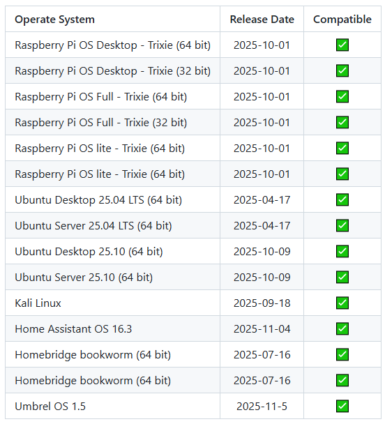
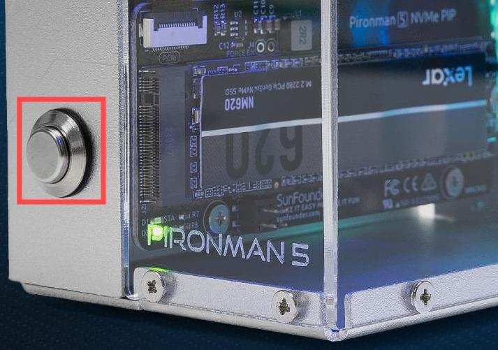
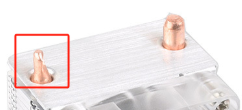
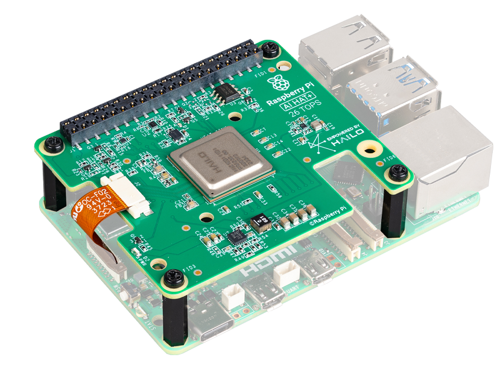
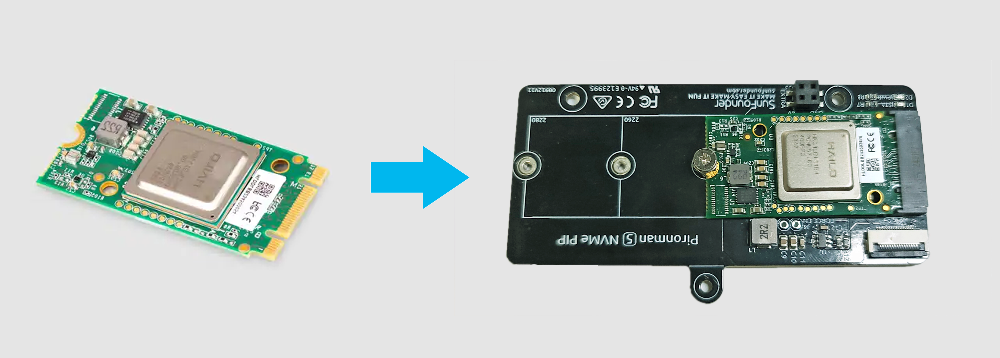
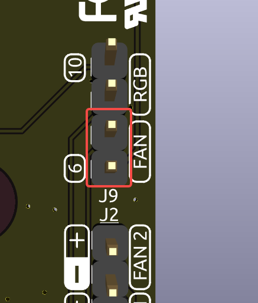

.. include:: /index.rst
   :start-after: start_hello_message
   :end-before: end_hello_message

FAQ
============

Dépannage rapide
-------------------------------

* L'écran OLED ne fonctionne pas → :ref:`faq_oled_5`
* Les LED RGB ne fonctionnent pas → :ref:`faq_rgb_5`
* Les ventilateurs GPIO ne fonctionnent pas → :ref:`faq_gpio_fans_5`
* Le ventilateur CPU ne tourne pas → :ref:`faq_pwm_fan_5`
* Le tableau de bord n'affiche aucune donnée → :ref:`faq_dashboard_5`
* Le SSD NVMe n'est pas détecté → :ref:`faq_nvme_5`

1. Matériel
-------------------------------

.. _compatible_systems_5:

Systèmes compatibles
^^^^^^^^^^^^^^^^^^^^^^^^^^^^

.. start_faq_com_os

Systèmes validés pour le Raspberry Pi 5 :

.. end_faq_com_os

Bouton d'alimentation
^^^^^^^^^^^^^^^^^^^^^^^^^^^^

.. |link_safe_shutdown| replace:: :ref:`safe_shutdown_5`

.. start_faq_power_button

Le bouton d'alimentation étend le bouton d'alimentation d'origine du Raspberry Pi 5 et se comporte de manière similaire.

* Appui bref : Allumer / réveiller l'OLED / changer de page OLED.
* Maintenir 2 secondes : Arrêt sécurisé (nécessite |link_safe_shutdown|).
* Maintenir 5 secondes : Arrêt forcé.

.. end_faq_power_button

Direction du flux d'air
^^^^^^^^^^^^^^^^^^^^^^^^^^^^

.. start_faq_airflow_direction

Le flux d'air à l'intérieur du Pironman 5 est conçu pour maximiser l'efficacité du refroidissement. L'air frais entre par l'ouverture GPIO et d'autres évents, traverse le refroidisseur tour et est évacué par les deux ventilateurs GPIO latéraux.

Pour une démonstration détaillée, consultez la vidéo suivante :

.. raw:: html

    

        <video center loop autoplay muted style="max-width:90%">
            <source src="../_static/video/airflow_direction.mp4"  type="video/mp4">
            Votre navigateur ne prend pas en charge la balise vidéo.
        </video>
    

.. end_faq_airflow_direction

Extrémités des caloducs en cuivre du refroidisseur tour
^^^^^^^^^^^^^^^^^^^^^^^^^^^^^^^^^^^^^^^^^^^^^^^^^^^^^^^^^^^^^^^^^^^^

.. start_faq_copper_pipe_ends

Les extrémités aplaties des caloducs en cuivre en forme de U font partie du processus de fabrication normal et sont conçues pour permettre aux caloducs de traverser les ailettes en aluminium.

.. end_faq_copper_pipe_ends

Raspberry Pi AI HAT+
^^^^^^^^^^^^^^^^^^^^^^^^^^^^

.. start_faq_ai_hat

Le Raspberry Pi AI HAT+ n'est pas compatible avec le Pironman 5.

Le kit Raspberry Pi AI combine le Raspberry Pi M.2 HAT+ et le module accélérateur IA Hailo.

.. image:: img/output2.jpg
    :width: 400

Vous pouvez détacher le module accélérateur IA Hailo du kit Raspberry Pi AI et l'insérer directement dans le module NVMe PIP du Pironman 5.

.. end_faq_ai_hat

2. Refroidissement et ventilateurs
------------------------------------------------

.. _faq_pwm_fan_5:

Le ventilateur CPU ne tourne pas ?
^^^^^^^^^^^^^^^^^^^^^^^^^^^^^^^^^^^^

.. start_faq_pwm_fan

Le ventilateur CPU du Pironman 5 est contrôlé par le système Raspberry Pi. La vitesse du ventilateur CPU dépend de la température du CPU du Raspberry Pi 5.

Courbe par défaut du ventilateur CPU :

* < 50°C : Arrêt (0 %)
* 50°C+ : Vitesse basse (30 %)
* 60°C+ : Vitesse moyenne (50 %)
* 67,5°C+ : Vitesse élevée (70 %)
* 75°C+ : Pleine vitesse (100 %)

Vérifiez la température actuelle du CPU (exemple de sortie : ``temp=48.7'C``) :

.. code-block:: shell

   vcgencmd measure_temp

Vous pouvez contrôler manuellement le ventilateur CPU avec les commandes suivantes :

.. code-block:: shell

   pinctrl FAN_PWM op dl   # Activer le ventilateur (actif bas)
   pinctrl FAN_PWM op dh   # Désactiver le ventilateur (actif haut)
   pinctrl FAN_PWM a0      # Mode automatique

Vous pouvez également ajuster les seuils de température du ventilateur CPU en modifiant :

.. code-block:: shell

   nano /boot/firmware/config.txt

Ajoutez :

.. code-block:: text

   dtparam=cooling_fan=on
   dtparam=fan_temp0=40000
   dtparam=fan_temp0_hyst=10000
   dtparam=fan_temp0_speed=125

Cette configuration démarre le ventilateur CPU à 40°C avec un niveau de vitesse PWM de 125.

Après avoir enregistré le fichier, redémarrez le Raspberry Pi pour appliquer les modifications.

.. end_faq_pwm_fan

.. _faq_gpio_fans_5:

Les ventilateurs GPIO ne tournent pas ?
^^^^^^^^^^^^^^^^^^^^^^^^^^^^^^^^^^^^^^^^^^^^^^^^^^^

.. start_faq_gpio_fans

Tout d'abord, vérifiez si le cavalier FAN sur la carte IO Expander est correctement installé.

Ensuite, réglez les ventilateurs GPIO en mode ``Toujours activé`` et vérifiez s'ils commencent à tourner.

.. code-block:: shell

   sudo pironman5 -gm 0

Vous pouvez également connecter les ventilateurs GPIO directement aux broches ``5V`` et ``GND`` du Raspberry Pi pour les tester.

Si les ventilateurs tournent normalement lorsqu'ils sont connectés directement, le problème peut provenir de la carte IO Expander. Veuillez nous contacter pour une assistance supplémentaire.

Si le problème persiste, ouvrez la page **Log** du tableau de bord et vérifiez les messages d'erreur. Vous pouvez également nous envoyer le fichier journal suivant :

.. code-block:: shell

   cat /var/log/pironman5/pironman5.log

.. end_faq_gpio_fans

3. OLED et RGB
-------------------------------

.. _faq_oled_5:

L'écran OLED ne fonctionne pas ?
^^^^^^^^^^^^^^^^^^^^^^^^^^^^^^^^^^^^

.. |link_set_up_pironman5| replace:: :ref:`set_up_pironman5_5`
.. |link_compatible_systems| replace:: :ref:`compatible_systems_5`

.. start_faq_oled

Si l'écran OLED ne s'affiche pas ou s'affiche incorrectement, suivez ces étapes de dépannage :

#. Assurez-vous que le câble FPC de l'écran OLED est bien connecté. Il est recommandé de reconnecter l'écran OLED, puis de mettre l'appareil sous tension.

   .. raw:: html

       

           <video center loop autoplay muted style="max-width:90%">
               <source src="../_static/video/connect_oled_screen.mp4" type="video/mp4">
               Votre navigateur ne prend pas en charge la balise vidéo.
           </video>
       

#. Vérifiez que le Raspberry Pi exécute un système d'exploitation compatible.

   Voir |link_compatible_systems|.

#. Lors de la première mise sous tension, l'écran OLED peut n'afficher que des blocs de pixels. Vous devez suivre les instructions de |link_set_up_pironman5| pour terminer la configuration avant qu'il puisse afficher des informations correctes.

#. Utilisez la commande suivante pour vérifier si l'adresse I2C ``0x3C`` de l'OLED est détectée :

   .. code-block:: shell

      sudo i2cdetect -y 1

   * Si l'adresse I2C ``0x3C`` est détectée, redémarrez le service Pironman 5 :

     .. code-block:: shell

        sudo systemctl restart pironman5.service

   * Si l'adresse n'est pas détectée, activez I2C :

     .. code-block:: shell

        sudo nano /boot/firmware/config.txt

     Ajoutez :

     .. code-block:: shell

        dtparam=i2c_arm=on

     Enregistrez le fichier et redémarrez le Raspberry Pi.

#. Si le problème persiste, veuillez nous envoyer le fichier journal suivant :

   .. code-block:: shell

      cat /var/log/pironman5/pironman5.log

.. end_faq_oled

.. _faq_rgb_5:

Les LED RGB ne fonctionnent pas ?
^^^^^^^^^^^^^^^^^^^^^^^^^^^^^^^^^^^^

.. start_faq_rgb

#. Les deux broches sur l'IO Expander au-dessus de J9 sont utilisées pour connecter les LED RGB à GPIO10. Vérifiez que le cavalier sur ces deux broches est correctement installé.

   .. image:: hardware/img/io_board_rgb_pin.png
      :width: 300
      :align: center

#. Vérifiez que le Raspberry Pi exécute un système d'exploitation compatible.

   Voir |link_compatible_systems|.

#. Exécutez la commande suivante pour activer SPI :

   .. code-block:: shell

      sudo raspi-config

   Naviguez vers :

   ``3 Options d'interface`` → ``I3 SPI`` → ``OUI``

   Puis redémarrez le Raspberry Pi.

#. Si le problème persiste, veuillez nous envoyer le fichier journal suivant :

   .. code-block:: shell

      cat /var/log/pironman5/pironman5.log

.. end_faq_rgb

.. _faq_customize_oled_5:

Comment personnaliser l'affichage OLED ?
^^^^^^^^^^^^^^^^^^^^^^^^^^^^^^^^^^^^^^^^^^^^

.. start_faq_customize_oled

Si vous souhaitez personnaliser l'affichage OLED, par exemple en ajoutant des affichages d'images personnalisés de 2 à 4 chiffres, vous pouvez modifier les fichiers de page OLED de l'une des manières suivantes.

* **Méthode 1 : Modifier directement les fichiers installés**

  #. Listez les fichiers de page OLED :

     .. code-block:: shell

        ls /opt/pironman5/venv/lib/python3.13/site-packages/pm_auto/addons/oled/pages/

  #. Modifiez les fichiers Python souhaités.

  #. Redémarrez le service pour appliquer les modifications :

     .. code-block:: shell

        sudo systemctl restart pironman5.service

* **Méthode 2 : Cloner et réinstaller ``pm_auto``**

  #. Clonez le dépôt ``pm_auto`` :

     .. code-block:: shell

        git clone -b 1.4.x https://github.com/sunfounder/pm_auto/

  #. Après avoir apporté des modifications, réinstallez le paquet modifié :

     .. code-block:: shell

        sudo /opt/pironman5/venv/bin/pip3 uninstall pm_auto -y && \
        sudo /opt/pironman5/venv/bin/pip3 install ~/pm_auto --no-build-isolation && \
        sudo chown -R pironman5:pironman5 /opt/pironman5

  #. Redémarrez le service :

     .. code-block:: shell

        sudo systemctl restart pironman5.service

* **Test et débogage**

  Pour afficher les journaux d'exécution :

  .. code-block:: shell

     journalctl -xefu pironman5.service

  Vous pouvez également arrêter le service et l'exécuter manuellement pour des tests plus rapides :

  .. code-block:: shell

     sudo systemctl stop pironman5.service
     sudo systemctl restart pironman5.service

.. end_faq_customize_oled

4. Tableau de bord et logiciel
-------------------------------

.. _faq_dashboard_5:

Le tableau de bord n'affiche aucune donnée
^^^^^^^^^^^^^^^^^^^^^^^^^^^^^^^^^^^^^^^^^^^^

.. start_faq_dashboard

Si le tableau de bord n'affiche aucune donnée, ouvrez d'abord la page **Log** du tableau de bord et vérifiez s'il y a des messages d'erreur liés à ``influxdb``.

Les erreurs courantes incluent :

* ``database not found``
* ``failed to connect to influxdb``
* ``connection refused``
* ``timeout``

Vous pouvez essayer les étapes suivantes pour résoudre le problème.

#. Videz le cache de votre navigateur ou rouvrez la page du tableau de bord en mode **Navigation privée**.

#. Vérifiez si les services suivants fonctionnent correctement :

   .. code-block:: shell

      sudo systemctl status pironman5 --no-pager
      sudo systemctl status influxdb --no-pager

   Les deux services doivent afficher :

   .. code-block:: text

      active (running)

#. Si l'un des services ne fonctionne pas correctement, redémarrez-les :

   .. code-block:: shell

      sudo systemctl restart influxdb
      sudo systemctl restart pironman5

   Attendez ensuite environ 30 secondes et actualisez la page du tableau de bord.

#. Vérifiez si la base de données ``pironman5`` existe :

   .. code-block:: shell

      influx

   Puis exécutez :

   .. code-block:: text

      SHOW DATABASES;

   Vous devriez voir :

   .. code-block:: text

      pironman5
      _internal

#. Si la base de données est manquante ou corrompue, essayez d'effacer les données historiques du tableau de bord via :

   ``Paramètres → Effacer toutes les données``

#. Si le problème persiste après avoir essayé toutes les étapes ci-dessus, nous vous recommandons de réinstaller le Raspberry Pi OS et le logiciel Pironman 5.

.. end_faq_dashboard

Comment désactiver le tableau de bord web
^^^^^^^^^^^^^^^^^^^^^^^^^^^^^^^^^^^^^^^^^^^^

.. |link_view_control_dashboard| replace:: :ref:`view_control_dashboard_5`

.. start_faq_disable_dashboard

Une fois l'installation du module ``pironman5`` terminée, vous pourrez accéder au |link_view_control_dashboard|.

Si vous n'avez pas besoin de cette fonctionnalité et souhaitez réduire l'utilisation du CPU et de la RAM, vous pouvez désactiver le tableau de bord lors de l'installation en ajoutant l'option ``--disable-dashboard``.

.. code-block:: shell

   cd ~/pironman5
   sudo python3 install.py --disable-dashboard

Si vous avez déjà installé ``pironman5``, vous pouvez supprimer le module Dashboard et ``influxdb`` :

.. code-block:: shell

   /opt/pironman5/env/bin/pip3 uninstall pm-dashboard influxdb
   sudo apt purge influxdb
   sudo systemctl restart pironman5

.. end_faq_disable_dashboard

Comment désinstaller et réinstaller le logiciel Pironman 5
^^^^^^^^^^^^^^^^^^^^^^^^^^^^^^^^^^^^^^^^^^^^^^^^^^^^^^^^^^^^^^

.. start_faq_reinstall_pironman5

#. Désinstallez le logiciel ``pironman5`` actuel :

   .. code-block:: shell

      cd ~/pironman5
      sudo python3 install.py --uninstall

#. Redémarrez le Raspberry Pi comme demandé, puis supprimez le répertoire ``pironman5`` :

   .. code-block:: shell

      cd ~/
      sudo rm -rf pironman5

#. Exécutez la commande suivante pour réinstaller le logiciel pour votre modèle Pironman 5 :

   .. code-block:: shell

      curl -sSL "https://raw.githubusercontent.com/sunfounder/sunfounder-installer-scripts/main/pironman5/install.sh" | sudo bash

.. end_faq_reinstall_pironman5

Comment contrôler les composants avec la commande ``pironman5``
^^^^^^^^^^^^^^^^^^^^^^^^^^^^^^^^^^^^^^^^^^^^^^^^^^^^^^^^^^^^^^^^^^^^^

.. |link_view_control_commands| replace:: :ref:`view_control_commands_5`

.. start_faq_pironman5_command

Vous pouvez vous référer au tutoriel suivant pour contrôler les composants de la série Pironman 5 à l'aide de la commande ``pironman5``.

* |link_view_control_commands|

.. end_faq_pironman5_command

5. Démarrage et stockage
-------------------------------

Le PI5 ne démarre pas (LED rouge) ?
^^^^^^^^^^^^^^^^^^^^^^^^^^^^^^^^^^^^

.. |link_update_bootloader| replace:: :ref:`update_bootloader_5`

.. start_faq_pi5_boot_fail

Ce problème peut être causé par une mise à jour système, des modifications de l'ordre de démarrage ou un bootloader corrompu. Vous pouvez essayer les étapes suivantes pour résoudre le problème :

#. Vérifiez la connexion de l'adaptateur USB-HDMI

   * Vérifiez soigneusement si l'adaptateur USB-HDMI est bien connecté au PI5.
   * Essayez de débrancher et de rebrancher l'adaptateur USB-HDMI.
   * Reconnectez ensuite l'alimentation et vérifiez si le PI5 démarre correctement.

#. Testez le PI5 hors du boîtier

   * Si reconnecter l'adaptateur ne résout pas le problème :
   * Retirez le PI5 du boîtier de la série Pironman 5.
   * Alimentez le PI5 directement avec l'adaptateur secteur (sans le boîtier).
   * Vérifiez s'il peut démarrer normalement.

#. Restaurez le bootloader

   * Si le PI5 ne démarre toujours pas, le bootloader est peut-être corrompu. Suivez ce guide : |link_update_bootloader| et choisissez de démarrer depuis la carte SD ou NVMe/USB.
   * Insérez la carte SD préparée dans le PI5, mettez-le sous tension et attendez au moins 10 secondes. Une fois la récupération terminée, retirez et reformatez la carte SD.
   * Utilisez ensuite Raspberry Pi Imager pour flasher le dernier Raspberry Pi OS et essayez de démarrer à nouveau.

.. end_faq_pi5_boot_fail

.. _faq_nvme_5:

Le module NVMe PIP ne fonctionne pas ?
^^^^^^^^^^^^^^^^^^^^^^^^^^^^^^^^^^^^^^^^^^^^^^^^^^^^

.. |link_install_the_os| replace:: :ref:`install_the_os_5`
.. |link_configure_boot_ssd| replace:: :ref:`configure_boot_ssd_5`

.. start_faq_nvme_pip

#. Assurez-vous que le câble FPC reliant le module NVMe PIP au Raspberry Pi 5 est bien fixé.

   .. raw:: html

       

           <video center loop autoplay muted style="max-width:90%">
               <source src="../_static/video/connect_nvme_pip1.mp4" type="video/mp4">
               Votre navigateur ne prend pas en charge la balise vidéo.
           </video>
       

   .. raw:: html

       

           <video center loop autoplay muted style="max-width:90%">
               <source src="../_static/video/connect_nvme_pip2.mp4" type="video/mp4">
               Votre navigateur ne prend pas en charge la balise vidéo.
           </video>
       

#. Vérifiez que votre SSD est correctement fixé au module NVMe PIP.

   .. raw:: html

       

           <video center loop autoplay muted style="max-width:90%">
               <source src="../_static/video/connect_ssd.mp4" type="video/mp4">
               Votre navigateur ne prend pas en charge la balise vidéo.
           </video>
       

#. Vérifiez l'état des LED du module NVMe PIP :

   * **LED PWR** : Doit être allumée.
   * **LED STA** : Doit clignoter pendant le fonctionnement normal.

   .. image:: img/nvme_pip_leds.png

   * Si la **LED PWR** est allumée mais que la **LED STA** ne clignote pas, le SSD NVMe n'est pas reconnu.
   * Si la **LED PWR** est éteinte, court-circuitez les broches ``Force Enable`` (J4).

     .. image:: img/nvme_pip_j4.png

#. Vérifiez que votre SSD NVMe contient un système d'exploitation valide.

   Voir |link_install_the_os|.

#. Si le SSD ne démarre toujours pas, essayez de démarrer d'abord depuis une carte Micro SD, puis configurez le démarrage NVMe :

   * |link_configure_boot_ssd|

#. Si le problème persiste, veuillez nous envoyer le fichier journal suivant :

   .. code-block:: shell

      cat /var/log/pironman5/pironman5.log

.. end_faq_nvme_pip

Comment modifier l'ordre de démarrage du Raspberry Pi avec des commandes
^^^^^^^^^^^^^^^^^^^^^^^^^^^^^^^^^^^^^^^^^^^^^^^^^^^^^^^^^^^^^^^^^^^^^^^^^^^^

.. start_faq_boot_order_command

Si vous êtes déjà connecté à votre Raspberry Pi, vous pouvez modifier l'ordre de démarrage à l'aide de commandes.

* |link_configure_boot_ssd|

.. end_faq_boot_order_command

Comment modifier l'ordre de démarrage avec Raspberry Pi Imager
^^^^^^^^^^^^^^^^^^^^^^^^^^^^^^^^^^^^^^^^^^^^^^^^^^^^^^^^^^^^^^^^^^^^^^

.. start_faq_boot_order_imager

En plus de modifier ``BOOT_ORDER`` dans la configuration EEPROM, vous pouvez également utiliser Raspberry Pi Imager pour changer l'ordre de démarrage.

* |link_update_bootloader|

.. end_faq_boot_order_imager

Comment copier le système de la carte SD vers un SSD NVMe
^^^^^^^^^^^^^^^^^^^^^^^^^^^^^^^^^^^^^^^^^^^^^^^^^^^^^^^^^^^^^^

.. |link_copy_sd_to_nvme| replace:: :ref:`copy_sd_to_nvme_5`

.. start_faq_copy_sd_to_nvme

Si vous ne disposez pas d'un adaptateur NVMe vers USB, vous pouvez d'abord installer le système sur une carte Micro SD, puis copier le système sur le SSD NVMe après avoir démarré avec succès.

* |link_copy_sd_to_nvme|

.. end_faq_copy_sd_to_nvme

6. Utilisation avancée
-------------------------------

Comment retirer le film protecteur
^^^^^^^^^^^^^^^^^^^^^^^^^^^^^^^^^^^^

.. start_faq_remove_film

Deux panneaux en acrylique sont inclus dans l'emballage, tous deux recouverts d'un film protecteur jaune/transparent des deux côtés pour éviter les rayures.

Le film protecteur peut être difficile à retirer. Utilisez un tournevis pour soulever délicatement un coin, puis décollez soigneusement l'intégralité du film.

.. end_faq_remove_film
