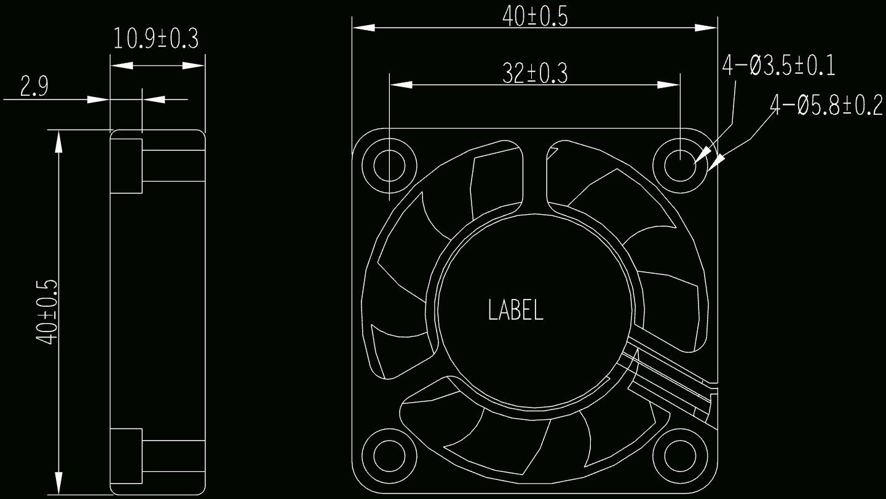
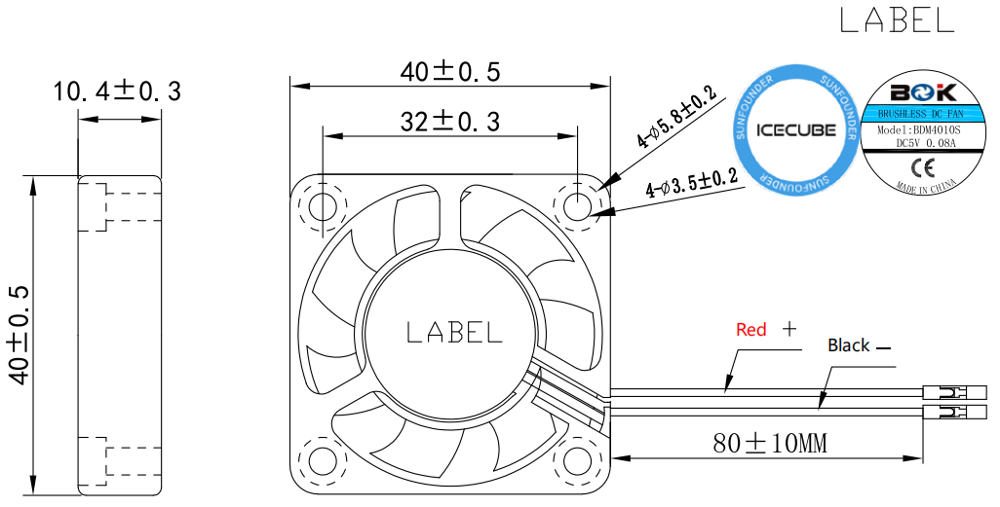

.. _fan:

风扇
============

PWM 风扇
-----------------

Pironman 5 所搭载的 PWM 风扇由 Raspberry Pi 系统控制，是其智能散热解决方案的核心，特别适用于高负载运行场景。该系统将主 PWM 风扇与两颗辅助 RGB 风扇协同工作，提升整体散热性能，并与 Raspberry Pi 5 的热管理系统深度集成。

**电气参数**

* **额定电压**：5 VDC  
* **启动电压**：4.0 V（在 25°C 下，电源开启/关闭）  
* **工作电压范围**：4.0 ~ 5.5 VDC  
* **额定电流**：0.05 A / 最大 0.08 A  
* **额定功率**：0.25 W / 最大 0.40 W  
* **额定转速**：3500±10% RPM（在 25°C 条件下，运行 3 分钟后测试）  
* **最大风量**：2.46 CFM（最小值 2.21 CFM，静压为零时）  
* **最大静压**：0.62 mmH2O（最小值 0.496 mmH2O，风量为零时）  
* **噪音水平**：22.31 dB(A)，最大值 25.31 dB(A)  
* **预期寿命**：40,000 小时（在 25°C、65% 湿度、常温环境下）

**机械参数**

* **尺寸**：40 × 10.4 × 40 mm（长 × 宽 × 高）  
* **外壳材质**：PBT 工程塑料  
* **风叶材质**：PBT 工程塑料  
* **轴承类型**：液压轴承  

**环境参数**

* **工作温度**：-10°C ~ 70°C  
* **储存温度**：-40°C ~ 75°C  
* **工作湿度**：5% ~ 90% RH  
* **储存湿度**：5% ~ 95% RH  

**基于温度的风扇转速控制**

PWM 风扇会根据 Raspberry Pi 5 的实时温度自动调节转速：

* **低于 50°C**：风扇关闭（0% 转速）  
* **达到 50°C**：风扇低速运行（30% 转速）  
* **达到 60°C**：风扇中速运行（50% 转速）  
* **达到 67.5°C**：风扇高速运行（70% 转速）  
* **达到或超过 75°C**：风扇全速运行（100% 转速）

该温控策略设有 5°C 的滞后阈值，以避免风扇频繁启停。例如，风扇仅在温度低于相应阈值 5°C 后才会降低转速。

您可以通过以下命令查看 PWM 风扇的当前状态：

.. code-block:: shell

  cat /sys/class/thermal/cooling_device0/cur_state

RGB 风扇
-------------------

* **外形尺寸**：40 × 40 × 10 mm  
* **重量**：13.5±5g / 个  
* **寿命**：40,000 小时（室温 25°C 条件下）  
* **最大风量**：2.46 CFM  
* **最大静压**：0.62 mm-H2O  
* **噪音等级**：22.31 dBA  
* **额定输入功率**：5V / 0.1A  
* **额定转速**：3500±10% RPM  
* **工作温度范围**：-10℃ ~ +70℃  
* **储存温度范围**：-30℃ ~ +85℃

