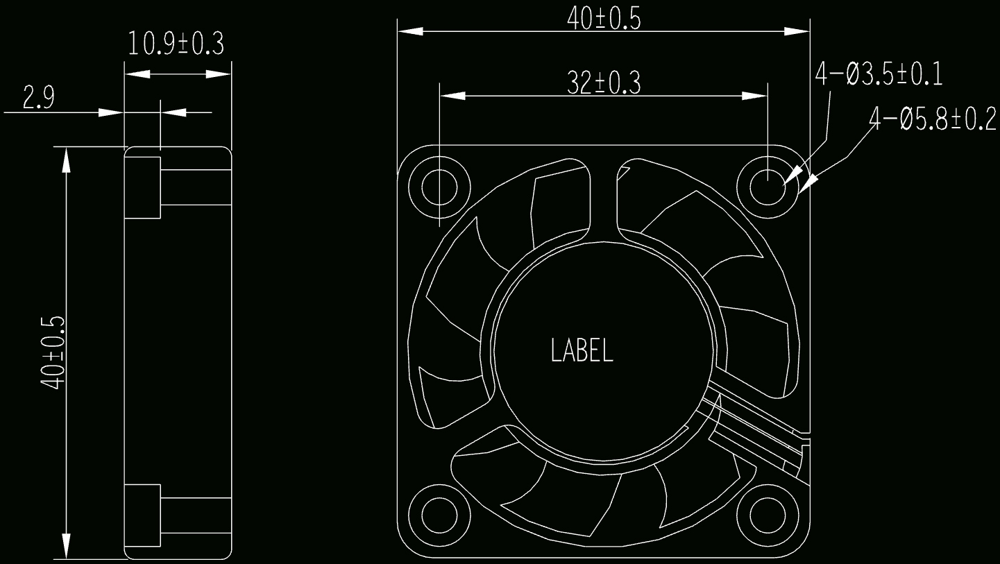

.. include:: /index.rst
   :start-after: start_hello_message
   :end-before: end_hello_message

.. _fans:

Ventilateurs
================

Ventilateur du CPU
------------------

Le Ventilateur du CPU dans le Pironman 5 est géré par le système Raspberry Pi et constitue la pierre angulaire de sa solution de refroidissement intelligent, notamment sous forte charge. Ce système combine un Ventilateur du CPU principal avec deux Ventilateurs GPIO supplémentaires pour améliorer les performances de refroidissement, étroitement intégrés au système de gestion thermique du Raspberry Pi 5.  

**Caractéristiques électriques**

* **Tension nominale** : 5 VDC  
* **Tension de démarrage** : 4,0 V (à 25°C, Marche/Arrêt)  
* **Plage de tension de fonctionnement** : 4,0 ~ 5,5 VDC  
* **Courant nominal** : 0,05 A / MAX. 0,08 A  
* **Puissance nominale** : 0,25 W / MAX. 0,40 W  
* **Vitesse nominale** : 3500±10% RPM (à 25°C, testée après 3 minutes de fonctionnement)  
* **Débit d'air maximal** : 2,46 (MIN. 2,21) CFM (à pression statique nulle)  
* **Pression statique maximale** : 0,62 (MIN. 0,496) mmH2O (à débit d'air nul)  
* **Bruit acoustique** : 22,31 dB(A) MAX. 25,31 dB(A)  
* **Durée de vie** : 40 000 heures (à 25°C, 65% d'humidité, conditions normales de la pièce)  

**Caractéristiques mécaniques**

* **Dimensions** : 40x10,4x40 mm (LxLxH)  
* **Matériau du cadre** : Plastique PBT  
* **Matériau de l'hélice** : Plastique PBT  
* **Type de palier** : Palier hydraulique  

**Paramètres environnementaux**

* **Température de fonctionnement** : -10°C ~ 70°C  
* **Température de stockage** : -40°C ~ 75°C  
* **Humidité de fonctionnement** : 5% ~ 90% HR  
* **Humidité de stockage** : 5% ~ 95% HR  

**Contrôle de la vitesse du ventilateur en fonction de la température**  

Le Ventilateur du CPU fonctionne de manière dynamique, ajustant sa vitesse en fonction de la température du Raspberry Pi 5 :  

* **En dessous de 50°C** : Le ventilateur reste éteint (vitesse 0%).  
* **À 50°C** : Le ventilateur fonctionne à basse vitesse (vitesse 30%).  
* **À 60°C** : Le ventilateur passe à une vitesse moyenne (vitesse 50%).  
* **À 67,5°C** : Le ventilateur augmente à une vitesse élevée (vitesse 70%).  
* **À 75°C et au-delà** : Le ventilateur fonctionne à pleine vitesse (vitesse 100%).  

Ce contrôle de la vitesse en fonction de la température inclut une hystérésis de 5°C pour éviter des changements fréquents de vitesse. Par exemple, le ventilateur réduit sa vitesse uniquement après une baisse de température de 5°C en dessous de chaque seuil.  

Les commandes suivantes permettent aux utilisateurs de surveiller le fonctionnement du Ventilateur du CPU :  

Pour vérifier l'état actuel du ventilateur :  

.. code-block:: shell

  cat /sys/class/thermal/cooling_device0/cur_state

Ventilateurs GPIO
---------------------

.. image:: img/size_fan.png

* **Dimensions externes**: 40*40*10MM
* **Poids**: 13,5±5g/pc
* **Durée de vie**: 40 000 heures (température ambiante 25°C)
* **Débit d'air maximal**: 2,46 CFM
* **Pression d'air maximale**: 0,62 mm-H2O
* **Niveau sonore**: 22,31 dBA
* **Puissance nominale d'entrée**: 5V/0.1A
* **Vitesse nominale**: 3500±10% RPM
* **Température de fonctionnement**: -10℃~+70℃
* **Température de stockage**: -30℃~+85℃
