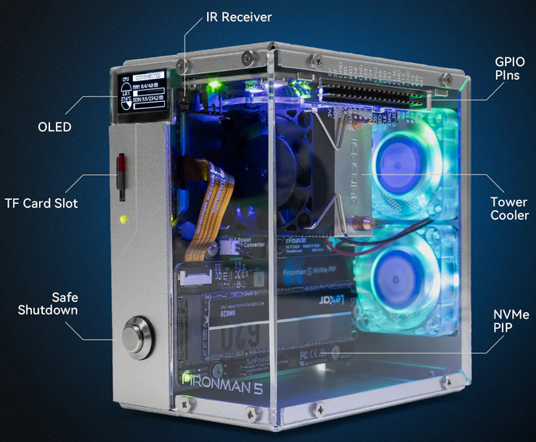
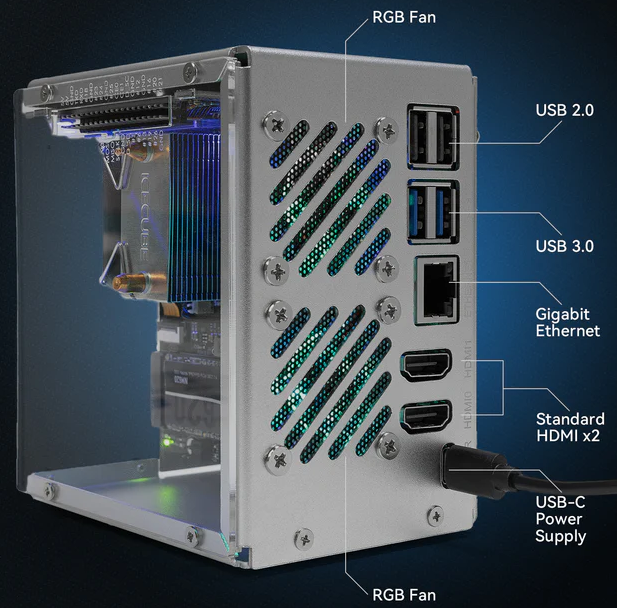
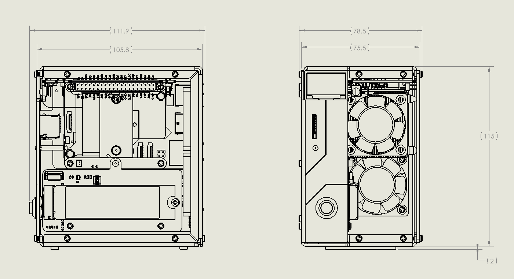

.. note::

    Ciao, benvenuto nella SunFounder Raspberry Pi & Arduino & ESP32 Enthusiasts Community su Facebook! Approfondisci Raspberry Pi, Arduino e ESP32 insieme ad altri appassionati.

    **Perché unirsi?**

    - **Supporto esperto**: Risolvi problemi post-vendita e sfide tecniche con l'aiuto della nostra comunità e del nostro team.
    - **Impara e condividi**: Scambia consigli e tutorial per migliorare le tue competenze.
    - **Anteprime esclusive**: Ottieni accesso anticipato agli annunci dei nuovi prodotti e alle anteprime.
    - **Sconti speciali**: Approfitta di sconti esclusivi sui nostri prodotti più recenti.
    - **Promozioni festive e giveaway**: Partecipa a giveaway e promozioni festive.

    👉 Pronto a esplorare e creare con noi? Clicca [|link_sf_facebook|] e unisciti oggi stesso!

Caratteristiche
======================

**Interfacce**

**Parametri**

* Dimensioni: 111.9x78.5x117mm
* Materiale
    * Corpo principale: lega di alluminio
    * Due pannelli laterali: acrilico
* Piattaforma supportata: Raspberry Pi 5
* Ingresso alimentazione: USB Type C, 5V/5A
* Interfacce
    * GPIO standard 40-Pin per Raspberry Pi
    * Slot Micro SD a molla
    * Ingresso alimentazione USB Type C
    * 2 x USB 2.0
    * 2 x USB 3.0
    * Porta LAN Gigabit
    * 2 x HDMI Type A 4Kp60
* Pulsante di accensione in metallo
* Schermo OLED: 0.96'' risoluzione 128x64
* 1 x Ventola PWM, 2 x Ventole RGB: 40x40x10mm
* 4 x LED RGB WS2812-5050
* Ricevitore IR a 38KHz
* Dissipatore a torre
* PCIe 3.0 x1 M.2 M key 2230, 2242, 2260, 2280 per NVMe SSD
* Batteria 1220 per RTC

**Disegno quotato**

