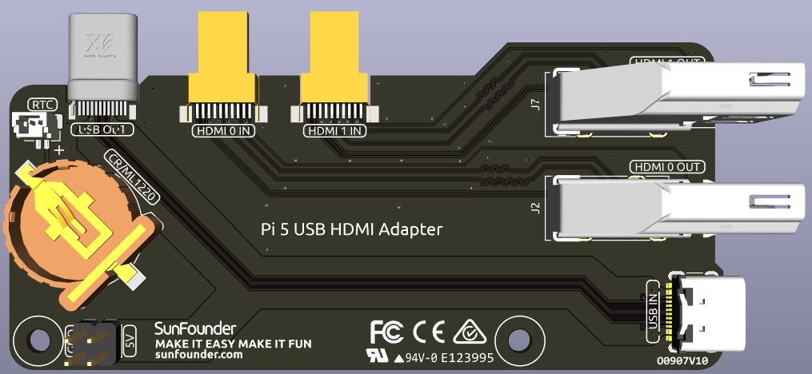

USB HDMI 转接板
==========================================

这款 USB HDMI 转接板是专为 Raspberry Pi 5 设计的，主要用于将 USB 与 HDMI 接口的位置重新排列，使其集中于 Raspberry Pi 的 USB 接口一侧，从而提升接口可访问性并优化线缆管理。

此外，该转接板将原有 HDMI 接口转换为标准 HDMI Type A 接口，提供更广泛的兼容性。

**NVMe 额外供电接口**

该转接板配备一个 5V 电源插针，专用于 NVMe PIP 的额外供电。通过延长排针，可将其连接至 NVMe 模块上的额外供电接口，为设备提供补充电源。

**1220RTC 电池座**

转接板上集成了一个 1220RTC 电池座，便于安装 RTC 电池。该电池座通过 SH1.0 2P 反向排线连接至 Raspberry Pi 的 RTC 接口。

电池座兼容 CR1220 和 ML1220 两种电池类型。如使用 ML1220（锂锰二氧化物电池），可在 Raspberry Pi 上启用充电功能。请注意，CR1220 是不可充电电池。

**启用涓流充电功能**

.. warning::

  若您使用的是 CR1220 电池，请勿启用涓流充电，否则将造成电池损坏，甚至有可能损坏转接板。

默认情况下，电池的涓流充电功能是关闭的。通过 ``sysfs`` 文件系统可查看当前涓流充电电压及限制参数：

.. code-block:: shell

    pi@raspberrypi:~ $ cat /sys/devices/platform/soc/soc:rpi_rtc/rtc/rtc0/charging_voltage
    0
    pi@raspberrypi:~ $ cat /sys/devices/platform/soc/soc:rpi_rtc/rtc/rtc0/charging_voltage_max
    4400000
    pi@raspberrypi:~ $ cat /sys/devices/platform/soc/soc:rpi_rtc/rtc/rtc0/charging_voltage_min
    1300000

如需启用涓流充电，请将 ``rtc_bbat_vchg`` 添加至 ``/boot/firmware/config.txt`` 文件中：

  * 打开 ``/boot/firmware/config.txt``：

    .. code-block:: shell
    
      sudo nano /boot/firmware/config.txt
      
  * 添加如下参数：

    .. code-block:: shell
    
      dtparam=rtc_bbat_vchg=3000000

重启系统后，将会显示如下内容：

.. code-block:: shell

    pi@raspberrypi:~ $ cat /sys/devices/platform/soc/soc:rpi_rtc/rtc/rtc0/charging_voltage
    3000000
    pi@raspberrypi:~ $ cat /sys/devices/platform/soc/soc:rpi_rtc/rtc/rtc0/charging_voltage_max
    4400000
    pi@raspberrypi:~ $ cat /sys/devices/platform/soc/soc:rpi_rtc/rtc/rtc0/charging_voltage_min
    1300000

这表示电池已成功启用涓流充电功能。如需禁用该功能，只需从 ``config.txt`` 中移除对应的 ``dtparam`` 行。

