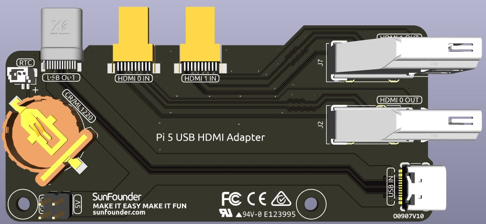

.. include:: /index.rst
   :start-after: start_hello_message
   :end-before: end_hello_message

Adaptador USB HDMI
===========================================

Este adaptador USB HDMI está diseñado específicamente para la Raspberry Pi 5. Su función principal es reposicionar las conexiones USB y HDMI para alinearlas con el lado de la interfaz USB de la Raspberry Pi, mejorando la accesibilidad y la gestión de cables.

Además, el puerto HDMI se convierte en una interfaz HDMI Tipo A estándar, lo que ofrece una mayor compatibilidad.

**Fuente de Alimentación Adicional para NVMe**

La placa incluye un conector de alimentación de 5V específicamente para la fuente de alimentación NVMe PIP. Junto con un cabezal de extensión, puede conectarse a la interfaz de alimentación adicional del NVMe para proporcionar energía adicional.

**Soporte para Batería 1220RTC**

Se incorpora un soporte para batería 1220RTC para facilitar la instalación de una batería RTC. Se conecta a la interfaz RTC de la Raspberry Pi a través de un cable SH1.0 2P inverso.

El soporte para baterías es compatible con las baterías CR1220 y ML1220. Si se utiliza una ML1220 (batería de dióxido de manganeso de litio), la carga se puede configurar directamente en la Raspberry Pi. Cabe señalar que la CR1220 no es recargable.

**Activar la Carga de Mantenimiento**

.. warning::

  Si estás utilizando una batería CR1220, no habilites la carga de mantenimiento, ya que puede causar daños irreparables a la batería y poner en riesgo la placa.

Por defecto, la función de carga de mantenimiento de la batería está deshabilitada. Los archivos ``sysfs`` indican el voltaje actual de carga de mantenimiento y los límites:

.. code-block:: shell

    pi@raspberrypi:~ $ cat /sys/devices/platform/soc/soc:rpi_rtc/rtc/rtc0/charging_voltage
    0
    pi@raspberrypi:~ $ cat /sys/devices/platform/soc/soc:rpi_rtc/rtc/rtc0/charging_voltage_max
    4400000
    pi@raspberrypi:~ $ cat /sys/devices/platform/soc/soc:rpi_rtc/rtc/rtc0/charging_voltage_min
    1300000

Para habilitar la carga de mantenimiento, agrega ``rtc_bbat_vchg`` a ``/boot/firmware/config.txt``:

  * Abre el archivo ``/boot/firmware/config.txt``.
  
    .. code-block:: shell
    
      sudo nano /boot/firmware/config.txt
      
  * Agrega ``rtc_bbat_vchg`` a ``/boot/firmware/config.txt``.
  
    .. code-block:: shell
    
      dtparam=rtc_bbat_vchg=3000000
  
Después de reiniciar, el sistema mostrará:

.. code-block:: shell

    pi@raspberrypi:~ $ cat /sys/devices/platform/soc/soc:rpi_rtc/rtc/rtc0/charging_voltage
    3000000
    pi@raspberrypi:~ $ cat /sys/devices/platform/soc/soc:rpi_rtc/rtc/rtc0/charging_voltage_max
    4400000
    pi@raspberrypi:~ $ cat /sys/devices/platform/soc/soc:rpi_rtc/rtc/rtc0/charging_voltage_min
    1300000

Esto confirma que la batería ahora está bajo carga de mantenimiento. Para deshabilitar esta función, simplemente elimina la línea ``dtparam`` del archivo ``config.txt``.
