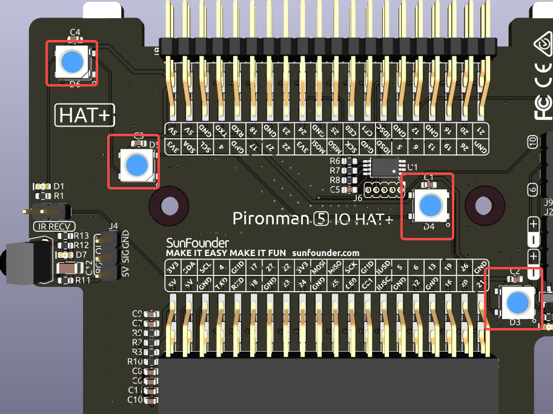
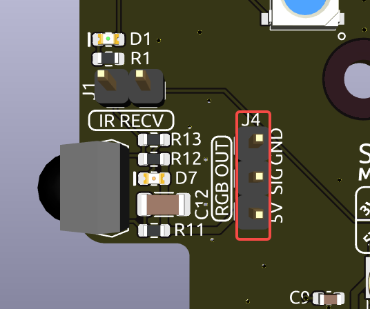
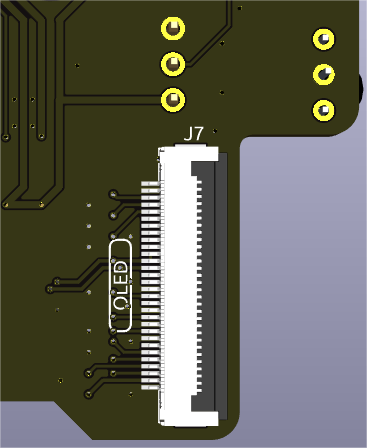
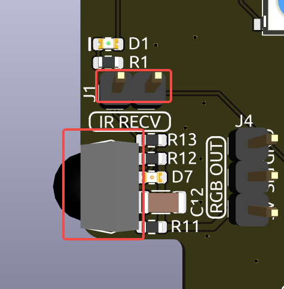
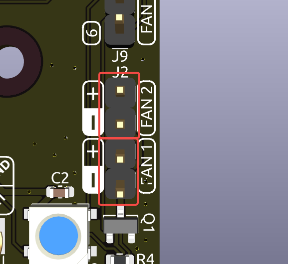
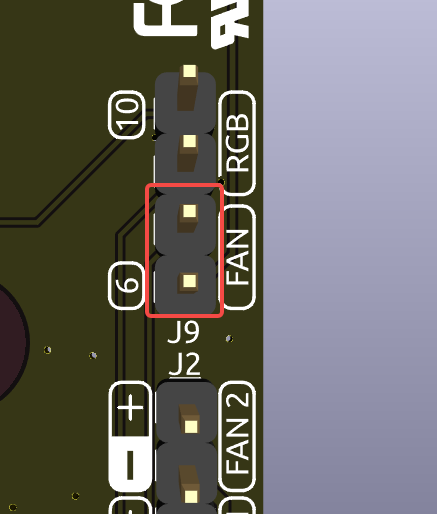
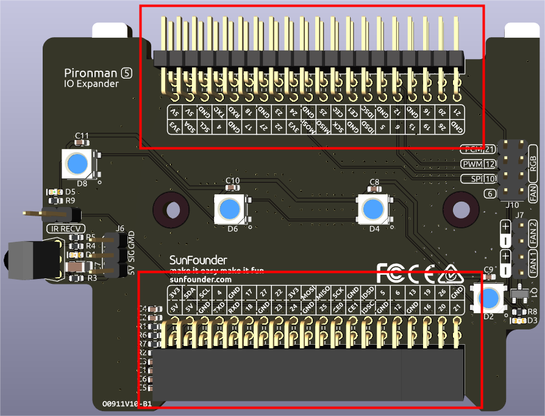

.. note::

    Bonjour, bienvenue dans la communauté SunFounder Raspberry Pi, Arduino & ESP32 Enthusiasts sur Facebook ! Plongez au cœur de Raspberry Pi, Arduino et ESP32 avec d'autres passionnés.

    **Pourquoi nous rejoindre ?**

    - **Support d'experts**: Résolvez les problèmes post-achat et relevez les défis techniques grâce à l'aide de notre communauté et de notre équipe.
    - **Apprendre & Partager**: Échangez des astuces et des tutoriels pour perfectionner vos compétences.
    - **Avant-premières exclusives**: Bénéficiez d'un accès anticipé aux annonces de nouveaux produits et à des aperçus exclusifs.
    - **Réductions spéciales**: Profitez de remises exclusives sur nos nouveaux produits.
    - **Promotions festives et tirages au sort**: Participez à des concours et à des promotions pendant les fêtes.

    👉 Prêt à explorer et à créer avec nous ? Cliquez sur [|link_sf_facebook|] et rejoignez-nous dès aujourd'hui !

IO Expander
================

LEDs RGB
------------

La carte dispose de 4 LEDs RGB WS2812, offrant un contrôle personnalisable. Les utilisateurs peuvent les allumer ou les éteindre, changer leur couleur, ajuster la luminosité, modifier les modes d'affichage et régler la vitesse des changements.

* Pour modifier l'état des LEDs RGB, utilisez ``true`` pour allumer les LEDs, ``false`` pour les éteindre.

.. code-block:: shell

  pironman5 -re true

* Pour changer leur couleur, entrez les valeurs hexadécimales de la couleur souhaitée, par exemple ``fe1a1a``.

.. code-block:: shell

  pironman5 -rc fe1a1a

* Pour ajuster la luminosité des LEDs RGB (plage: 0 ~ 100 %) :

.. code-block:: shell

  pironman5 -rb 100

* Pour modifier les modes d'affichage des LEDs RGB, choisissez parmi les options: ``solid/breathing/flow/flow_reverse/rainbow/rainbow_reverse/hue_cycle`` :

.. note::

  Si vous définissez le mode d'affichage des LEDs RGB sur ``rainbow``, ``rainbow_reverse`` ou ``hue_cycle``, vous ne pourrez pas définir la couleur avec ``pironman5 -rc``.

.. code-block:: shell

  pironman5 -rs breathing

* Pour ajuster la vitesse de changement (plage: 0 ~ 100 %) :

.. code-block:: shell

  pironman5 -rp 80

Broche de contrôle RGB
----------------------------

Les LED RGB sont pilotées par SPI et connectées au **GPIO10**, qui est également la broche SPI MOSI. Les deux broches au-dessus de J9 sont utilisées pour connecter les LED RGB au GPIO10. Si elles ne sont pas nécessaires, le cavalier peut être retiré.

  .. image:: img/io_board_rgb_pin.png

Broches RGB OUT
---------------------------

Les LEDs RGB WS2812 prennent en charge la connexion en série, permettant la connexion d'une bande LED RGB externe. Connectez la broche **SIG** à la broche **DIN** de la bande externe pour l'expansion.

La configuration par défaut comprend 4 LEDs RGB. Connectez des LEDs supplémentaires et mettez à jour le nombre avec :

.. code-block:: shell

  pironman5 -rl 12

Connecteur d'écran OLED
----------------------------

Le connecteur d'écran OLED, avec une adresse de 0x3C, est une fonctionnalité clé.

Si l'écran OLED ne s'affiche pas ou s'affiche incorrectement, suivez ces étapes pour résoudre le problème :

Vérifiez si le câble FPC de l'écran OLED est correctement connecté.

#. Utilisez la commande suivante pour afficher les journaux d'exécution du programme et vérifier les messages d'erreur.

    .. code-block:: shell

        cat /opt/pironman5/log

#. Vous pouvez également utiliser la commande suivante pour vérifier si l'adresse i2c 0x3C de l'OLED est reconnue :
    
    .. code-block:: shell
        
        sudo i2cdetect -y 1

#. Si les deux premières étapes ne révèlent aucun problème, essayez de redémarrer le service pironman5 pour voir si cela résout le problème.

    .. code-block:: shell

        sudo systemctl restart pironman5.service

Récepteur Infrarouge
---------------------------

* **Modèle**: IRM-56384, fonctionnant à 38KHz.
* **Connexion**: Le récepteur IR se connecte au **GPIO13**.
* **D1**: Un indicateur de réception infrarouge qui clignote lors de la détection d'un signal.
* **J8**: Une broche pour activer la fonction infrarouge. Par défaut, un cavalier est inséré pour une fonctionnalité immédiate. Retirez le cavalier pour libérer GPIO13 si le récepteur IR n'est pas utilisé.

Pour utiliser le récepteur IR, vérifiez sa connexion et installez le module nécessaire :

* Testez la connexion :

  .. code-block:: shell

    sudo ls /dev |grep lirc

* Installez le module ``lirc`` :

  .. code-block:: shell

    sudo apt-get install lirc -y

* Testez ensuite le récepteur IR en exécutant la commande suivante.

  .. code-block:: shell

    mode2 -d /dev/lirc0

* Après avoir exécuté la commande, appuyez sur un bouton de la télécommande et le code de ce bouton s'affichera.

Broches des ventilateurs RGB
------------------------------------

La carte d'extension IO prend en charge jusqu'à deux ventilateurs 5V non-PWM. Les deux ventilateurs sont contrôlés ensemble. 

**FAN1** et **FAN2** sont deux ensembles de broches pour ventilateurs. Vous devez connecter le fil rouge du ventilateur à « + », et le fil noir à « - ».

Les deux broches situées sous J9 sont les broches d'activation des ventilateurs RGB. Par défaut, un cavalier est inséré sur ces broches, permettant de contrôler l'état des ventilateurs via le GPIO6. Si le fonctionnement des ventilateurs n'est pas souhaité, le cavalier peut être retiré pour libérer GPIO6.

**D2** est un indicateur de signal du ventilateur qui s'allume lorsque le ventilateur est actif.

.. image:: img/io_board_fan_d2.png

Vous pouvez utiliser une commande pour configurer le mode de fonctionnement des deux ventilateurs RGB. Ces modes déterminent les conditions sous lesquelles les ventilateurs RGB s'activeront.

Par exemple, si le mode est réglé sur **1: Performance**, les ventilateurs RGB s'activeront à 50°C.

.. code-block:: shell

  pironman5 -gm 3

* **4: Silencieux**: Les ventilateurs RGB s'activeront à 70°C.
* **3: Équilibré**: Les ventilateurs RGB s'activeront à 67,5°C.
* **2: Cool**: Les ventilateurs RGB s'activeront à 60°C.
* **1: Performance**: Les ventilateurs RGB s'activeront à 50°C.
* **0: Toujours activés**: Les ventilateurs RGB resteront toujours activés.

Si vous connectez la broche de contrôle des ventilateurs RGB à différentes broches du Raspberry Pi, vous pouvez utiliser la commande suivante pour modifier le numéro de la broche.

.. code-block:: shell

  sudo pironman5 -gp 18

Broches d'en-tête
--------------------

Deux connecteurs d'en-tête coudés étendent le GPIO du Raspberry Pi, mais notez que le récepteur IR, les LEDs RGB et le ventilateur occupent certaines broches. Retirez les cavaliers correspondants pour utiliser ces broches pour d'autres fonctions.

.. list-table:: 
  :widths: 25 25
  :header-rows: 1

  * - Pironman 5
    - Raspberry Pi 5
  * - Récepteur IR (Optionnel)
    - GPIO13
  * - OLED SDA
    - SDA
  * - OLED SCL
    - SCL
  * - Ventilateur (Optionnel)
    - GPIO6
  * - RGB (Optionnel)
    - GPIO10
  * - RGB (Optionnel)
    - GPIO12
  * - RGB (Optionnel)
    - GPIO21
