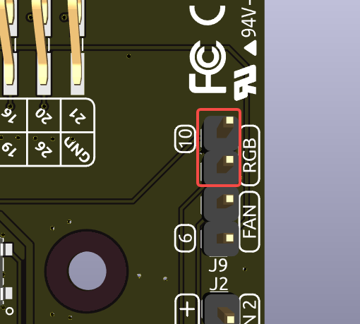

IO 扩展板
================

RGB LED 灯
---------------

.. image:: img/io_board_rgb.png

该扩展板配备 4 颗 WS2812 RGB LED，支持个性化控制。用户可开启或关闭灯效、更改颜色、调节亮度、切换显示模式以及设置变换速度。

* 控制 RGB 灯的开关状态，使用 ``true`` 开启， ``false`` 关闭：

.. code-block:: shell

  sudo pironman5 -re true

* 更改颜色：输入所需的十六进制颜色值，如 ``fe1a1a``：

.. code-block:: shell

  sudo pironman5 -rc fe1a1a

* 设置亮度（范围 0 ~ 100%）：

.. code-block:: shell

  sudo pironman5 -rb 100

* 切换显示模式，可选项包括： ``solid/breathing/flow/flow_reverse/rainbow/rainbow_reverse/hue_cycle``：

.. note::

  若设置为 ``rainbow`` 、 ``rainbow_reverse`` 或 ``hue_cycle`` 模式，则无法通过 ``sudo pironman5 -rc`` 修改颜色。

.. code-block:: shell

  sudo pironman5 -rs breathing

* 设置变换速度（范围 0 ~ 100%）：

.. code-block:: shell

  sudo pironman5 -rp 80

RGB 控制引脚
-------------------------

RGB LED 通过 SPI 接口驱动，连接至 **GPIO10** （即 SPI 的 MOSI 引脚）。J9 上方的两个引脚用于将 RGB LED 接入 GPIO10。如不使用，可移除跳帽。

RGB 输出引脚
-------------------------

.. image:: img/io_board_rgb_out.png

WS2812 RGB LED 支持串联扩展。您可以将 **SIG** 引脚连接至外部灯带的 **DIN** 引脚进行扩展。

默认配置为 4 颗 RGB LED。如需连接更多 LED，可通过以下命令更新数量：

.. code-block:: shell

  sudo pironman5 -rl 12

OLED 屏幕接口
----------------------------

OLED 屏幕接口的 I2C 地址为 0x3C，是扩展板的重要功能之一。

.. image:: img/io_board_oled.png

如 OLED 屏幕未显示或显示异常，可按以下步骤进行排查：

检查 OLED 屏幕的 FPC 软排线是否连接牢固。

#. 查看程序运行日志，排查错误信息：

    .. code-block:: shell

        cat /opt/pironman5/log

#. 或者检查 OLED 是否被系统识别，其 I2C 地址应为 0x3C：

    .. code-block:: shell

        sudo i2cdetect -y 1

#. 若上述方法均未发现问题，可尝试重启 pironman5 服务：

    .. code-block:: shell

        sudo systemctl restart pironman5.service

红外接收器
---------------------------

.. image:: img/io_board_receiver.png

* **型号**：IRM-56384，工作频率 38KHz  
* **连接方式**：接收器连接至 **GPIO13**  
* **D1**：红外接收指示灯，接收到信号时闪烁  
* **J8**：红外功能使能引脚，默认插有跳帽可立即使用。如不使用红外接收器，可移除跳帽释放 GPIO13

使用红外接收器前，请确认连接正确并安装必要模块：

* 检查连接状态：

  .. code-block:: shell

    sudo ls /dev |grep lirc

* 安装 ``lirc`` 模块：

  .. code-block:: shell

    sudo apt-get install lirc -y

* 运行以下命令测试红外接收器：

  .. code-block:: shell

    mode2 -d /dev/lirc0

* 执行命令后，按下遥控器上的任意按钮，终端将输出该按钮的码值。

RGB 风扇引脚
---------------

IO 扩展板支持连接最多两颗 5V 非 PWM 风扇，两个风扇统一控制。

**FAN1** 和 **FAN2** 为两个风扇接线接口。请将风扇红线连接至 “+”，黑线连接至 “-”。

.. image:: img/io_board_fan.png

J9 下方的两个引脚为 RGB 风扇控制引脚。默认插有跳帽，可通过 GPIO6 控制风扇启停。如不使用风扇，可移除跳帽释放 GPIO6。

.. image:: img/io_board_fan_j9.png

**D2** 为风扇状态指示灯，当风扇启动时点亮。

.. image:: img/io_board_fan_d2.png

可使用命令设置两颗 RGB 风扇的运行模式，不同模式对应不同的温度启动阈值。

例如，将风扇模式设置为 **1: Performance**，风扇将在温度达到 50°C 时启动。

.. code-block:: shell

  sudo pironman5 -gm 3

* **4: Quiet**：70°C 启动  
* **3: Balanced**：67.5°C 启动  
* **2: Cool**：60°C 启动  
* **1: Performance**：50°C 启动  
* **0: Always On**：风扇始终开启

如将风扇控制引脚连接至其他 GPIO 引脚，可使用以下命令修改：

.. code-block:: shell

  sudo pironman5 -gp 18

GPIO 排针
--------------

.. image:: img/io_board_pin_header.png

扩展板上的两组直角排针可延伸 Raspberry Pi 的 GPIO 引脚。但请注意，红外接收器、RGB 灯与风扇占用了部分 GPIO。若需使用这些引脚的其他功能，请移除相应跳帽释放引脚。

.. list-table:: 
  :widths: 25 25
  :header-rows: 1

  * - Pironman 5
    - Raspberry Pi 5
  * - IR 接收器（可选）
    - GPIO13
  * - OLED SDA
    - SDA
  * - OLED SCL
    - SCL
  * - 风扇（可选）
    - GPIO6
  * - RGB（可选）
    - GPIO10
  * - RGB（可选）
    - GPIO12
  * - RGB（可选）
    - GPIO21
