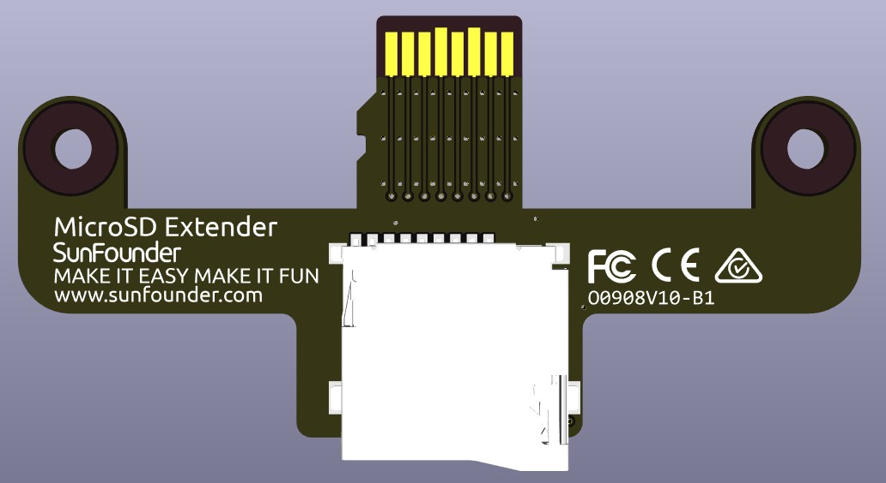

.. note::

    Hallo und willkommen in der SunFounder Raspberry Pi & Arduino & ESP32 Enthusiasten-Community auf Facebook! Tauchen Sie tiefer in Raspberry Pi, Arduino und ESP32 zusammen mit anderen Enthusiasten ein.

    **Warum mitmachen?**

    - **Fachkundige Unterstützung**: Lösen Sie nach dem Kauf auftretende Probleme und technische Herausforderungen mit Hilfe unserer Community und unseres Teams.
    - **Lernen & Teilen**: Tauschen Sie Tipps und Tutorials aus, um Ihre Fähigkeiten zu verbessern.
    - **Exklusive Vorschauen**: Erhalten Sie frühzeitigen Zugang zu neuen Produktankündigungen und Vorschauen.
    - **Sonderrabatte**: Genießen Sie exklusive Rabatte auf unsere neuesten Produkte.
    - **Festliche Aktionen und Verlosungen**: Nehmen Sie an Verlosungen und Feiertagsaktionen teil.

    👉 Bereit, mit uns zu entdecken und zu erschaffen? Klicken Sie auf [|link_sf_facebook|] und treten Sie noch heute bei!

MicroSD-Erweiterung
=======================

Dies ist eine MicroSD-Karten-Erweiterungsplatine, die den MicroSD-Kartensteckplatz des Raspberry Pi nach außen verlängert und einen federbelasteten Kartensteckplatz hinzufügt.

    
