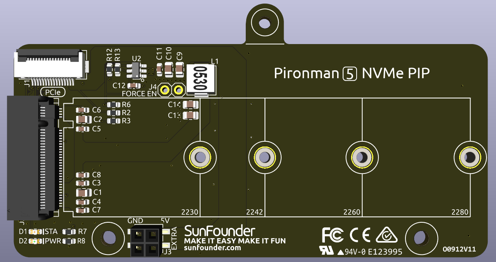
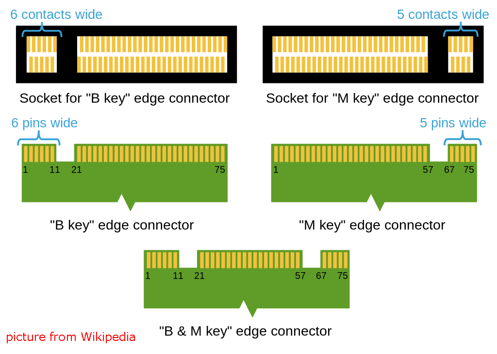

Pi5 NVMe PIP
=================

Pi5 NVMe PIP（PCIe 外设板）是 Raspberry Pi 基金会定义的一款专为 NVMe 固态硬盘设计的 PCIe 转接板。它支持四种不同尺寸的 NVMe SSD：2230、2242、2260 和 2280，均可插入 M.2 M-Key 插槽中。

* 该板通过 16P 0.5mm 反向 FFC（柔性扁平线缆）或定制阻抗匹配的 FPC（柔性电路板）进行连接。
* **STA**：状态指示灯。
* **PWR**：电源指示灯。
* 板载 3.3V 电源模块可提供最高 3A 电流输出。但由于 Raspberry Pi 的 PCIe 接口仅能提供 5V/1A（相当于 5W）输出，因此若需为 NVMe 提供 3.3V/3A 电力，可通过 J3 接口外接 5V 电源补充。
* **FORCE ENABLE**：板载电源默认由 PCIe 接口的控制信号触发，在 Raspberry Pi 上电后，系统会发出信号以开启 3.3V 电源。如某些系统不支持该控制信号，或出于其他考虑，可通过将 J4 的两个焊盘短接（焊接导线）强制开启板载 3.3V 电源，供电给 NVMe 使用。

关于接口型号
---------------------------

M.2 SSD 以其紧凑的体积广泛应用，其主要区别在于接口类型（Key 类型）和所使用的通信协议。以下是常见的几种类型：

* **M.2 SATA SSD**：采用 SATA 接口，尽管外形为 M.2，但传输速率受限于 SATA III，最高约为 600 MB/s。此类 SSD 通常兼容 B-Key 与 M-Key 插槽。
* **M.2 NVMe SSD**：采用 PCIe 通道并使用 NVMe 协议，相比 M.2 SATA SSD 拥有更高的读写速度，非常适合游戏、多媒体编辑或数据密集型应用。此类 SSD 通常为 M-Key 设计，并依赖 PCIe 接口，支持 3.0、4.0、5.0 等不同版本。每一代 PCIe 接口的带宽约为上一代的两倍。Raspberry Pi 5 使用 PCIe 3.0 接口，理论最大传输速度可达 3500 MB/s。

M.2 接口按金手指缺口分为三种类型：B-Key、M-Key 和 B+M-Key。后期推出的 B+M-Key 兼容性更强，逐渐取代了单一的 B-Key 接口。详见下图所示：

一般来说，M.2 SATA SSD 多为 B+M-Key，可兼容 B-Key 和 M-Key 插槽；而 M.2 NVMe SSD（PCIe 3.0 x4）则多为 M-Key 设计。

.. image:: img/ssd_model2.png

关于长度规格
-----------------------

M.2 模块具有多种尺寸，除用于存储外，也可扩展为 Wi-Fi、WWAN、蓝牙、GPS 和 NFC 等功能模块。

Pironman 5 支持四种尺寸的 NVMe M.2 SSD（支持 PCIe Gen 2.0 / Gen 3.0）：2230、2242、2260 和 2280。其中，“22” 表示宽度（单位为毫米），后两位数字表示长度。SSD 越长，可容纳的 NAND 闪存芯片越多，对应容量也越大。

.. image:: img/m2_ssd_size.png
  :width: 600

