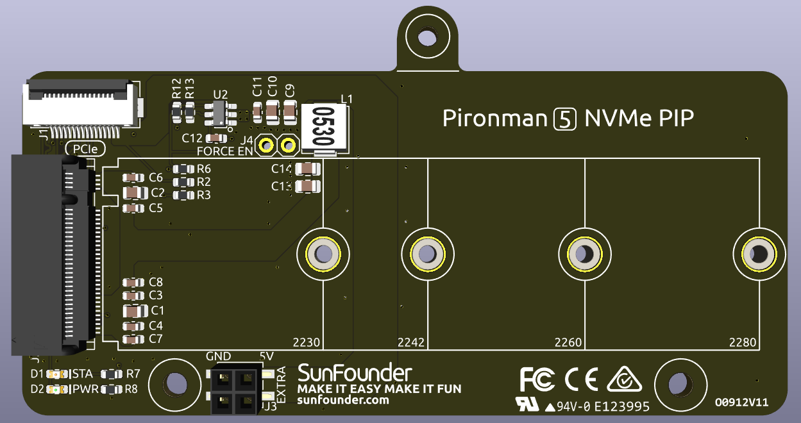
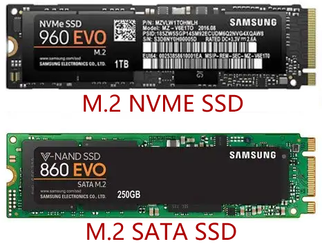
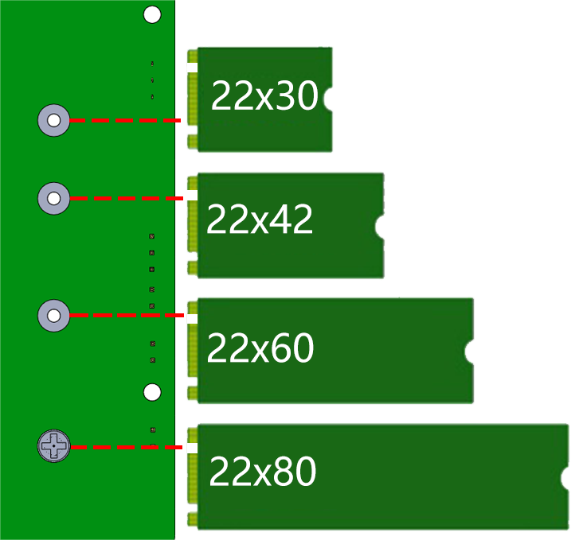

.. include:: /index.rst
   :start-after: start_hello_message
   :end-before: end_hello_message

Pi5 NVMe PIP
=================

Il Pi5 NVMe PIP (PCIe Peripheral Board), come definito dalla Raspberry Pi Foundation, è una scheda adattatore PCIe progettata specificamente per dischi a stato solido NVMe. Supporta quattro dimensioni diverse di SSD NVMe: 2230, 2242, 2260 e 2280, tutte compatibili con uno slot M.2 M key.

* La scheda si collega tramite un cavo FFC (Flexible Flat Cable) inverso da 16P 0.5mm o un cavo FPC (Flexible Printed Circuit) con impedenza abbinata.
* **STA**: Indicatore LED di stato.
* **PWR**: Indicatore LED di alimentazione.
* L'alimentazione integrata da 3,3V può supportare fino a 3A di uscita. Tuttavia, poiché l'interfaccia PCIe del Raspberry Pi è limitata a fornire un'uscita di 5V/1A (equivalente a 5W), è possibile fornire alimentazione aggiuntiva per l'uso di 3,3V/3A tramite il connettore J3 da una fonte di alimentazione a 5V.
* **FORCE ENABLE**: L'alimentazione integrata è attivata dal segnale di commutazione dell'interfaccia PCIe. Dopo l'accensione del Raspberry Pi, viene inviato un segnale per attivare l'alimentazione da 3,3V. Se alcuni sistemi non supportano il segnale di commutazione o per altri motivi, è possibile cortocircuitare J4 FORCE ENABLE saldando un filo tra i due pad flottanti per forzare l'alimentazione da 3,3V integrata per alimentare l'NVMe.

Informazioni sul modello
---------------------------

Gli SSD M.2, noti per le loro dimensioni compatte, esistono in vari tipi, principalmente differenziati dalla loro configurazione delle chiavi (design della tacca sul connettore) e dall'interfaccia che utilizzano. Ecco i tipi principali:

* **SSD SATA M.2**: Questi utilizzano l'interfaccia SATA, simile agli SSD SATA da 2,5 pollici ma nel formato più piccolo M.2. Sono limitati dalle velocità massime del SATA III, intorno ai 600 MB/s. Questi SSD sono compatibili con slot M.2 con chiave B e M.
* **SSD NVMe M.2**: Questi SSD utilizzano il protocollo NVMe su corsie PCIe e sono significativamente più veloci degli SSD SATA M.2. Sono adatti per applicazioni che richiedono elevate velocità di lettura/scrittura, come il gaming, l'editing video e attività che richiedono molta elaborazione dati. Questi SSD richiedono generalmente slot con chiave M. Questi dischi utilizzano l'interfaccia PCIe (Peripheral Component Interconnect Express), con versioni diverse come 3.0, 4.0 e 5.0. Ogni nuova versione di PCIe raddoppia effettivamente la velocità di trasferimento dati della precedente. Tuttavia, il Raspberry Pi 5 utilizza un'interfaccia PCIe 3.0, in grado di offrire velocità di trasferimento fino a 3.500 MB/s.

Gli SSD M.2 sono disponibili in tre tipi principali di chiavi: B key, M key e B+M key. Successivamente è stata introdotta la chiave B+M, che combina le funzionalità delle chiavi B e M. Di conseguenza, ha sostituito la chiave B autonoma. Si prega di fare riferimento all'immagine qui sotto.

.. image:: img/ssd_key.png

In generale, gli SSD SATA M.2 hanno chiave B+M (possono adattarsi a socket per moduli con chiave B e M), mentre gli SSD NVMe M.2 per PCIe 3.0 x4 lane hanno chiave M.

Informazioni sulla lunghezza
--------------------------------------

I moduli M.2 sono disponibili in diverse dimensioni e possono essere utilizzati anche per Wi-Fi, WWAN, Bluetooth, GPS e NFC.

Pironman 5 supporta quattro dimensioni di SSD NVMe M.2 (PCIe Gen 2.0 / PCIe Gen 3.0) in base ai loro nomi: 2230, 2242, 2260 e 2280. Il "22" indica la larghezza in millimetri (mm), e i due numeri successivi rappresentano la lunghezza. Più lungo è il drive, più chip di memoria NAND può ospitare; quindi, maggiore sarà la capacità.

