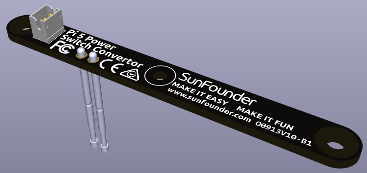
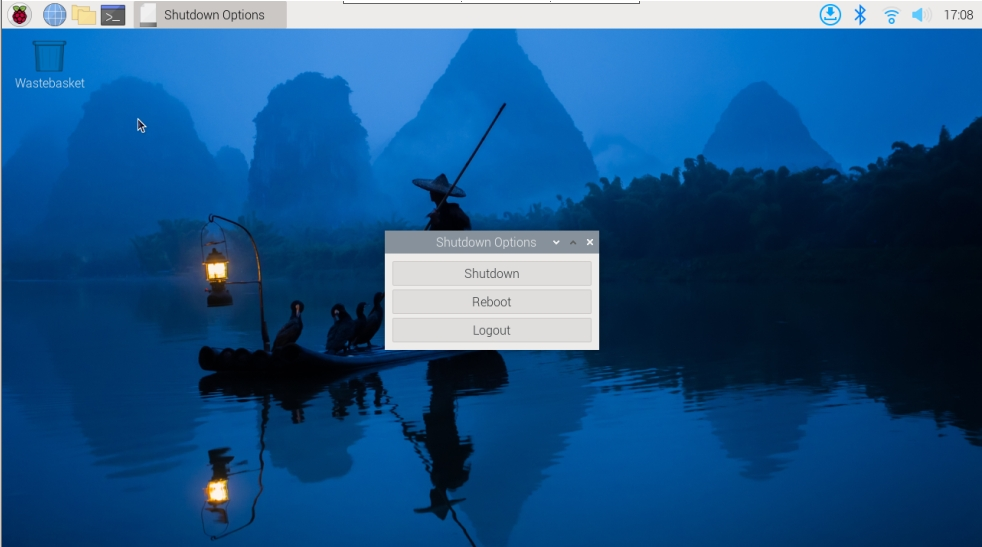

.. note::

    Hallo und willkommen in der SunFounder Raspberry Pi & Arduino & ESP32 Enthusiasten-Community auf Facebook! Tauchen Sie tiefer in Raspberry Pi, Arduino und ESP32 zusammen mit anderen Enthusiasten ein.

    **Warum mitmachen?**

    - **Fachkundige Unterstützung**: Lösen Sie nach dem Kauf auftretende Probleme und technische Herausforderungen mit Hilfe unserer Community und unseres Teams.
    - **Lernen & Teilen**: Tauschen Sie Tipps und Tutorials aus, um Ihre Fähigkeiten zu verbessern.
    - **Exklusive Vorschauen**: Erhalten Sie frühzeitigen Zugang zu neuen Produktankündigungen und Vorschauen.
    - **Sonderrabatte**: Genießen Sie exklusive Rabatte auf unsere neuesten Produkte.
    - **Festliche Aktionen und Verlosungen**: Nehmen Sie an Verlosungen und Feiertagsaktionen teil.

    👉 Bereit, mit uns zu entdecken und zu erschaffen? Klicken Sie auf [|link_sf_facebook|] und treten Sie noch heute bei!

Power-Switch-Konverter
==============================

Dies ist ein Modul, das den Netzschalter des Raspberry Pi 5 nach außen erweitert.

**Hinzufügen des Netzschalters**

* Der Raspberry Pi 5 verfügt über einen **J2**-Jumper, der sich zwischen dem RTC-Batterieanschluss und dem Rand der Platine befindet. Dieser Breakout ermöglicht das Hinzufügen eines benutzerdefinierten Netzschalters zum Raspberry Pi 5, indem ein Normal Open (NO) Momentanschalter über die beiden Pads angeschlossen wird. Ein kurzes Betätigen dieses Schalters imitiert die Funktion des eingebauten Netzschalters.

   .. image:: img/pi5_j2.jpg

* Auf dem Pironman 5 gibt es einen **Power-Switch-Konverter**, der den **J2**-Jumper über zwei Pogo-Pins mit einem externen Netzschalter verbindet.

   .. image:: img/power_switch_convertor.png

* Nun kann der Raspberry Pi 5 mit dem Netzschalter ein- und ausgeschaltet werden.

   .. image:: img/pironman_button.JPG

**Stromzyklus**

Beim erstmaligen Einschalten Ihres Raspberry Pi 5 wird er automatisch eingeschaltet und bootet ins Betriebssystem, ohne dass der Schalter gedrückt werden muss.

Wenn der Raspberry Pi Desktop ausgeführt wird, führt ein kurzes Drücken des Netzschalters einen sauberen Herunterfahrvorgang ein. Ein Menü erscheint, das Optionen zum Herunterfahren, Neustarten oder Abmelden bietet. Durch die Auswahl einer Option oder durch erneutes Drücken des Netzschalters wird das Herunterfahren eingeleitet.

**Herunterfahren**

    * Wenn Sie das **Raspberry Pi OS Desktop**-System ausführen, können Sie den Netzschalter zweimal schnell hintereinander drücken, um herunterzufahren.
    * Wenn Sie das **Raspberry Pi OS Lite**-System ohne Desktop ausführen, drücken Sie den Netzschalter einmal, um das Herunterfahren einzuleiten.
    * Um ein hartes Herunterfahren zu erzwingen, halten Sie den Netzschalter gedrückt.

**Einschalten**

    * Wenn das Raspberry Pi-Board heruntergefahren, aber noch mit Strom versorgt ist, drücken Sie den Schalter einmal, um aus dem ausgeschalteten Zustand einzuschalten.

.. note::

    Wenn Sie ein System verwenden, das den Ausschalter nicht unterstützt, können Sie ihn 5 Sekunden lang gedrückt halten, um ein hartes Herunterfahren zu erzwingen, und einmal drücken, um aus dem ausgeschalteten Zustand einzuschalten.
