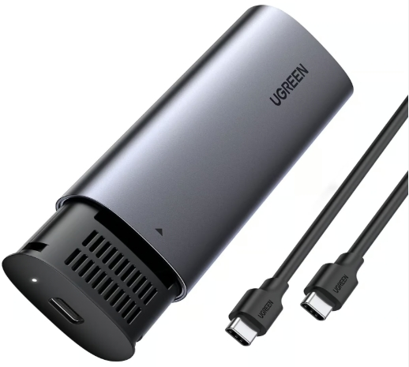

.. note::

    こんにちは！SunFounderのRaspberry Pi & Arduino & ESP32エンスージアストコミュニティへようこそ！Facebookで他のエンスージアストたちと共に、Raspberry Pi、Arduino、ESP32の世界をさらに深く探求しましょう。

    **参加する理由**

    - **専門サポート**: コミュニティやチームの支援を受けて、アフターサポートや技術的な課題を解決します。
    - **学びと共有**: スキル向上のためのヒントやチュートリアルを交換しましょう。
    - **限定プレビュー**: 新製品の発表や先行情報にいち早くアクセスできます。
    - **特別割引**: 最新製品の特別割引をお楽しみください。
    - **イベントやプレゼント企画**: プレゼント企画や季節のプロモーションに参加できます。

    👉 探索と創造の旅に出る準備はできましたか？[|link_sf_facebook|]をクリックして、今日から参加しましょう！

.. _install_to_nvme_home_bridge:

NVMe SSDにOSをインストールする
============================================

NVMe SSDを使用しており、システムインストールのためにNVMe SSDをコンピュータに接続するためのアダプターがある場合は、以下のチュートリアルを使用して迅速にインストールできます。

**必要なコンポーネント**

* パーソナルコンピュータ
* NVMe SSD
* NVMeからUSBへのアダプター
* Micro SDカードおよびリーダー

.. _update_bootloader_5:

1. ブートローダーの更新
----------------------------------

最初に、Raspberry Pi 5のブートローダーを更新して、USBおよびSDカードの前にNVMeから起動するように設定する必要があります。

.. raw:: html

    <iframe width="700" height="500" src="https://www.youtube.com/embed/tCKTgAeWIjc?start=47&end=95&si=xbmsWGBvCWefX01T" title="YouTube video player" frameborder="0" allow="accelerometer; autoplay; clipboard-write; encrypted-media; gyroscope; picture-in-picture; web-share" referrerpolicy="strict-origin-when-cross-origin" allowfullscreen></iframe>

.. note::

    このステップでは、予備のMicro SDカードを使用することをお勧めします。最初にこのMicro SDカードにブートローダーを書き込み、その後すぐにRaspberry Piに挿入して、NVMeデバイスからの起動を有効にします。
    
    または、ブートローダーを最初にNVMeデバイスに直接書き込み、Raspberry Piに挿入して起動方法を変更することも可能です。その後、NVMe SSDをコンピュータに接続してオペレーティングシステムをインストールし、インストールが完了したら再度Raspberry Piに挿入します。

#. 予備のMicro SDカードまたはNVMe SSDをリーダーを使用してコンピュータに挿入します。

#. |link_rpi_imager| 内で **Raspberry Piデバイス** をクリックし、ドロップダウンリストから **Raspberry Pi 5** モデルを選択します。

   .. image:: img/os_choose_device_pi5.png
      :width: 90%
      
#. **オペレーティングシステム** タブでスクロールして **Misc utility images** を選択します。

   .. image:: img/nvme_misc.png
      :width: 90%

#. **ブートローダー (Pi 5ファミリー)** を選択します。

   .. image:: img/nvme_bootloader.png
      :width: 90%
      

#. Raspberry Pi 5がUSBおよびSDカードの前にNVMeから起動するようにするには、 **NVMe/USB Boot** を選択します。

   .. image:: img/nvme_nvme_boot.png
      :width: 90%
      

#. **ストレージ** オプションで、インストールする適切なストレージデバイスを選択します。

   .. note::

      正しいストレージデバイスを選択するようにしてください。混乱を避けるため、複数のストレージデバイスが接続されている場合は他のデバイスを切断することをお勧めします。

   .. image:: img/os_choose_sd.png
      :width: 90%
      

#. **次へ** をクリックできます。ストレージデバイスに既存のデータが含まれている場合は、データ損失を防ぐためにバックアップを確実に行ってください。バックアップが不要であれば、 **Yes** をクリックして続行します。

   .. image:: img/os_continue.png
      :width: 90%
      

#. **NVMe/USB Boot** がストレージデバイスに書き込まれたことが通知されます。

   .. image:: img/nvme_boot_finish.png
      :width: 90%
      

#. これで、Micro SDカードまたはNVMe SSDをRaspberry Piに挿入できます。Type CアダプターでRaspberry Piに電源を入れると、Micro SDカードまたはNVMe SSDからブートローダーがRaspberry PiのEEPROMに書き込まれます。

.. note::

   その後、Raspberry PiはUSBおよびSDカードの前にNVMeから起動するようになります。 
    
   Raspberry Piの電源を切り、Micro SDカードまたはNVMe SSDを取り外してください。

2. NVMe SSDにOSをインストールする
------------------------------------

これで、NVMe SSDにオペレーティングシステムをインストールする準備が整いました。

**手順**

#. リーダーを使用してSDカードをコンピュータに挿入します。

#. |link_rpi_imager| 内で **Raspberry Piデバイス** をクリックし、ドロップダウンリストから **Raspberry Pi 5** モデルを選択します。

   .. image:: img/os_choose_device_pi5.png
      :width: 90%
      

#. **オペレーティングシステム** タブをクリックします。

   .. image:: img/os_choose_os.png
      :width: 90%

#. ページの一番下までスクロールして、使用するオペレーティングシステムを選択します。

   .. note::

      * **Ubuntu** システムの場合、 **Other general-purpose OS**  -> **Ubuntu** をクリックし、 **Ubuntu Desktop 24.04 LTS (64 bit)** または **Ubuntu Server 24.04 LTS (64 bit)** を選択します。
      * **Kali Linux**、 **Home Assistant** 、 **Homebridge** システムの場合は、 **Other specific-purpose OS** をクリックして、対応するシステムを選択します。

   .. image:: img/os_other_os.png
      :width: 90%

#. **ストレージ** オプションで、インストールする適切なストレージデバイスを選択します。

   .. image:: img/nvme_ssd_storage.png
      :width: 90%
      

#. **次へ** をクリックします。

   .. note::

      * 事前に設定できないシステムの場合、 **次へ** をクリックすると、デバイス内のデータを保存するかどうかが表示されます。バックアップが確保されていることを確認したら、 **Yes** を選択します。

      * ホスト名、WiFi、SSHの有効化を事前に設定できるシステムの場合、ポップアップが表示され、OSのカスタム設定を適用するかどうかが促されます。 **Yes** または **No** を選択するか、戻ってさらに編集することができます。

   .. image:: img/os_enter_setting.png
      :width: 90%
      

   * Raspberry Piの **ホスト名** を設定します。ホスト名は、Raspberry Piのネットワーク識別子です。 ``<hostname>.local`` または ``<hostname>.lan`` を使用してPiにアクセスできます。

     .. image:: img/os_set_hostname.png

   * Raspberry Piの管理者アカウント用の **ユーザー名** と **パスワード** を作成します。Raspberry Piにはデフォルトのパスワードがないため、独自のユーザー名とパスワードを設定することが重要です。

     .. image:: img/os_set_username.png

   * ネットワークの **SSID** および **パスワード** を入力してワイヤレスLANを構成します。

     .. note::

       ``Wireless LAN country`` を、あなたの所在地に対応する `ISO/IEC alpha2 code <https://en.wikipedia.org/wiki/ISO_3166-1_alpha-2#Officially_assigned_code_elements>`_ に設定してください。

     .. image:: img/os_set_wifi.png
         
   * Raspberry Piにリモートで接続するために、サービスタブでSSHを有効にします。

     * **パスワード認証** の場合は、一般タブで設定したユーザー名とパスワードを使用します。
     * 公開鍵認証の場合は「公開鍵認証のみを許可する」を選択します。RSAキーを持っている場合はそれが使用され、持っていない場合は「Run SSH-keygen」をクリックして新しいキーペアを生成します。

     .. image:: img/os_enable_ssh.png

   * **オプション** メニューでは、書き込み中に音を再生する、書き込みが終了したらメディアを取り出す、テレメトリを有効にするなど、Imagerの動作を構成できます。

     .. image:: img/os_options.png

         
    
#. OSのカスタマイズ設定を入力し終えたら、 **保存** をクリックしてカスタマイズを保存します。その後、 **Yes** をクリックして、書き込み時にそれらを適用します。

   .. image:: img/os_click_yes.png
      :width: 90%
      

#. NVMe SSDに既存のデータが含まれている場合、データ損失を防ぐためにバックアップを確実に行ってください。バックアップが不要であれば、 **Yes** をクリックして続行します。

   .. image:: img/nvme_erase.png
      :width: 90%
      

#. 「書き込み成功」のポップアップが表示されたら、イメージが完全に書き込まれ、検証されています。これでNVMe SSDからRaspberry Piを起動する準備が整いました！
