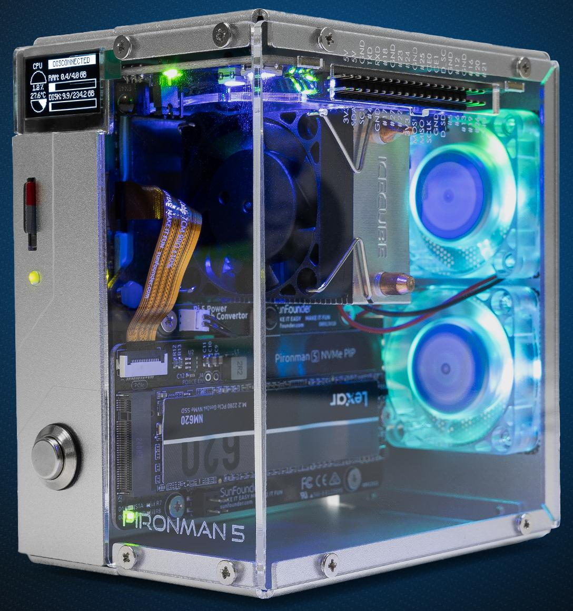
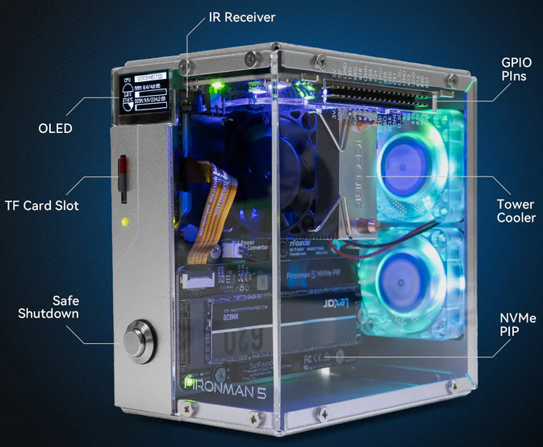
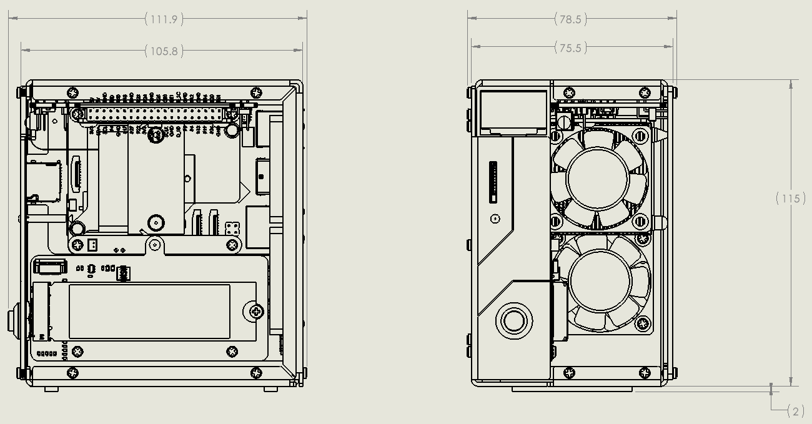

.. note::

    Hello, welcome to the SunFounder Raspberry Pi & Arduino & ESP32 Enthusiasts Community on Facebook! Dive deeper into Raspberry Pi, Arduino, and ESP32 with fellow enthusiasts.

    **Why Join?**

    * **Expert Support**: Solve post-sale issues and technical challenges with help from our community and team.
    * **Learn & Share**: Exchange tips and tutorials to enhance your skills.
    * **Exclusive Previews**: Get early access to new product announcements and sneak peeks.
    * **Special Discounts**: Enjoy exclusive discounts on our newest products.
    * **Festive Promotions and Giveaways**: Take part in giveaways and holiday promotions.

    👉 Ready to explore and create with us? Click [|link_sf_facebook|] and join today!

.. _intro_pironman5:

Pironman 5
=================================

Thanks for choosing our |link_pironman5|.

|link_pironman5| is a premium mini PC case designed specifically for the Raspberry Pi 5. Built from **durable aluminum**, it combines robust construction with advanced features to deliver high performance for a wide range of applications.

**Key Features**

* **Advanced Cooling**: Tower cooler with dual RGB fans for efficient temperature control.
* **High-Speed Storage & AI Support**: Supports NVMe M.2 SSDs (**2230**, **2242**, **2260**, **2280**) and is fully compatible with the **Hailo-8L AI accelerator** for powerful edge AI capabilities.
* **Smart Display**: Built-in 0.96” OLED screen showing CPU usage, memory, temperature, and IP address in real time.
* **Enhanced Connectivity**: Dual HDMI ports, customizable RGB LEDs, secure power switch, IR receiver, and external GPIO extender.
* **Versatile Use Cases**: Ideal for NAS, Home Assistant, media centers, gaming setups, and AI projects.

.. note::

  It is recommended to use the official 27W power supply or |link_sf_27w_supply| for the Pironman 5 series products to avoid insufficient power supply, which may cause the Raspberry Pi 5 to reboot.

.. toctree::
    :maxdepth: 1

    About this Kit <self>
    what_do_we_need    
    assembly_instructions
    install/install_the_os
    set_up/set_up_pironman5
    control/control_pironman5
    hardware/hardware
    optional_modules/optional_modules
    home_server/home_server
    compitable_nvme_ssd
    faq

**Interfaces**

.. image:: img/pironman5_interfaces2.png
    :width: 400

**Parameters**

* Dimension: 111.9x78.5x117mm
* Material
    * Main Body: Silver Aluminum Alloy
    * Two Side Panel: Transparent Acrylic
* Support Platform: Raspberry Pi 5
* Power Input: USB Type C, 5V/5A
* Interfaces
    * Raspberry Pi standard 40-Pin GPIO
    * spring-loaded Micro SD socket
    * USB Type C power input
    * 2 x USB 2.0
    * 2 x USB 3.0
    * Gigabit LAN port
    * 2 x 4Kp60 Standard HDMI Output
* 1 x Metal Power Button
* 1 x 0.96'' 128x64 OLED Screen
* 1 x PWM Fan (40x40x10mm)
* 2 x RGB Fans (40x40x10mm)
* 4 x WS2812-5050 RGB LEDs
* 1 x 38KHz IR Receiver
* 1 x Tower Cooler
* 1 x PCIe 2.0 M.2 M key (2230, 2242, 2260, 2280) for NVMe SSD
* 1 x 1220 Battery for RTC

**Dimensional Drawing**

