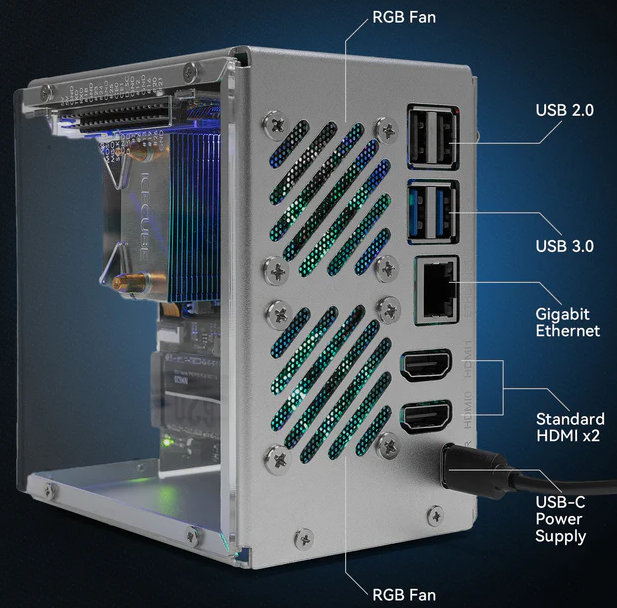

.. note:: 

    Hola, ¡bienvenido a la comunidad de entusiastas de SunFounder Raspberry Pi, Arduino y ESP32 en Facebook! Profundiza en el mundo de Raspberry Pi, Arduino y ESP32 junto a otros entusiastas.

    **¿Por qué unirte?**

    - **Soporte experto**: Resuelve problemas postventa y desafíos técnicos con la ayuda de nuestra comunidad y equipo.
    - **Aprende y comparte**: Intercambia consejos y tutoriales para mejorar tus habilidades.
    - **Avances exclusivos**: Accede anticipadamente a anuncios de nuevos productos y contenido exclusivo.
    - **Descuentos especiales**: Disfruta de descuentos exclusivos en nuestros productos más recientes.
    - **Promociones y sorteos festivos**: Participa en sorteos y promociones de temporada.

    👉 ¿Listo para explorar y crear con nosotros? Haz clic en [|link_sf_facebook|] y únete hoy mismo.

.. _intro_pironman5: 

Pironman 5
=================================

Gracias por elegir nuestro |link_pironman5|.

.. image:: img/pironman5_pic.jpg
    :width: 400
    :align: center

|link_pironman5| es una carcasa premium para mini PC diseñada específicamente para la Raspberry Pi 5. Construida con **aluminio duradero**, combina una estructura robusta con funciones avanzadas para ofrecer un alto rendimiento en una amplia gama de aplicaciones.

**Características Clave**

* **Refrigeración Avanzada**: Disipador tipo torre con ventiladores RGB duales para un control eficiente de la temperatura.  
* **Almacenamiento de Alta Velocidad y Soporte de IA**: Compatible con SSD NVMe M.2 (**2230**, **2242**, **2260**, **2280**) y totalmente compatible con el **acelerador de IA Hailo-8L** para potentes capacidades de IA en el borde.  
* **Pantalla Inteligente**: Pantalla OLED integrada de 0.96” que muestra en tiempo real el uso de CPU, memoria, temperatura y dirección IP.  
* **Conectividad Mejorada**: Puertos HDMI duales, LEDs RGB personalizables, interruptor de encendido seguro, receptor IR y expansor GPIO externo.  
* **Usos Versátiles**: Ideal para NAS, Home Assistant, centros multimedia, configuraciones de juegos y proyectos de IA.  

.. note::

  Se recomienda usar la fuente de alimentación oficial de 27W o |link_sf_27w_supply| para los productos de la serie Pironman 5, a fin de evitar un suministro de energía insuficiente que pueda provocar el reinicio de la Raspberry Pi 5.

.. toctree::
    :maxdepth: 1

    About this Kit <self>
    what_do_we_need    
    assembly_instructions
    install/install_the_os
    set_up/set_up_pironman5
    control/control_pironman5
    hardware/hardware
    optional_modules/optional_modules
    compitable_nvme_ssd
    faq

**Interfaces**

.. image:: img/pironman5_interfaces1.png
    :width: 500

**Parámetros**

* Dimensiones: 111.9x78.5x117 mm
* Material
    * Cuerpo principal: Aleación de aluminio plateado
    * Paneles laterales: Acrílico transparente
* Plataforma compatible: Raspberry Pi 5
* Entrada de alimentación: USB Tipo C, 5V/5A
* Interfaces
    * GPIO de 40 pines estándar de Raspberry Pi
    * Zócalo microSD con resorte
    * Entrada de alimentación USB Tipo C
    * 2 x USB 2.0
    * 2 x USB 3.0
    * Puerto LAN Gigabit
    * 2 x Salidas HDMI estándar 4Kp60
* 1 x Botón de encendido metálico
* 1 x Pantalla OLED de 0.96'' 128x64
* 1 x Ventilador PWM (40x40x10 mm)
* 2 x Ventiladores RGB (40x40x10 mm)
* 4 x LEDs RGB WS2812-5050
* 1 x Receptor IR de 38KHz
* 1 x Disipador tipo torre
* 1 x Conector PCIe 2.0 M.2 M key (2230, 2242, 2260, 2280) para NVMe SSD
* 1 x Batería 1220 para RTC

**Dibujo de dimensiones**

.. image:: img/pironman5_dimension.png
    :width: 800
