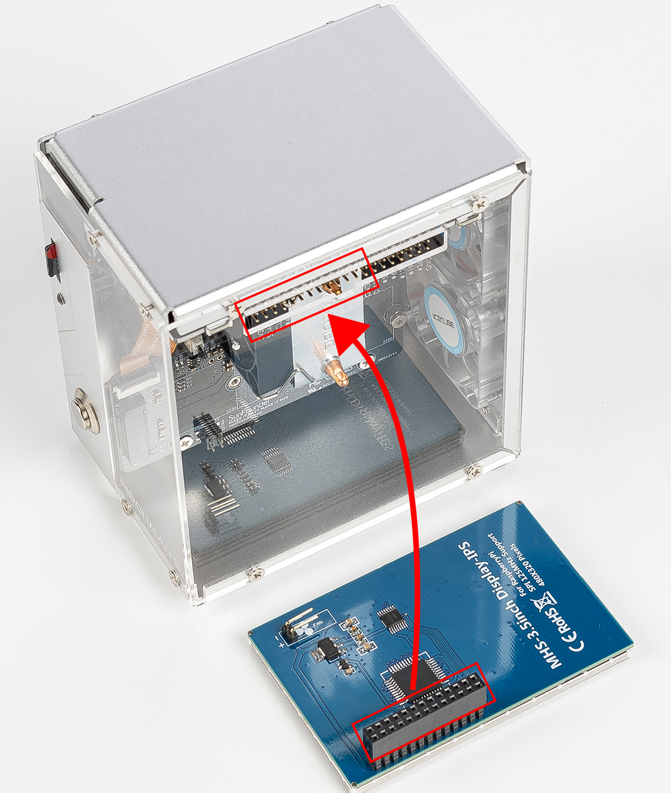
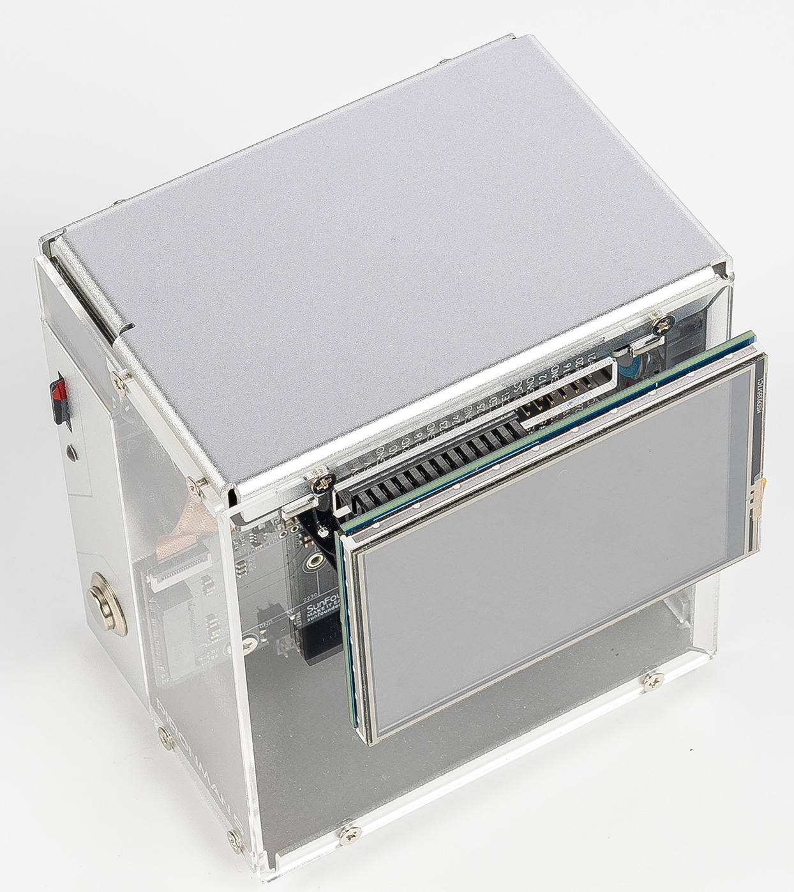

.. note::

    Hello, welcome to the SunFounder Raspberry Pi & Arduino & ESP32 Enthusiasts Community on Facebook! Dive deeper into Raspberry Pi, Arduino, and ESP32 with fellow enthusiasts.

    **Why Join?**

    - **Expert Support**: Solve post-sale issues and technical challenges with help from our community and team.
    - **Learn & Share**: Exchange tips and tutorials to enhance your skills.
    - **Exclusive Previews**: Get early access to new product announcements and sneak peeks.
    - **Special Discounts**: Enjoy exclusive discounts on our newest products.
    - **Festive Promotions and Giveaways**: Take part in giveaways and holiday promotions.

    👉 Ready to explore and create with us? Click [|link_sf_facebook|] and join today!

3.5-inch Touch Screen
=============================

.. note::

    The Pironman 5 series do not include a 3.5-inch touch screen.  
    You will need to prepare one yourself or purchase it from our official website:

   * `3.5-ihch Touch Screen <https://www.sunfounder.com/products/touchscreen-02>`_

The 3.5-inch touch screen connects directly to the Raspberry Pi GPIO header,  
providing both display and touch control for the Pironman 5.  
Please follow the steps carefully to ensure correct installation and avoid hardware damage.

More details can be found here:  
`3.5-inch touch screen Documentation <http://wiki.sunfounder.cc/index.php?title=3.5_Inch_LCD_Touch_Screen_Monitor_for_Raspberry_Pi>`_.

**Assemble**

.. warning:: 
   
   When installing the 3.5-inch touch screen onto the Pironman 5, ensure the pins are perfectly aligned.  
   The header must match the Raspberry Pi’s GPIO interface with no offset.  
   Misalignment may damage the screen or even the Raspberry Pi.  
   Double-check connections before powering on!

**Remove RGB Jumper**

When using the Pironman 5 with the 3.5-inch touch screen,  
note that the RGB LEDs on the IO Expander share the same SPI MOSI pin (GPIO10) as the screen.  
To prevent conflicts and ensure proper operation:

1. On the IO Expander, remove the jumper cap from the **RGB LED pins** (above J9).

   .. image:: img/lcd_to_max0.jpg
      :width: 600
      :align: center

2. Disable the RGB LED control service:

   .. code-block:: bash

      sudo pironman5 -re false
      sudo systemctl restart pironman5.service

This frees the SPI interface for the 3.5-inch touch screen and avoids display issues.

**Driver Installation**

For detailed instructions, please refer to |link_3.5_screen|, which describes the driver installation for different systems.
