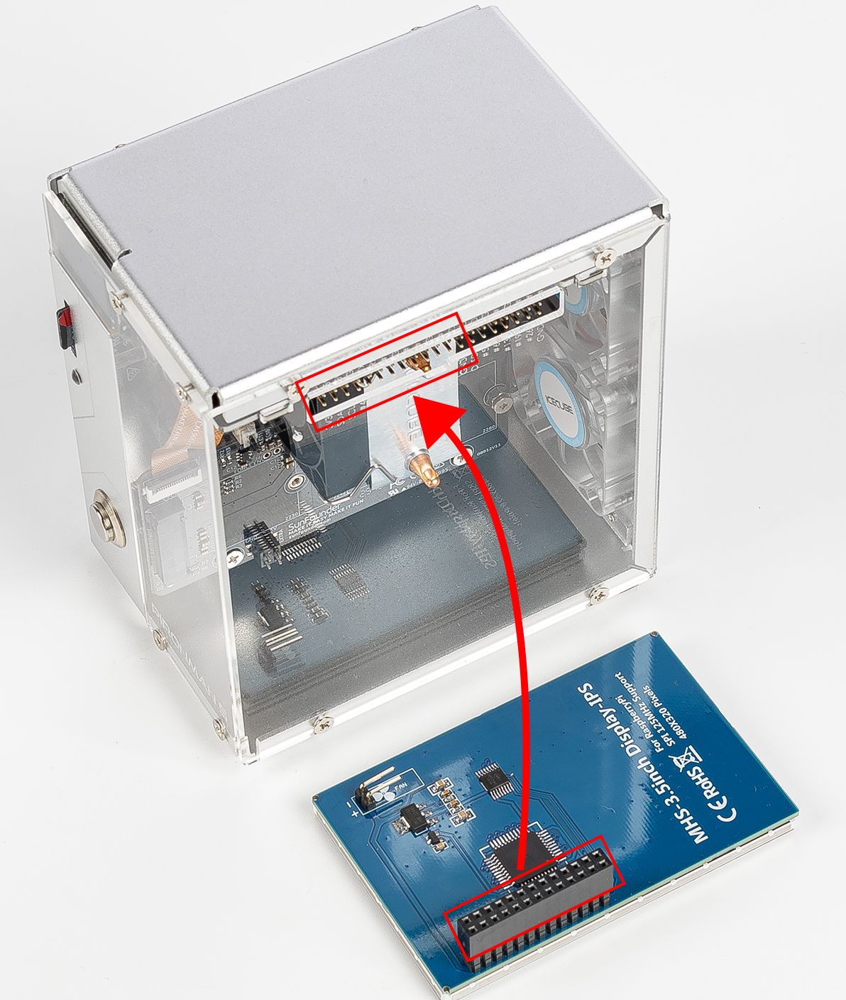
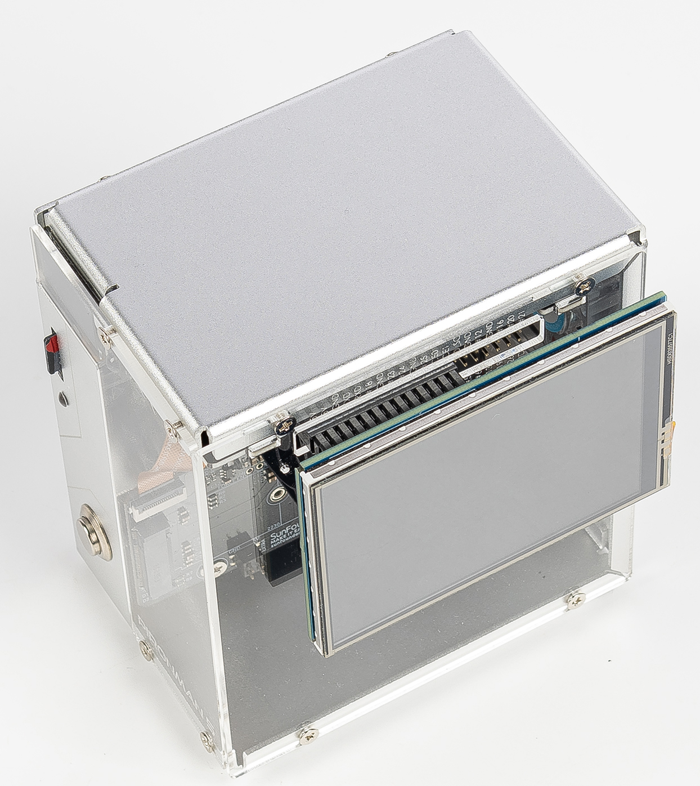

.. include:: /index.rst
   :start-after: start_hello_message
   :end-before: end_hello_message

Pantalla táctil de 3.5 pulgadas
=========================================

.. note::

    La serie Pironman 5 no incluye una pantalla táctil de 3.5 pulgadas.  
    Necesitarás preparar una por tu cuenta o comprarla en nuestro sitio web oficial:

   * `Pantalla táctil de 3.5 pulgadas <https://www.sunfounder.com/products/touchscreen-02>`_

La pantalla táctil de 3.5 pulgadas se conecta directamente al encabezado GPIO de la Raspberry Pi,  
proporcionando tanto visualización como control táctil para el Pironman 5.  
Sigue los pasos cuidadosamente para garantizar la instalación correcta y evitar daños en el hardware.

Más detalles se pueden encontrar aquí:  
`Documentación de la pantalla táctil de 3.5 pulgadas <https://docs.sunfounder.com/projects/35-ips-screen/en/latest/get_started/get_started.html>`_.

**Ensamblar**

.. warning:: 
   
   Al instalar la pantalla táctil de 3.5 pulgadas en el Pironman 5, asegúrate de que los pines estén perfectamente alineados.  
   El encabezado debe coincidir con la interfaz GPIO de la Raspberry Pi sin ningún desplazamiento.  
   Una mala alineación puede dañar la pantalla o incluso la Raspberry Pi.  
   ¡Verifica las conexiones antes de encenderla!

**Quitar el Jumper de RGB**

Al usar el Pironman 5 con la pantalla táctil de 3.5 pulgadas,  
ten en cuenta que los LED RGB en el IO Expander comparten el mismo pin SPI MOSI (GPIO10) que la pantalla.  
Para evitar conflictos y asegurar un funcionamiento adecuado:

1. En el IO Expander, retira el capuchón del jumper de los **pines RGB LED** (arriba de J9).

   .. image:: img/lcd_to_max0.jpg
      :width: 600
      :align: center

2. Deshabilita el servicio de control de LED RGB:

   .. code-block:: bash

      sudo pironman5 -re false
      sudo systemctl restart pironman5.service

Esto libera la interfaz SPI para la pantalla táctil de 3.5 pulgadas y evita problemas de visualización.

**Instalación del Controlador**

Para obtener instrucciones detalladas, consulte |link_3.5_screen|, que describe la instalación del controlador para diferentes sistemas.
