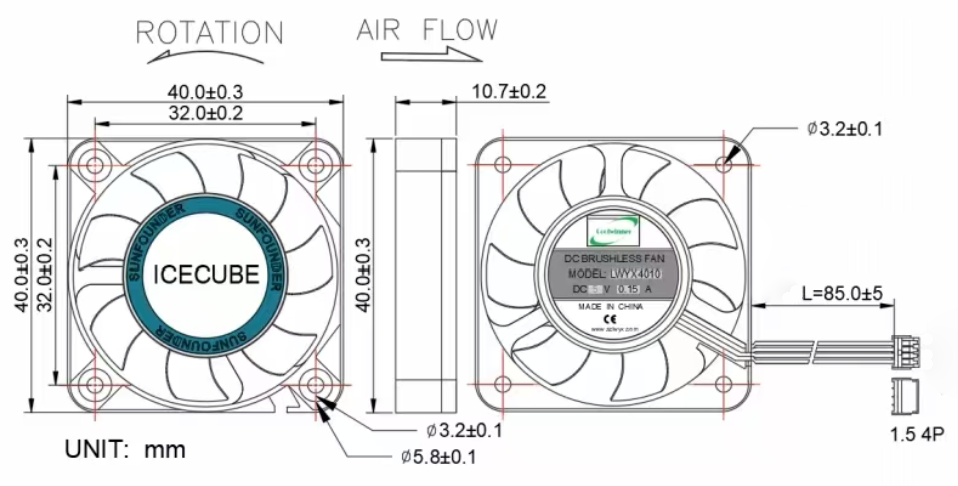

.. note:: 

    Ciao, benvenuto nella community Facebook degli appassionati di Raspberry Pi, Arduino ed ESP32 targata SunFounder! Approfondisci le tue conoscenze su Raspberry Pi, Arduino ed ESP32 insieme ad altri appassionati come te.

    **Why Join?**

    - **Expert Support**: Risolvi problemi post-vendita e sfide tecniche con l’aiuto della nostra community e del nostro team.
    - **Learn & Share**: Condividi suggerimenti e tutorial per potenziare le tue competenze.
    - **Exclusive Previews**: Accedi in anteprima ai nuovi annunci di prodotto e alle anticipazioni esclusive.
    - **Special Discounts**: Approfitta di sconti esclusivi sui nostri prodotti più recenti.
    - **Festive Promotions and Giveaways**: Partecipa a promozioni festive e giveaway.

    👉 Pronto a esplorare e creare con noi? Clicca su [|link_sf_facebook|] ed entra nella community oggi stesso!

Ventole
============

Ventola PWM
---------------

La ventola PWM del Pironman 5 è controllata direttamente dal sistema del Raspberry Pi.

In merito alle soluzioni di raffreddamento per il Raspberry Pi 5, soprattutto sotto carichi elevati, il design del Pironman 5 integra un sistema di raffreddamento intelligente. Include una ventola PWM principale e due ventole RGB supplementari. La strategia di raffreddamento è strettamente integrata con il sistema di gestione termica del Raspberry Pi 5.

Il funzionamento della ventola PWM si basa sulla temperatura del Raspberry Pi 5:

* Sotto i 50°C, la ventola PWM rimane spenta (velocità 0%).
* A 50°C, la ventola parte a bassa velocità (30%).
* A 60°C, la ventola passa a velocità media (50%).
* A 67,5°C, la ventola aumenta a velocità alta (70%).
* A 75°C e oltre, la ventola funziona alla massima velocità (100%).

Questa relazione temperatura-velocità si applica anche quando la temperatura scende, con una isteresi di 5°C. La velocità della ventola si riduce quando la temperatura scende di 5°C al di sotto di ciascuna soglia.

* Comandi per monitorare la ventola PWM. Per verificare lo stato della ventola PWM:

  .. code-block:: shell
  
    cat /sys/class/thermal/cooling_device0/cur_state

* Per visualizzare la velocità della ventola PWM:

  .. code-block:: shell

    cat /sys/devices/platform/cooling_fan/hwmon/*/fan1_input

Nel Pironman 5, la ventola PWM è un componente essenziale per mantenere temperature operative ottimali, soprattutto durante attività intensive, garantendo che il Raspberry Pi 5 operi in modo efficiente e affidabile.

Ventole RGB
-------------------

* **Dimensioni esterne**: 40*40*10MM
* **Peso**: 13,5±5g/cad
* **Durata**: 30.000 ore (temperatura ambiente 25°C)
* **Portata massima d'aria**: 2.46CFM
* **Pressione massima dell'aria**: 0.62mm-H2O
* **Rumorosità acustica**: 22.31dBA
* **Potenza nominale in ingresso**: 5V/0.15A
* **Velocità nominale**: 3500±10%RPM
* **Temperatura operativa**: -10℃~+60℃
* **Temperatura di stoccaggio**: -20℃~+70℃

