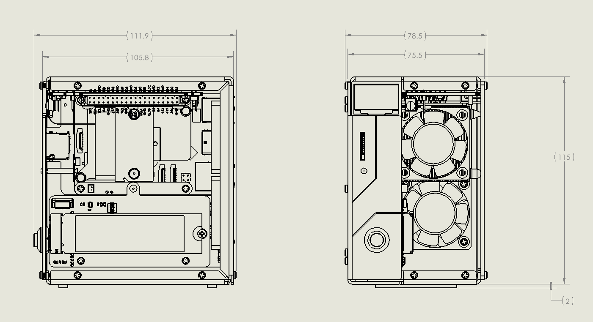

.. note::

    Bonjour et bienvenue dans la communauté Facebook des passionnés de SunFounder Raspberry Pi, Arduino et ESP32 ! Rejoignez d'autres passionnés pour approfondir vos connaissances sur le Raspberry Pi, l’Arduino et l’ESP32.

    **Pourquoi nous rejoindre ?**

    - **Support d’experts** : Résolvez les problèmes après-vente et relevez les défis techniques grâce à l’aide de notre équipe et de notre communauté.
    - **Apprendre et partager** : Échangez des conseils et des tutoriels pour développer vos compétences.
    - **Aperçus exclusifs** : Soyez informé(e) en avant-première des nouvelles sorties de produits et accédez à des aperçus exclusifs.
    - **Réductions spéciales** : Profitez de remises exclusives sur nos produits les plus récents.
    - **Promotions festives et cadeaux** : Participez à des concours et à des offres spéciales durant les périodes de fête.

    👉 Prêt(e) à explorer et à créer avec nous ? Cliquez sur [|link_sf_facebook|] et rejoignez-nous dès aujourd’hui !

Fonctionnalités
======================

**Paramètres**

* Dimensions : 111,9 × 78,5 × 117 mm  
* Matériaux :
    * Corps principal : alliage d'aluminium  
    * Panneaux latéraux : acrylique  
* Plateforme prise en charge : Raspberry Pi 5  
* Alimentation : USB Type-C, 5V / 5A  
* Interfaces :
    * GPIO 40 broches standard Raspberry Pi  
    * Logement micro SD à ressort  
    * Entrée d’alimentation USB Type-C  
    * 2 x USB 2.0  
    * 2 x USB 3.0  
    * Port LAN Gigabit  
    * 2 x HDMI Type A 4Kp60  
* Bouton d’alimentation en métal  
* Écran OLED : 0,96’’ résolution 128x64  
* 1 ventilateur PWM, 2 ventilateurs RGB : 40×40×10 mm  
* 4 LED RGB WS2812-5050  
* Récepteur IR 38 kHz  
* Dissipateur thermique vertical (Tower Cooler)  
* 2 x emplacements PCIe 2.0 x1 M.2 M Key (2230, 2242, 2260, 2280) pour SSD NVMe ou accélérateur IA  
* Batterie 1220 pour l’horloge temps réel (RTC)  

**Schéma dimensionnel**

