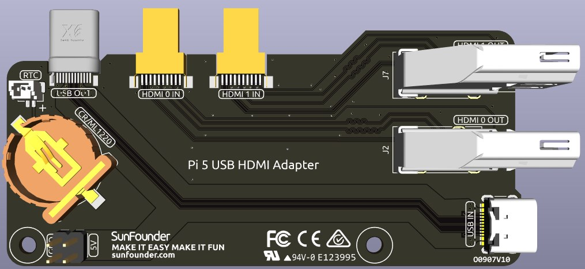

.. note:: 

    Hallo, willkommen in der SunFounder Raspberry Pi & Arduino & ESP32 Enthusiasten-Community auf Facebook! Tauche tiefer in die Welt von Raspberry Pi, Arduino und ESP32 ein und tausche dich mit anderen Enthusiasten aus.

    **Warum beitreten?**

    - **Expertensupport**: Löse nach dem Kauf auftretende Probleme und technische Herausforderungen mit Hilfe unserer Community und unseres Teams.
    - **Lernen & Teilen**: Tausche Tipps und Tutorials aus, um deine Fähigkeiten zu verbessern.
    - **Exklusive Einblicke**: Erhalte frühzeitigen Zugang zu neuen Produktankündigungen und exklusiven Vorschauen.
    - **Sonderrabatte**: Profitiere von exklusiven Rabatten auf unsere neuesten Produkte.
    - **Festliche Aktionen und Verlosungen**: Nimm an Verlosungen und saisonalen Sonderaktionen teil.

    👉 Bereit, mit uns zu entdecken und zu kreieren? Klicke auf [|link_sf_facebook|] und werde noch heute Mitglied!

USB HDMI-Adapter
==========================================

Dieses USB-HDMI-Adapter-Board wurde speziell für den Raspberry Pi 5 entwickelt. Seine Hauptfunktion besteht darin, die USB- und HDMI-Anschlüsse so zu positionieren, dass sie mit der USB-Schnittstelle des Raspberry Pi übereinstimmen, wodurch die Zugänglichkeit und das Kabelmanagement verbessert werden.

Zusätzlich wird der HDMI-Anschluss in eine Standard-HDMI-Typ-A-Schnittstelle umgewandelt, was eine breitere Kompatibilität ermöglicht.

**NVMe-Zusatzeinspeisung**

Das Board verfügt über einen 5V-Stromanschluss, der speziell für die NVMe PIP-Stromversorgung vorgesehen ist. In Verbindung mit einem Erweiterungsanschluss kann er mit dem zusätzlichen Stromanschluss des NVMe verbunden werden, um zusätzliche Energie bereitzustellen.

**1220RTC-Batteriehalter**

Ein 1220RTC-Batteriehalter ist integriert, um eine bequeme Installation einer RTC-Batterie zu ermöglichen. Er wird über ein SH1.0 2P Reverse-Kabel mit dem RTC-Anschluss des Raspberry Pi verbunden.

Der Batteriehalter ist mit den Batterien CR1220 und ML1220 kompatibel. Wenn du eine ML1220 (Lithium-Mangan-Dioxid-Batterie) verwendest, kann das Laden direkt auf dem Raspberry Pi konfiguriert werden. Beachte, dass die CR1220-Batterie nicht wiederaufladbar ist.

**Aktivierung des Trickle-Charging**

.. warning::

  Wenn du eine CR1220-Batterie verwendest, aktiviere das Trickle-Charging nicht, da dies die Batterie irreparabel beschädigen und das Board gefährden kann.

Standardmäßig ist die Funktion für das Trickle-Charging der Batterie deaktiviert. Die ``sysfs``-Dateien zeigen die aktuelle Ladespannung und die Grenzen an:

.. code-block:: shell

    pi@raspberrypi:~ $ cat /sys/devices/platform/soc/soc:rpi_rtc/rtc/rtc0/charging_voltage
    0
    pi@raspberrypi:~ $ cat /sys/devices/platform/soc/soc:rpi_rtc/rtc/rtc0/charging_voltage_max
    4400000
    pi@raspberrypi:~ $ cat /sys/devices/platform/soc/soc:rpi_rtc/rtc/rtc0/charging_voltage_min
    1300000

Um das Trickle-Charging zu aktivieren, füge ``rtc_bbat_vchg`` in ``/boot/firmware/config.txt`` hinzu:

  * Öffne die Datei ``/boot/firmware/config.txt``.
  
    .. code-block:: shell
    
      sudo nano /boot/firmware/config.txt
      
  * Füge ``rtc_bbat_vchg`` in ``/boot/firmware/config.txt`` hinzu.
  
    .. code-block:: shell
    
      dtparam=rtc_bbat_vchg=3000000
  
Nach dem Neustart zeigt das System an:

.. code-block:: shell

    pi@raspberrypi:~ $ cat /sys/devices/platform/soc/soc:rpi_rtc/rtc/rtc0/charging_voltage
    3000000
    pi@raspberrypi:~ $ cat /sys/devices/platform/soc/soc:rpi_rtc/rtc/rtc0/charging_voltage_max
    4400000
    pi@raspberrypi:~ $ cat /sys/devices/platform/soc/soc:rpi_rtc/rtc/rtc0/charging_voltage_min
    1300000

Dies bestätigt, dass die Batterie nun im Trickle-Charging-Modus ist. Um diese Funktion zu deaktivieren, entferne einfach die ``dtparam``-Zeile aus ``config.txt``.

