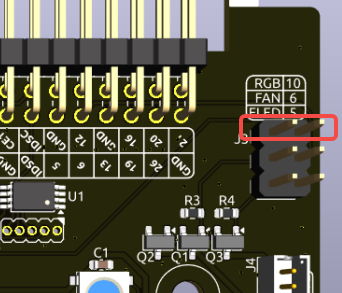

IO 扩展板  
================

RGB 灯  
------------

.. image:: img/io_board_rgb.png

该扩展板集成了 4 颗 WS2812 RGB LED，支持多种自定义控制。用户可以开启或关闭灯效、调节颜色和亮度、切换显示模式，并设定变化速度。

* 控制 RGB LED 的开关状态，使用 ``true`` 开启， ``false`` 关闭：

.. code-block:: shell

  pironman5 -re true

* 更改颜色，输入目标的十六进制色值，例如 ``fe1a1a``：

.. code-block:: shell

  pironman5 -rc fe1a1a

* 调整亮度（范围：0 ~ 100%）：

.. code-block:: shell

  pironman5 -rb 100

* 切换显示模式，可选项包括： ``solid/breathing/flow/flow_reverse/rainbow/rainbow_reverse/hue_cycle``：

.. note::

  如果 RGB 模式设置为 ``rainbow`` 、 ``rainbow_reverse`` 或 ``hue_cycle`` ，将无法使用 ``pironman5 -rc`` 设置颜色。

.. code-block:: shell

  pironman5 -rs breathing

* 设置变化速度（范围：0 ~ 100%）：

.. code-block:: shell

  pironman5 -rp 80

RGB 控制引脚  
-------------------------

RGB LED 由 SPI 驱动，连接至 **GPIO10** （SPI 的 MOSI 引脚）。图中两根引脚连接 RGB 到 GPIO10。如不需要此功能，可移除跳线帽。

RGB OUT 扩展引脚  
-------------------------

.. image:: img/io_board_rgb_out.png

WS2812 LED 支持串联，可外接 RGB 灯带。将 **SIG** 引脚连接至灯带的 **DIN** 引脚即可。

默认配置为 4 个 RGB 灯，如需扩展数量，使用以下命令修改：

.. code-block:: shell

  sudo pironman5 --rgb-led-count [quantity]

示例：

.. code-block:: shell

  sudo pironman5 --rgb-led-count 12

OLED 显示屏接口  
----------------------------

OLED 显示屏地址为 0x3C。

.. image:: img/io_board_oled.png

如果屏幕未正常显示，可尝试以下步骤排查问题：

1. 确认 OLED 显示屏的 FPC 线缆连接正确。

2. 查看程序日志检查错误信息：

.. code-block:: shell

  cat /var/log/pironman5/pm_auto.oled.log

3. 检查 OLED 是否被识别：

.. code-block:: shell

  sudo i2cdetect -y 1

4. 如果上述方法无效，可尝试重启 pironman5 服务：

.. code-block:: shell

  sudo systemctl restart pironman5.service

红外接收器  
---------------------------

.. image:: img/io_board_receiver.png

* **型号**：IRM-56384，工作频率 38KHz  
* **连接**：接入 **GPIO13**  
* **D1**：接收到红外信号时闪烁  
* **J8**：用于启用红外功能，默认已插跳线帽。如无需使用 IR，可移除跳线帽释放 GPIO13

要启用红外接收器，请确认连接无误并安装所需模块：

* 检查设备节点是否存在：

.. code-block:: shell

  sudo ls /dev |grep lirc

* 安装 ``lirc`` 模块：

.. code-block:: shell

  sudo apt-get install lirc -y

* 使用以下命令测试：

.. code-block:: shell

  mode2 -d /dev/lirc0

* 按下遥控器任意按键，终端将输出按键的编码信息。

RGB 风扇引脚  
---------------

IO 扩展板支持最多连接两颗 5V 非 PWM 风扇，两者统一控制。

**FAN1** 和 **FAN2** 为两个风扇接口，红线接 “+”，黑线接 “-”。

.. image:: img/io_board_fan.png

两组 2 针风扇连接器及跳线帽默认连接至 GPIO6（风扇）和 GPIO5（风扇灯），支持 GPIO 控制。如果不需要风扇控制功能，可移除跳线帽释放引脚。

.. image:: img/io_board_fan_j9.png

跳线帽移除后风扇默认关闭。如需风扇开机即转动，可在下方焊盘处加锡桥接，此时风扇将在系统通电时开启、关机时关闭，但不再支持 GPIO 控制。

.. image:: img/io_board_fan_hanpan.png

.. **D2** 为风扇运行指示灯，风扇工作时点亮。

.. .. image:: img/io_board_fan_d2.png

.. 使用以下命令配置 RGB 风扇运行模式，不同模式下的启动温度如下：

例如，若设置为 **1: 性能模式**，RGB 风扇将在温度达到 50°C 时启动。

.. code-block:: shell

  pironman5 -gm 3

* **4: 安静模式**：风扇在 70°C 启动  
* **3: 平衡模式**：风扇在 67.5°C 启动  
* **2: 冷却模式**：风扇在 60°C 启动  
* **1: 性能模式**：风扇在 50°C 启动  
* **0: 始终开启**：风扇始终转动

如风扇的控制引脚连接至其他 GPIO 引脚，可使用以下命令重新指定：

.. code-block:: shell

  sudo pironman5 -gp 18

引脚排针  
--------------

.. image:: img/io_board_pin_header.png

两组直角排针用于拓展树莓派 GPIO，但需注意红外接收器、RGB LED、风扇等占用了部分引脚。可移除相应跳线帽释放引脚。

.. list-table:: 
  :widths: 25 25
  :header-rows: 1

  * - Pironman 5
    - 树莓派 5 引脚
  * - 红外接收器（可选）
    - GPIO13
  * - OLED SDA
    - SDA
  * - OLED SCL
    - SCL
  * - 风扇（可选）
    - GPIO6
  * - 风扇灯（可选）
    - GPIO5  
  * - RGB（可选）
    - GPIO10
