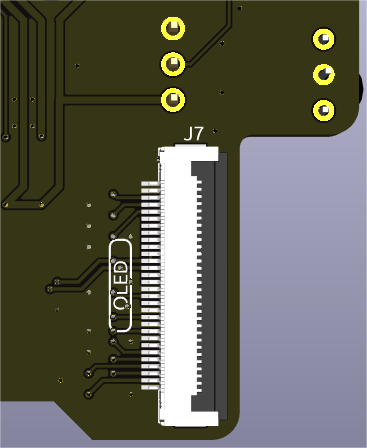

.. note:: 

    Hallo, willkommen in der SunFounder Raspberry Pi & Arduino & ESP32 Enthusiasten-Community auf Facebook! Tauche tiefer in die Welt von Raspberry Pi, Arduino und ESP32 ein und tausche dich mit anderen Enthusiasten aus.

    **Warum beitreten?**

    - **Expertensupport**: Löse nach dem Kauf auftretende Probleme und technische Herausforderungen mit Hilfe unserer Community und unseres Teams.
    - **Lernen & Teilen**: Tausche Tipps und Tutorials aus, um deine Fähigkeiten zu verbessern.
    - **Exklusive Einblicke**: Erhalte frühzeitigen Zugang zu neuen Produktankündigungen und exklusiven Vorschauen.
    - **Sonderrabatte**: Profitiere von exklusiven Rabatten auf unsere neuesten Produkte.
    - **Festliche Aktionen und Verlosungen**: Nimm an Verlosungen und saisonalen Sonderaktionen teil.

    👉 Bereit, mit uns zu entdecken und zu kreieren? Klicke auf [|link_sf_facebook|] und werde noch heute Mitglied!

IO-Erweiterung
================

RGB-LEDs
------------

Das Board verfügt über 4 WS2812 RGB-LEDs, die eine anpassbare Steuerung bieten. Benutzer können sie ein- oder ausschalten, die Farbe ändern, die Helligkeit anpassen, Anzeige-Modi wechseln und die Geschwindigkeit der Änderungen einstellen.

* Um den Ein- und Aus-Zustand der RGB-LEDs zu ändern, verwende ``true``, um die RGB-LEDs einzuschalten, und ``false``, um sie auszuschalten.

.. code-block:: shell

  sudo pironman5 -re true

* Um ihre Farbe zu ändern, gib die gewünschten hexadezimalen Farbwerte ein, wie zum Beispiel ``fe1a1a``.

.. code-block:: shell

  sudo pironman5 -rc fe1a1a

* Um die Helligkeit der RGB-LED zu ändern (Bereich: 0 ~ 100%):

.. code-block:: shell

  sudo pironman5 -rb 100

* Um die Anzeige-Modi der RGB-LED zu wechseln, wähle aus den folgenden Optionen: ``solid/breathing/flow/flow_reverse/rainbow/rainbow_reverse/hue_cycle``:

.. note::

  Wenn du den RGB-LED-Anzeigemodus auf ``rainbow``, ``rainbow_reverse`` oder ``hue_cycle`` einstellst, kannst du die Farbe nicht mit ``pironman5 -rc`` festlegen.

.. code-block:: shell

  sudo pironman5 -rs breathing

* Um die Geschwindigkeit der Änderung zu ändern (Bereich: 0 ~ 100%):

.. code-block:: shell

  sudo pironman5 -rp 80

RGB-Steuerpin
-------------------------

Die RGB-LED wird über SPI gesteuert und ist mit **GPIO10** verbunden, das auch der SPI MOSI-Pin ist. Die beiden gezeigten Pins werden verwendet, um die RGB-LED mit GPIO10 zu verbinden. Wenn dies nicht benötigt wird, kann der Jumper entfernt werden.

  .. image:: img/io_board_rgb_pin.png

RGB-OUT-Pins
-------------------------

Die WS2812 RGB-LEDs unterstützen serielle Verbindungen, sodass ein externer RGB-LED-Streifen angeschlossen werden kann. Verbinde den **SIG**-Pin mit dem **DIN**-Pin des externen Streifens zur Erweiterung.

Die Standardkonfiguration umfasst 4 RGB-LEDs. Schließe zusätzliche LEDs an und aktualisiere die Anzahl mit:

.. code-block:: shell

  sudo pironman5 --rgb-led-count [quantity]

Beispiel:

.. code-block:: shell

  sudo pironman5 --rgb-led-count 12

OLED-Bildschirmanschluss
----------------------------

Der OLED-Bildschirmanschluss mit der Adresse 0x3C ist ein wichtiges Merkmal.

Wenn der OLED-Bildschirm nicht angezeigt wird oder fehlerhaft ist, kannst du folgende Schritte zur Fehlerbehebung durchführen:

Überprüfe, ob das FPC-Kabel des OLED-Bildschirms korrekt angeschlossen ist.

#. Verwende den folgenden Befehl, um die Programmlogs anzuzeigen und nach Fehlermeldungen zu suchen.

    .. code-block:: shell

        cat /var/log/pironman5/pm_auto.oled.log

#. Alternativ kannst du den folgenden Befehl verwenden, um zu überprüfen, ob die i2c-Adresse 0x3C des OLED erkannt wird:
    
    .. code-block:: shell
        
        sudo i2cdetect -y 1

#. Wenn die ersten beiden Schritte keine Probleme anzeigen, versuche, den pironman5-Dienst neu zu starten, um zu sehen, ob das Problem dadurch behoben wird.

    .. code-block:: shell

        sudo systemctl restart pironman5.service

Wake-Up-Auslöser
-------------------------

.. image:: img/io_board_vib.png

Der integrierte Vibrationsschalter wird verwendet, um das OLED-Display aus dem Energiesparmodus aufzuwecken. Wenn eine Vibration erkannt wird, sendet er ein Signal zur Reaktivierung des OLED-Bildschirms, sodass das Display im Ruhezustand ausgeschaltet bleiben und bei Bewegung automatisch eingeschaltet werden kann.

Wenn Sie die für den Vibrationsschalter vorgesehene Jumperkappe entfernen, wird die Aufweckfunktion deaktiviert. Sobald das OLED in den Ruhezustand übergeht, kann es nicht mehr aufgeweckt werden. Diese Option richtet sich an fortgeschrittene Benutzer, die den entsprechenden GPIO-Pin für andere Anwendungen verwenden möchten.

.. note::

  Jumper installiert: Vibrationserkennung zum Aufwecken ist aktiviert.

  Jumper entfernt: OLED kann nach dem Ausschalten nicht mehr aufgeweckt werden. Der Pin steht für andere Zwecke zur Verfügung.

Infrarot-Empfänger
---------------------------

.. image:: img/io_board_receiver.png

* **Modell**: IRM-56384, arbeitet bei 38KHz.
* **Verbindung**: Der IR-Empfänger ist mit **GPIO13** verbunden.
* **D1**: Ein Infrarot-Empfangsanzeiger, der beim Empfang eines Signals blinkt.
* **J8**: Ein Pin zur Aktivierung der Infrarot-Funktion. Standardmäßig ist ein Jumper-Deckel eingesetzt, um sofortige Funktionalität zu gewährleisten. Entferne den Deckel, um GPIO13 freizugeben, wenn der IR-Empfänger nicht verwendet wird.

Um den IR-Empfänger zu nutzen, überprüfe seine Verbindung und installiere das notwendige Modul:

* Teste die Verbindung:

  .. code-block:: shell

    sudo ls /dev |grep lirc

* Installiere das ``lirc``-Modul:

  .. code-block:: shell

    sudo apt-get install lirc -y

* Teste jetzt den IR-Empfänger, indem du den folgenden Befehl ausführst.

  .. code-block:: shell

    mode2 -d /dev/lirc0

* Nachdem du den Befehl ausgeführt hast, drücke eine Taste auf der Fernbedienung, und der Code dieser Taste wird angezeigt.

RGB-Lüfter-Pins
---------------

Das IO-Erweiterungsboard unterstützt bis zu zwei 5V-Nicht-PWM-Lüfter. Beide Lüfter werden gemeinsam gesteuert.

**FAN1** und **FAN 2** sind zwei Sätze von Lüfter-Pins. Du musst das rote Kabel des Lüfters an „+“ und das schwarze Kabel an „-“ anschließen.

.. image:: img/io_board_fan.png

Es gibt zwei Sätze von 2-Pin-Anschlüssen und zwei Jumper, die zur Steuerung der RGB-Lüfter und ihrer LEDs verwendet werden. 
Standardmäßig sind die Jumper mit diesen Pins verbunden, was die Steuerung der Lüfter und LEDs über GPIO6 und GPIO5 ermöglicht. 
Wenn der Lüfterbetrieb nicht erforderlich ist, können diese Jumper entfernt werden, um GPIO5 und GPIO6 freizugeben.

.. image:: img/io_board_fan_j9.png

Nachdem die Jumper-Deckel entfernt wurden, ist der Lüfter oder die Lüfter-LED standardmäßig ausgeschaltet. 
Wenn eine Aktivierung erforderlich ist, können die beiden Pads unten mit Lötzinn überbrückt werden. 
Sobald sie verbunden sind, wird der Lüfter/LED beim Einschalten des Systems eingeschaltet und beim Herunterfahren des Systems ausgeschaltet, 
kann jedoch nicht über den IO-Port gesteuert werden.

.. **D2** ist ein Lüfter-Signalindikator, der leuchtet, wenn der Lüfter aktiv ist.

.. .. image:: img/io_board_fan_d2.png

.. Du kannst den Befehl verwenden, um den Betriebsmodus der beiden RGB-Lüfter zu konfigurieren. Diese Modi bestimmen die Bedingungen, unter denen die RGB-Lüfter aktiviert werden.

Zum Beispiel, wenn auf **1: Performance**-Modus eingestellt, werden die RGB-Lüfter bei 50°C aktiviert.

.. code-block:: shell

  sudo pironman5 -gm 3

* **4: Quiet**: Die RGB-Lüfter werden bei 70°C aktiviert.
* **3: Balanced**: Die RGB-Lüfter werden bei 67,5°C aktiviert.
* **2: Cool**: Die RGB-Lüfter werden bei 60°C aktiviert.
* **1: Performance**: Die RGB-Lüfter werden bei 50°C aktiviert.
* **0: Always On**: Die RGB-Lüfter sind immer an.

Wenn du den Steuerpin des RGB-Lüfters an verschiedene Pins des Raspberry Pi anschließt, kannst du den folgenden Befehl verwenden, um die Pin-Nummer zu ändern.

.. code-block:: shell

  sudo pironman5 -gp 18

Pin-Header
----------------

.. image:: img/io_board_pin_header.png

Zwei rechteckige Header-Steckverbinder erweitern den GPIO des Raspberry Pi, beachte jedoch, dass der IR-Empfänger, die RGB-LED und der Lüfter einige Pins belegen. Entferne die entsprechenden Jumper-Deckel, um diese Pins für andere Funktionen zu nutzen.

.. list-table:: 
  :widths: 25 25
  :header-rows: 1

  * - Pironman 5
    - Raspberry Pi 5
  * - IR-Empfänger (Optional)
    - GPIO13
  * - OLED SDA
    - SDA
  * - OLED SCL
    - SCL
  * - FAN (Optional)
    - GPIO6
  * - FLED (Optional)
    - GPIO5  
  * - RGB (Optional)
    - GPIO10
