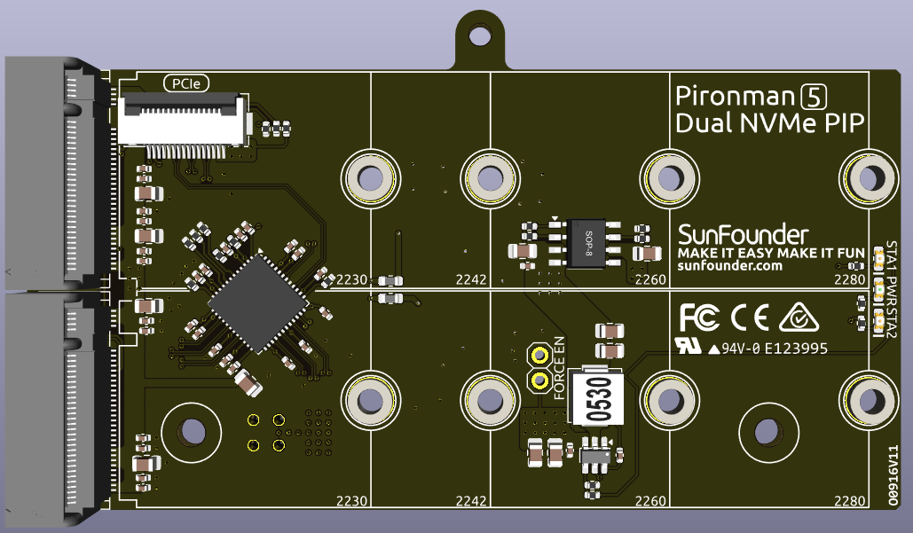

.. note:: 

    ¡Hola! Bienvenido a la comunidad de entusiastas de Raspberry Pi, Arduino y ESP32 de SunFounder en Facebook. Sumérgete en el mundo de Raspberry Pi, Arduino y ESP32 junto a otros apasionados como tú.

    **¿Por qué unirte?**

    - **Expert Support**: Resuelve problemas postventa y retos técnicos con el respaldo de nuestra comunidad y equipo.
    - **Learn & Share**: Comparte y aprende consejos y tutoriales para mejorar tus habilidades.
    - **Exclusive Previews**: Accede con antelación a anuncios de nuevos productos y adelantos exclusivos.
    - **Special Discounts**: Disfruta de descuentos exclusivos en nuestros productos más recientes.
    - **Festive Promotions and Giveaways**: Participa en sorteos y promociones especiales durante las festividades.

    👉 ¿Listo para explorar y crear con nosotros? Haz clic en [|link_sf_facebook|] y únete hoy mismo.

Dual NVMe PIP
=====================

La Dual NVMe PIP (placa periférica PCIe), según la definición de la Fundación Raspberry Pi, es una placa adaptadora PCIe diseñada específicamente para unidades de estado sólido NVMe.

La interfaz PCIe de la Raspberry Pi 5 proporciona un único canal Gen2 x1 (ancho de banda de 500 MB/s) por defecto. Al integrar el chip ASM1182e, se puede ampliar a dos canales Gen2 x1 independientes para conectar dos dispositivos M.2 con ranura M-key (como dos SSD NVMe M.2 o un SSD NVMe M.2 + un acelerador M.2 Hailo-8/8LAI). Sin embargo, cabe destacar que la Dual NVMe PIP no es compatible con Gen 3.

Admite cuatro tamaños diferentes de SSD NVMe: 2230, 2242, 2260 y 2280, todos compatibles con una ranura M-key M.2.

* La placa se conecta mediante un cable FFC inverso de 16 pines y 0.5 mm o un cable FPC personalizado con coincidencia de impedancia.
* **STA**: LED indicador de estado.
* **PWR**: LED indicador de alimentación.
* La fuente de alimentación integrada de 3.3 V admite hasta 3 A de salida. Sin embargo, como la interfaz PCIe del Raspberry Pi solo proporciona hasta 5 V/1 A (equivalente a 5 W), se puede suministrar energía adicional de 5 V a través del conector J3 para alcanzar los 3.3 V/3 A.
* **FORCE ENABLE**: La fuente de alimentación de la placa se activa mediante una señal de encendido proveniente de la interfaz PCIe. Al arrancar el Raspberry Pi, se envía una señal para habilitar la fuente de 3.3 V. Si el sistema no admite esta señal o en otros casos, puedes forzar la activación soldando un puente entre las almohadillas de J4 FORCE ENABLE.

Sobre el modelo
---------------------------

Los SSD M.2, conocidos por su formato compacto, se presentan en varias versiones que se diferencian principalmente por el tipo de llave (notch) y la interfaz que utilizan. A continuación se describen los principales tipos:

* **SSD M.2 SATA**: Utilizan la interfaz SATA, similar a los SSD de 2.5 pulgadas pero en formato M.2. Están limitados por la velocidad máxima de SATA III (~600 MB/s). Son compatibles con ranuras M.2 con llave B o M.
* **SSD M.2 NVMe**: Usan el protocolo NVMe sobre carriles PCIe y son mucho más rápidos que los SATA. Son ideales para tareas que requieren altas velocidades de lectura/escritura como juegos, edición de video o procesamiento de datos. Generalmente requieren ranuras con llave M. Utilizan la interfaz PCIe (Peripheral Component Interconnect Express), con versiones como 3.0, 4.0 y 5.0. Cada nueva versión duplica la velocidad de transferencia respecto a la anterior. No obstante, el Raspberry Pi 5 utiliza PCIe 3.0, capaz de alcanzar velocidades de hasta 3,500 MB/s.

Existen tres tipos de llaves en SSD M.2: llave B, llave M y llave B+M. Esta última combina la funcionalidad de ambas y ha reemplazado a la llave B en la mayoría de los casos. Consulta la siguiente imagen.

.. image:: img/ssd_key.png

En general, los SSD M.2 SATA usan llave B+M (compatibles tanto con ranuras B como M), mientras que los SSD M.2 NVMe PCIe 3.0 x4 usan llave M.

.. image:: img/ssd_model2.png

Sobre la longitud
-----------------------

Los módulos M.2 están disponibles en diferentes tamaños y también pueden utilizarse para Wi-Fi, WWAN, Bluetooth, GPS y NFC.

El Pironman 5 MAX admite cuatro tamaños de SSD NVMe M.2 (PCIe Gen 2.0 / Gen 3.0): 2230, 2242, 2260 y 2280. El número "22" indica el ancho en milímetros, y los siguientes dos dígitos indican la longitud. Cuanto más largo sea el módulo, mayor será el número de chips de memoria NAND que puede alojar, lo que se traduce en mayor capacidad.

.. image:: img/m2_ssd_size.png
  :width: 600

