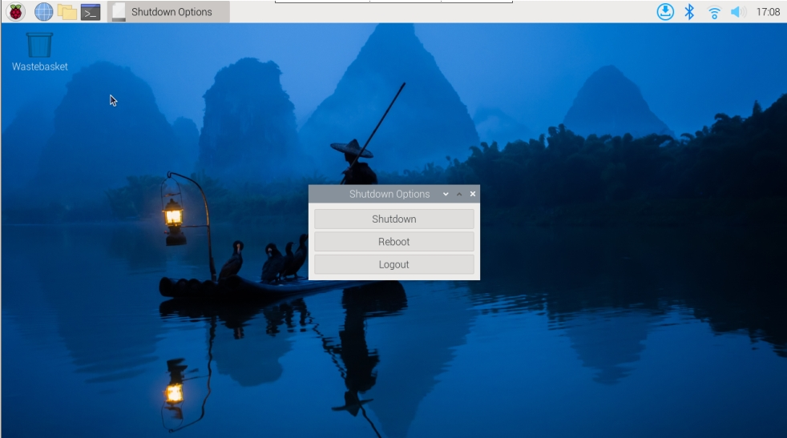

.. note::

    Hello, welcome to the SunFounder Raspberry Pi & Arduino & ESP32 Enthusiasts Community on Facebook! Dive deeper into Raspberry Pi, Arduino, and ESP32 with fellow enthusiasts.

    **Why Join?**

    - **Expert Support**: Solve post-sale issues and technical challenges with help from our community and team.
    - **Learn & Share**: Exchange tips and tutorials to enhance your skills.
    - **Exclusive Previews**: Get early access to new product announcements and sneak peeks.
    - **Special Discounts**: Enjoy exclusive discounts on our newest products.
    - **Festive Promotions and Giveaways**: Take part in giveaways and holiday promotions.

    👉 Ready to explore and create with us? Click [|link_sf_facebook|] and join today!

Power Switch Conventor
==============================

This is a module that expands the Raspberry Pi 5 power switch to the outside. 

**Adding the Power Button**

* The Raspberry Pi 5 features a **J2** jumper, situated between the RTC battery connector and the board edge. This breakout enables the addition of a custom power button to the Raspberry Pi 5 by connecting a Normally Open (NO) momentary switch across the two pads. Briefly engaging this switch mimics the onboard power button's functionality.

   .. image:: img/pi5_j2.jpg

* On the Pironman 5, there's a **Power Switch Converter** that extends the **J2** jumper to an external power button using two Pogo pins.

   .. image:: img/power_switch_convertor.png

* Now, the Raspberry Pi 5 can be powered on and off using the Power Button.

   .. image:: img/pironman_button.JPG

**Power Cycling**

Upon initially powering your Raspberry Pi 5, it will automatically turn on and boot into the operating system without the need to press the button.

If running the Raspberry Pi Desktop, a brief press of the power button initiates a clean shutdown process. A menu will appear, offering options to shutdown, reboot, or logout. Selecting an option or pressing the power button again will start a clean shutdown.

**Shutdown**

    * If you run Raspberry Pi **Bookworm Desktop** system, you can press the power button twice in quick succession to shutdown. 
    * If you run Raspberry Pi **Bookworm Lite** system without a desktop, press the power button a single time to initiate a shutdown.
    * To force a hard shutdown, press and hold the power button.

**Power on**

    * If the Raspberry Pi board is shut down, but still powered, single-press to power on from a shutdown state.

.. note::

    If you are running a system that does not support a shutdown button, you can hold it for 5 seconds to force a hard shutdown, and single-press to power on from a shutdown state.

