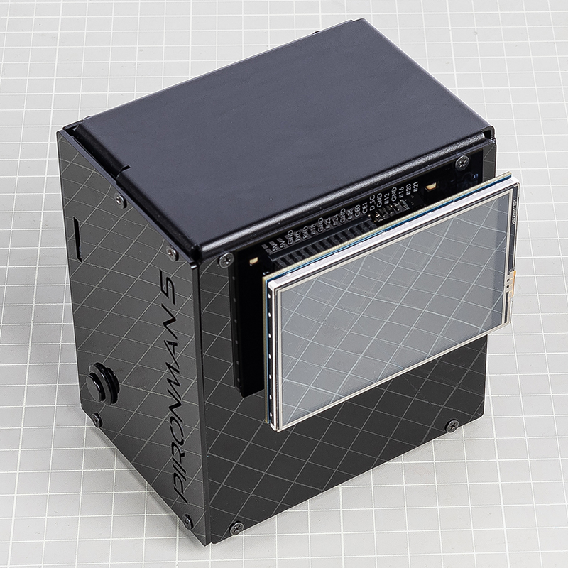

3.5英寸液晶屏连接
=============================

本章节适用于同时购买了 `3.5英寸液晶屏 <https://www.sunfounder.com/products/touchscreen-02?_pos=2&_sid=839d5db5b&_ss=r>`_ 的 Pironman 5 用户。

该液晶屏可以直接安装在树莓派的GPIO接口上，为Pironman 5 MAX增加图像显示和触摸操作功能。请按照正确步骤进行组装，以避免设备损坏。

详细的使用方法和信息，请参考以下说明书：  
`3.5英寸液晶屏说明书 <http://wiki.sunfounder.cc/index.php?title=3.5_Inch_LCD_Touch_Screen_Monitor_for_Raspberry_Pi>`_

**组装步骤**

.. image:: ../img/lcd_to_max1.jpg
    :width: 340

.. warning:: 将3.5英寸液晶屏安装到Pironman 5 MAX时，请务必确认接口方向完全对应。液晶模块的连接端必须与树莓派的GPIO接口完全对应。如果连接错位，可能会导致液晶屏或主机损坏。在通电前，请仔细检查连接情况。

**RGB接口的移除**

当同时使用Pironman 5和3.5英寸液晶屏时，RGB发光二极管与液晶屏使用相同的SPI接口。因此，为了避免冲突并正确使用液晶屏，需要断开RGB的连接。

请按照以下步骤操作：

1. **在I/O扩展板（IO Expansion Board）** 上， **拔下RGB接口上的跳线帽**。

   .. image:: ../img/lcd_to_max0.jpg
      :width: 600
      :align: center

2. 然后执行以下命令， **停止RGB控制功能**：

   .. code-block:: bash

      pironman5 -re false
      sudo systemctl restart pironman5.service 

这样可以释放SPI接口供液晶屏使用，避免冲突和显示异常。

**设备驱动（Driver）的安装**

使用该液晶屏之前，需要先安装设备控制驱动。具体步骤根据所使用的操作系统不同而不同。

* **Raspberry Pi OS** 用户请执行以下步骤：

   .. code-block:: bash

      sudo rm -rf LCD-show 
      git clone https://github.com/sunfounder/LCD-show.git 
      chmod -R 755 LCD-show 
      cd LCD-show/ 
      sudo ./LCD35-show

   成功执行后，树莓派的画面会显示在3.5英寸液晶屏上。

   如果需要调整显示方向，请执行以下步骤：

   .. code-block:: bash

      cd LCD-show/
      sudo ./rotate.sh 90   

   执行后设备会自动重启，屏幕将旋转90度并支持触摸操作。数字可更改为 0、90、180、270 之一。

* **Ubuntu** 用户请执行以下步骤：

   .. code-block:: bash

      sudo rm -rf LCD-show-ubuntu 
      git clone https://github.com/sunfounder/LCD-show-ubuntu.git 
      chmod -R 755 LCD-show-ubuntu 
      cd LCD-show-ubuntu/ 
      sudo ./LCD35-show

   成功执行后，树莓派的画面会显示在3.5英寸液晶屏上。

   如果需要调整显示方向，请执行以下步骤：

   .. code-block:: bash

      cd LCD-show/
      sudo ./rotate.sh 90   

   执行后设备会自动重启，屏幕将旋转90度并支持触摸操作。数字可更改为 0、90、180、270 之一。

* **Kali Linux** 用户请执行以下步骤：

   .. code-block:: bash

      sudo rm -rf LCD-show-kali 
      git clone https://github.com/sunfounder/LCD-show-kali.git 
      chmod -R 755 LCD-show-kali 
      cd LCD-show-kali/ 
      sudo ./LCD35-show

   成功执行后，树莓派的画面会显示在3.5英寸液晶屏上。

   如果需要调整显示方向，请执行以下步骤：

   .. code-block:: bash

      cd LCD-show/
      sudo ./rotate.sh 90   

   执行后设备会自动重启，屏幕将旋转90度并支持触摸操作。数字可更改为 0、90、180、270 之一。
