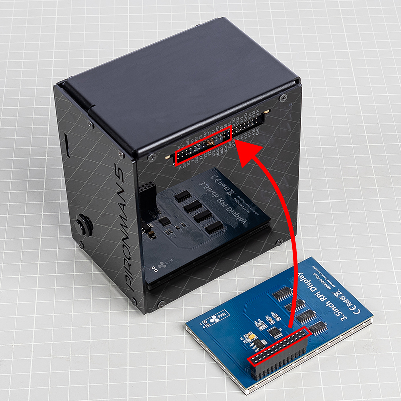

3.5インチ液晶画面との接続
=============================

この章は、 `3.5インチ液晶画面 <https://www.sunfounder.com/products/touchscreen-02?_pos=2&_sid=839d5db5b&_ss=r>`_ をあわせて購入されたPironman 5 MAXの利用者向けです。

この液晶画面は、ラズベリーパイのGPIO端子に直接取り付けることができ、Pironman 5 MAXに映像表示と触れて操作できる機能を追加します。正しい手順に従って組み立てを行い、機器の破損を防ぐようにしてください。

くわしい使い方や情報は、下記の説明書をご覧ください：  
`3.5インチ液晶の説明書 <http://wiki.sunfounder.cc/index.php?title=3.5_Inch_LCD_Touch_Screen_Monitor_for_Raspberry_Pi>`_

**組み立て手順**

.. image:: ../img/lcd_to_max2.jpg
    :width: 340

.. warning:: 3.5インチ液晶画面をPironman 5 MAXに取り付ける際は、端子の向きを必ず確認し、完全に一致させてください。液晶モジュールの接続部は、ラズベリーパイのGPIO端子と正確に対応していなければなりません。ずれた状態で接続すると、液晶や本体が故障するおそれがあります。電源を入れる前に、必ず配線をよく確認してください。

**RGB端子の取り外し**

Pironman 5 MAXと3.5インチ液晶画面を同時に使用する場合、RGB発光ダイオードと液晶画面が同じSPI端子を使用します。そのため、競合を避け、液晶を正しく使えるようにするには、RGBの接続を解除する必要があります。

以下の手順に従ってください：

1. **入出力拡張基板（IO Expansion Board）**上にある、 **RGB端子に差してあるジャンパーキャップを外してください**。

   .. image:: ../img/lcd_to_max0.jpg
      :width: 600
      :align: center

2. その後、次の操作を行い、 **RGB制御のしくみを停止**します：

   .. code-block:: bash

      pironman5 -re false
      sudo systemctl restart pironman5.service 

これにより、SPI端子が液晶画面のために空き、衝突や表示の不具合を防ぐことができます。

**装置用の設定（ドライバ）の導入**

この液晶画面を使うには、事前に装置制御用の設定（ドライバ）を導入する必要があります。導入手順は使用する基本ソフト（OS）によって異なります。

* **Raspberry Pi OS**をご利用の場合、以下の手順で設定を導入できます：

   .. code-block:: bash

      sudo rm -rf LCD-show 
      git clone https://github.com/sunfounder/LCD-show.git 
      chmod -R 755 LCD-show 
      cd LCD-show/ 
      sudo ./LCD35-show

   正しく実行されると、Raspberry Piの画面が3.5インチ液晶に表示されるようになります。

   表示画面の向きを変えたい場合は、次の手順を行ってください：

   .. code-block:: bash

      cd LCD-show/
      sudo ./rotate.sh 90   

   実行後、装置は自動的に再起動し、画面が90度回転して表示され、触って操作できる状態になります。数字は 0、90、180、270 のいずれかに変更可能です。

* **Ubuntu**をご利用の場合は、以下の手順を実行してください：

   .. code-block:: bash

      sudo rm -rf LCD-show-ubuntu 
      git clone https://github.com/sunfounder/LCD-show-ubuntu.git 
      chmod -R 755 LCD-show-ubuntu 
      cd LCD-show-ubuntu/ 
      sudo ./LCD35-show

   正しく実行されると、Raspberry Piの画面が3.5インチ液晶に表示されるようになります。

   表示画面の向きを変えたい場合は、次の手順を行ってください：

   .. code-block:: bash

      cd LCD-show/
      sudo ./rotate.sh 90   

   実行後、装置は自動的に再起動し、画面が90度回転して表示され、触って操作できる状態になります。数字は 0、90、180、270 のいずれかに変更可能です。

* **Kali Linux**をご利用の場合は、以下の手順を実行してください：

   .. code-block:: bash

      sudo rm -rf LCD-show-kali 
      git clone https://github.com/sunfounder/LCD-show-kali.git 
      chmod -R 755 LCD-show-kali 
      cd LCD-show-kali/ 
      sudo ./LCD35-show

   正しく実行されると、Raspberry Piの画面が3.5インチ液晶に表示されるようになります。

   表示画面の向きを変えたい場合は、次の手順を行ってください：

   .. code-block:: bash

      cd LCD-show/
      sudo ./rotate.sh 90   

   実行後、装置は自動的に再起動し、画面が90度回転して表示され、触って操作できる状態になります。数字は 0、90、180、270 のいずれかに変更可能です。
