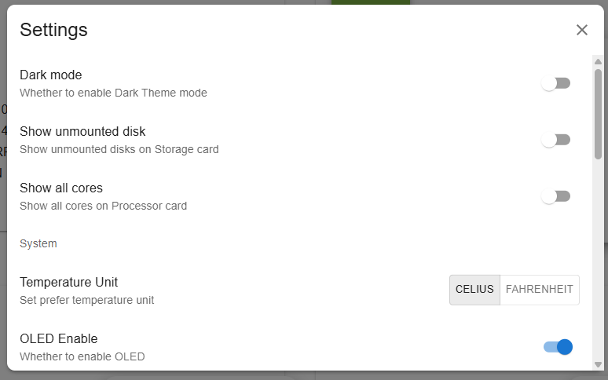
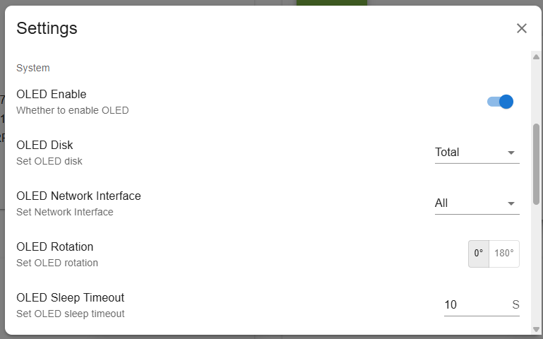
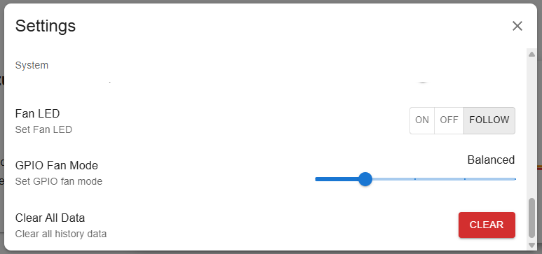

.. note:: 

    Hallo, willkommen in der SunFounder Raspberry Pi & Arduino & ESP32 Enthusiasten-Community auf Facebook! Tauche tiefer in die Welt von Raspberry Pi, Arduino und ESP32 ein und tausche dich mit anderen Enthusiasten aus.

    **Warum beitreten?**

    - **Expertensupport**: Löse nach dem Kauf auftretende Probleme und technische Herausforderungen mit Hilfe unserer Community und unseres Teams.
    - **Lernen & Teilen**: Tausche Tipps und Tutorials aus, um deine Fähigkeiten zu verbessern.
    - **Exklusive Einblicke**: Erhalte frühzeitigen Zugang zu neuen Produktankündigungen und exklusiven Vorschauen.
    - **Sonderrabatte**: Profitiere von exklusiven Rabatten auf unsere neuesten Produkte.
    - **Festliche Aktionen und Verlosungen**: Nimm an Verlosungen und saisonalen Sonderaktionen teil.

    👉 Bereit, mit uns zu entdecken und zu kreieren? Klicke auf [|link_sf_facebook|] und werde noch heute Mitglied!

.. _max_view_control_dashboard:

Anzeige und Steuerung über das Dashboard
=========================================

Nachdem du das ``pironman5``-Modul erfolgreich installiert hast, wird der ``pironman5.service`` nach dem Neustart automatisch gestartet.

Nun kannst du die Überwachungsseite in deinem Browser öffnen, um Informationen über deinen Raspberry Pi anzuzeigen, die RGB-Einstellungen zu konfigurieren und den Lüfter zu steuern. Der Link zur Seite lautet: ``http://<ip>:34001``.

Diese Seite enthält die Bereiche **Dashboard**, **Verlauf**, **Protokoll** und **Einstellungen**.

.. image:: img/dashboard_tab.png
  :width: 90%

Dashboard
-----------------------

Es gibt mehrere Karten, um den relevanten Status des Raspberry Pi anzuzeigen, darunter:

* **Temperatur**: Zeigt die CPU-Temperatur des Raspberry Pi und die PWM-Lüftergeschwindigkeit an. **GPIO Lüfterstatus** zeigt den Status der beiden seitlichen RGB-Lüfter an. Bei der aktuellen Temperatur sind die beiden RGB-Lüfter ausgeschaltet.

  .. image:: img/dashboard_temp.png
    :width: 90%

* **Speicher**: Zeigt die Speicherkapazität des Raspberry Pi an und zeigt verschiedene Festplattenpartitionen mit ihrem belegten und verfügbaren Speicherplatz.

  .. image:: img/dashboard_storage.png
    :width: 90%

* **Speicher**: Zeigt die RAM-Nutzung des Raspberry Pi und den Prozentsatz an.

  .. image:: img/dashboard_memory.png
    :width: 90%

* **Netzwerk**: Zeigt den aktuellen Verbindungstyp des Netzwerks sowie die Upload- und Download-Geschwindigkeiten an.

  .. image:: img/dashboard_network.png
    :width: 90%

* **Prozessor**: Zeigt die CPU-Leistung des Raspberry Pi an, einschließlich des Status der vier Kerne, der Betriebshäufigkeiten und des CPU-Nutzungsprozentsatzes.

  .. image:: img/dashboard_processor.png
    :width: 90%

Verlauf
--------------

Die Verlauf-Seite ermöglicht es dir, historische Daten anzuzeigen. Wähle im linken Seitenbereich die Daten aus, die du anzeigen möchtest, wähle dann den Zeitraum aus, um die Daten für diesen Zeitraum zu sehen, und du kannst sie auch herunterladen.

.. image:: img/dashboard_history1.png
  :width: 90%

.. image:: img/dashboard_history2.png
  :width: 90%

Protokoll
------------

Die Protokoll-Seite wird verwendet, um die Protokolle des aktuell laufenden Pironman5-Dienstes anzuzeigen. Der Pironman5-Dienst umfasst mehrere Unterdienste, von denen jeder sein eigenes Protokoll hat. Wähle das Protokoll aus, das du anzeigen möchtest, und du kannst die Protokolldaten auf der rechten Seite sehen. Wenn es leer ist, bedeutet dies möglicherweise, dass keine Protokollinhalte vorhanden sind.

* Jedes Protokoll hat eine feste Größe von 10 MB. Wenn diese Größe überschritten wird, wird ein zweites Protokoll erstellt.
* Die Anzahl der Protokolle für denselben Dienst ist auf 10 begrenzt. Wenn die Anzahl dieses Limits überschreitet, wird das älteste Protokoll automatisch gelöscht.
* Es gibt Filterwerkzeuge oberhalb des Protokollbereichs auf der rechten Seite. Du kannst das Protokollniveau auswählen, nach Schlüsselwörtern filtern und verschiedene praktische Werkzeuge wie **Zeilenumbruch**, **Automatisches Scrollen** und **Automatische Aktualisierung** verwenden.
* Protokolle können auch lokal heruntergeladen werden.

.. image:: img/dashboard_log1.png
  :width: 90%

.. image:: img/dashboard_log2.png
  :width: 90%

Einstellungen
-----------------

Im oberen rechten Bereich der Seite befindet sich ein Einstellungsmenü, in dem du die Einstellungen nach deinen Wünschen anpassen kannst. Nach Änderungen werden die Einstellungen automatisch gespeichert. Wenn nötig, kannst du die Schaltfläche CLEAR am unteren Rand verwenden, um die historischen Daten zu löschen.

* **Dunkelmodus**: Wechsle zwischen den Themen für den Hell- und Dunkelmodus. Die Themenoption wird im Browser-Cache gespeichert. Wenn du den Browser wechselst oder den Cache löschst, wird das Standardthema im hellen Modus wiederhergestellt.
* **Nicht gemountete Datenträger anzeigen**: Ob nicht gemountete Datenträger im Dashboard angezeigt werden sollen.
* **Alle Kerne anzeigen**: Ob alle Kerne im Dashboard angezeigt werden sollen.
* **Temperatur-Einheit**: Lege die Temperatureinheit fest, die im System angezeigt wird.

**Über OLED-Bildschirm**

* **OLED aktivieren**: Bestimmt, ob das OLED aktiviert werden soll.
* **OLED Festplatte**: Lege die OLED-Festplatte fest.
* **OLED Netzwerkinterface**:

  * **all**: Wechsle die Anzeige zwischen der Ethernet-IP und der Wi-Fi-IP in Reihenfolge.
  * **eth0**: Zeige nur die Ethernet-IP an.
  * **wlan0**: Zeige nur die Wi-Fi-IP an.

* **OLED Rotation**: Lege die OLED-Rotation fest.
* **OLED-Ruhezustand-Timeout**: Legen Sie das OLED-Ruhezustand-Timeout fest.

**Über RGB-LEDs**

.. image:: img/RGB_LEDS.jpg
  :width: 600

* **RGB aktivieren**: Bestimmt, ob die RGB-LEDs aktiviert werden sollen.
* **RGB-Farbe**: Lege die Farbe der RGB-LEDs fest.
* **RGB-Helligkeit**: Du kannst die Helligkeit der RGB-LEDs mit einem Schieberegler anpassen.
* **RGB-Stil**: Wähle den Anzeige-Modus der RGB-LEDs. Optionen beinhalten **Solid**, **Breathing**, **Flow**, **Flow_reverse**, **Rainbow**, **Rainbow Reverse**, und **Hue Cycle**.

  .. note::

     Wenn du den **RGB-Stil** auf **Rainbow**, **Rainbow Reverse** oder **Hue Cycle** einstellst, kannst du die Farbe nicht festlegen.

* **RGB-Geschwindigkeit**: Bestimme die Geschwindigkeit der RGB-LED-Änderungen.

**Über RGB-Lüfter**

* **Lüfter-LED**: Stellt den Modus der RGB-Lüfter ein.

    * **Aus**: RGB ausschalten.
    * **Ein**: RGB einschalten.
    * **Folgen**: RGB automatisch je nach Betriebszustand des Lüfters einschalten.

* **GPIO Lüftermodus**: Du kannst den Betriebsmodus der beiden RGB-Lüfter festlegen. Diese Modi bestimmen die Bedingungen, unter denen die RGB-Lüfter aktiviert werden.

    * **Quiet**: Die RGB-Lüfter werden bei 70°C aktiviert.
    * **Balanced**: Die RGB-Lüfter werden bei 67,5°C aktiviert.
    * **Cool**: Die RGB-Lüfter werden bei 60°C aktiviert.
    * **Performance**: Die RGB-Lüfter werden bei 50°C aktiviert.
    * **Always On**: Die RGB-Lüfter sind immer eingeschaltet.

Beispielsweise, wenn auf **Performance**-Modus eingestellt, werden die RGB-Lüfter bei 50°C aktiviert.

Wenn die CPU-Temperatur nach dem Speichern 50 °C überschreitet, werden Sie sehen, dass die seitlichen RGB-Lüfter zu rotieren beginnen.
