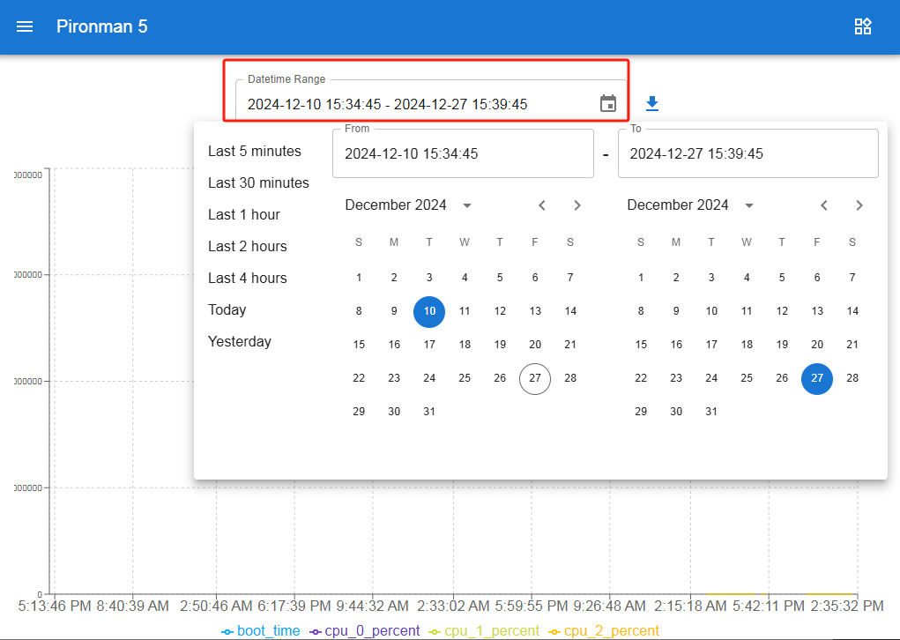

.. note:: 

    Ciao, benvenuto nella community Facebook degli appassionati di Raspberry Pi, Arduino ed ESP32 targata SunFounder! Approfondisci le tue conoscenze su Raspberry Pi, Arduino ed ESP32 insieme ad altri appassionati come te.

    **Why Join?**

    - **Expert Support**: Risolvi problemi post-vendita e sfide tecniche con il supporto della nostra community e del nostro team.
    - **Learn & Share**: Scambia consigli e tutorial per sviluppare le tue competenze.
    - **Exclusive Previews**: Ottieni accesso anticipato a nuovi annunci di prodotto e anteprime esclusive.
    - **Special Discounts**: Approfitta di sconti esclusivi sui nostri prodotti più recenti.
    - **Festive Promotions and Giveaways**: Partecipa a promozioni festive e concorsi a premi.

    👉 Pronto a esplorare e creare con noi? Clicca su [|link_sf_facebook|] ed entra nella community oggi stesso!

.. _max_view_control_dashboard:

Visualizzazione e Controllo dalla Dashboard
===============================================

Una volta installato correttamente il modulo ``pironman5``, il servizio ``pironman5.service`` si avvierà automaticamente al riavvio del sistema.

Ora puoi aprire la pagina di monitoraggio nel browser per visualizzare le informazioni sul tuo Raspberry Pi, configurare gli RGB, controllare la ventola e molto altro. Il link alla pagina è: ``http://<ip>:34001``.

Questa pagina include **Dashboard**, **Storico**, **Log** e una pagina delle **Impostazioni**.

.. image:: img/dashboard_tab.png
  :width: 90%

Dashboard
-----------------------

Sono disponibili diverse schede per monitorare lo stato del Raspberry Pi, tra cui:

* **Ventola**: Mostra la temperatura della CPU del Raspberry Pi e la velocità della ventola PWM. **GPIO Fan State** indica lo stato delle due ventole RGB laterali. Alla temperatura attuale, le due ventole RGB sono spente.

  .. image:: img/dashboard_pwm_fan.png
    :width: 90%

* **Archiviazione**: Visualizza la capacità di archiviazione del Raspberry Pi, mostrando le partizioni del disco con lo spazio utilizzato e disponibile.

  .. image:: img/dashboard_storage.png
    :width: 90%

* **Memoria**: Mostra l’utilizzo e la percentuale della RAM del Raspberry Pi.

  .. image:: img/dashboard_memory.png
    :width: 90%

* **Rete**: Visualizza il tipo di connessione attiva, e la velocità di upload e download.

  .. image:: img/dashboard_network.png
    :width: 90%

* **Processore**: Mostra le prestazioni della CPU, inclusi lo stato dei quattro core, la frequenza operativa e la percentuale di utilizzo.

  .. image:: img/dashboard_processor.png
    :width: 90%

Storico
--------------

La pagina Storico consente di visualizzare dati storici. Seleziona nel menu a sinistra i dati da monitorare, imposta l’intervallo di tempo e potrai anche scaricare le informazioni.

.. image:: img/dashboard_history1.png
  :width: 90%
  

Log
------------

La pagina Log permette di consultare i log del servizio Pironman5 in esecuzione. Il servizio comprende diversi sottoservizi, ognuno con il proprio log. Seleziona quello desiderato per visualizzarne i contenuti. Se la finestra è vuota, potrebbe significare che non ci sono log registrati.

* Ogni log ha una dimensione massima di 10MB. Una volta superata, viene creato un nuovo file.
* Il numero massimo di log per ogni servizio è 10. I log più vecchi vengono eliminati automaticamente.
* Nella parte superiore dell’area log ci sono strumenti di filtro per selezionare il livello del log, filtrare per parole chiave e utilizzare opzioni come **Line Wrap**, **Auto Scroll** e **Auto Update**.
* I log possono essere anche scaricati in locale.

.. image:: img/dashboard_log1.png
  :width: 90%
  
.. image:: img/dashboard_log2.png
  :width: 90%

Impostazioni
-----------------

Nel menu in alto a destra trovi le impostazioni personalizzabili. Le modifiche vengono salvate automaticamente. Se necessario, puoi cliccare sul pulsante CLEAR in basso per cancellare i dati storici.

.. image:: img/Dark_mode_and_Temperature.jpg
  :width: 600

* **Modalità Scura**: Passa tra tema chiaro e scuro. La preferenza viene salvata nella cache del browser.
* **Unità di Temperatura**: Imposta l’unità di temperatura visualizzata dal sistema.

**Informazioni sullo schermo OLED**

.. image:: img/OLED_Sreens.jpg
  :width: 600

* **OLED Enable**: Attiva/disattiva l'OLED.
* **OLED Disk**: Imposta il disco da visualizzare su OLED.
* **Interfaccia di rete OLED**: 

  * **all**: Alterna tra IP Ethernet e Wi-Fi.
  * **eth0**: Mostra solo l’IP Ethernet.
  * **wlan0**: Mostra solo l’IP Wi-Fi.

* **Rotazione OLED**: Imposta la rotazione dello schermo OLED.

**Informazioni sui LED RGB**

.. image:: img/RGB_LEDS.jpg
  :width: 600

* **RGB Enable**: Attiva/disattiva i LED RGB.
* **Colore RGB**: Imposta il colore dei LED RGB.
* **Luminosità RGB**: Regola la luminosità tramite un cursore.
* **Stile RGB**: Scegli la modalità di visualizzazione: **Solid**, **Breathing**, **Flow**, **Flow_reverse**, **Rainbow**, **Rainbow Reverse**, **Hue Cycle**.

  .. note::

     Se imposti lo **RGB Style** su **Rainbow**, **Rainbow Reverse** o **Hue Cycle**, non potrai modificare il colore.

* **Velocità RGB**: Imposta la velocità degli effetti RGB.

**Informazioni sulle Ventole RGB**

.. image:: img/RGB_FAN2.png
  :width: 600

* **Modalità Ventola GPIO**: Imposta la modalità operativa delle due ventole RGB. Queste modalità determinano la soglia di attivazione in base alla temperatura.

    * **Quiet**: Le ventole si attivano a 70°C.
    * **Balanced**: Le ventole si attivano a 67.5°C.
    * **Cool**: Le ventole si attivano a 60°C.
    * **Performance**: Le ventole si attivano a 50°C.
    * **Always On**: Le ventole restano sempre accese.

Ad esempio, impostando la modalità **Prestazioni**, le ventole RGB si attiveranno a 50°C.

Dopo aver salvato, se la temperatura della CPU supera i 50°C, vedrai lo **Stato Ventola GPIO** passare a ON nella Dashboard, e le ventole RGB laterali inizieranno a girare.

.. image:: img/dashboard_rgbfan_on.png
  :width: 300

