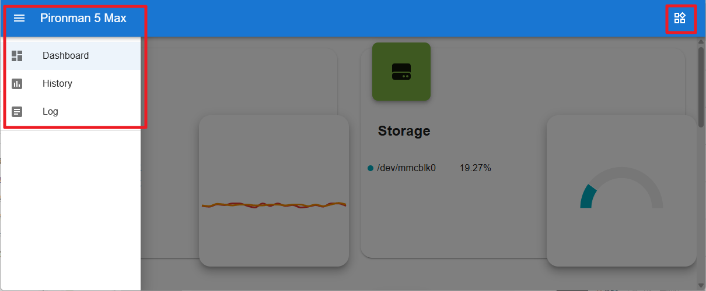

.. _max_view_control_dashboard:

通过仪表盘查看与控制
=========================================

成功安装 ``pironman5`` 模块后，系统将在重启后自动启动 ``pironman5.service`` 服务。

此时，你可以在浏览器中打开监控页面，查看树莓派的运行信息、配置 RGB 灯效、控制风扇等。访问地址为： ``http://<ip>:34001``。

该页面包含 **Dashboard（仪表盘）**、 **History（历史记录）**、 **Log（日志）** 和 **Settings（设置）** 四个子页面。

  

仪表盘
-----------------------

仪表盘页面通过多种卡片展示树莓派的实时状态信息，包括：

* **Fan**：显示树莓派 CPU 的温度与 PWM 风扇转速， **GPIO Fan State** 表示两个侧边 RGB 风扇的运行状态。当前温度下，两个 RGB 风扇处于关闭状态。

  .. image:: img/dashboard_pwm_fan.png
    :width: 90%

* **Storage**：显示树莓派的存储容量，展示各个磁盘分区的已用与可用空间。

  .. image:: img/dashboard_storage.png
    :width: 90%

* **Memory**：显示树莓派内存的使用情况及百分比。

  .. image:: img/dashboard_memory.png
    :width: 90%

 
* **Network**：显示当前的网络连接类型、上传速度和下载速度。

  .. image:: img/dashboard_network.png
    :width: 90%

* **Processor**：展示树莓派 CPU 的性能情况，包括四个核心的状态、运行频率以及 CPU 占用率。

  .. image:: img/dashboard_processor.png
    :width: 90%

历史记录
--------------

在 History 页面中可以查看历史数据。勾选左侧栏要查看的项目，选择时间范围后即可查看该时段的记录，也可以点击下载保存。

.. image:: img/dashboard_history1.png
  :width: 90%
  
.. image:: img/dashboard_history2.png
  :width: 90%

日志
------------

Log 页面用于查看当前 Pironman5 服务的运行日志。Pironman5 服务包含多个子服务，每个子服务都有自己的日志文件。选择要查看的日志，右侧将显示日志内容；如果为空，可能表示当前无日志记录。

* 每个日志文件大小为固定的 10MB，超出后将自动生成下一个日志文件。
* 每个服务最多保留 10 个日志文件，超过后最旧的文件将被自动删除。
* 日志区域上方提供多种筛选工具，可以按日志级别、关键字进行过滤，还支持 **自动换行**、 **自动滚动** 与 **自动更新** 功能。
* 日志也可以下载保存到本地。

.. image:: img/dashboard_log1.png
  :width: 90%
  
.. image:: img/dashboard_log2.png
  :width: 90%

设置
-----------------

页面右上角为设置菜单，可根据个人喜好自定义配置。设置修改后将自动保存。如需清除历史数据，可点击底部的 CLEAR 按钮。

.. image:: img/Dark_mode_and_Temperature.jpg
  :width: 600

* **Dark Mode**：切换浅色与深色主题。主题设置将保存在浏览器缓存中，切换浏览器或清空缓存将恢复为默认的浅色主题。
* **Temperature Unit**：设置系统显示的温度单位。

**关于 OLED 屏幕**

.. image:: img/OLED_Sreens.jpg
  :width: 600

* **OLED Enable**：是否启用 OLED 屏幕。
* **OLED Disk**：设置 OLED 显示的磁盘分区。
* **OLED Network Interface**：

  * **all**：轮流显示以太网 IP 和 Wi-Fi IP。
  * **eth0**：仅显示以太网 IP。
  * **wlan0**：仅显示 Wi-Fi IP。

* **OLED Rotation**：设置 OLED 显示方向。

**关于 RGB 灯效**

.. image:: img/RGB_LEDS.jpg
  :width: 600

* **RGB Enable**：是否启用 RGB 灯效。
* **RGB Color**：设置 RGB 灯的颜色。
* **RGB Brightness**：通过滑动条调节 RGB 灯的亮度。
* **RGB Style**：选择 RGB 灯的显示模式，包括 **Solid（常亮）**、 **Breathing（呼吸）**、 **Flow（流动）**、 **Flow_reverse（反向流动）**、 **Rainbow（彩虹）**、 **Rainbow Reverse（反向彩虹）** 和 **Hue Cycle（色相循环）**。

  .. note::

     如果设置了 **RGB Style** 为 **Rainbow**、 **Rainbow Reverse** 或 **Hue Cycle**，将无法自定义 RGB 灯的颜色。

* **RGB Speed**：设置 RGB 灯效果的变化速度。

**关于 RGB 风扇**

.. image:: img/RGB_FAN2.png
  :width: 600

* **GPIO Fan Mode**：设置两个 RGB 风扇的运行模式，不同模式决定风扇启动的温度阈值。

    * **Quiet**：风扇将在 70°C 时启动。
    * **Balanced**：风扇将在 67.5°C 时启动。
    * **Cool**：风扇将在 60°C 时启动。
    * **Performance**：风扇将在 50°C 时启动。
    * **Always On**：风扇始终运行。

例如，如果设置为 **Performance** 模式，当 CPU 温度超过 50°C 时，RGB 风扇将自动开启。

保存后，当 CPU 温度超过 50°C，你将在仪表盘中看到 **GPIO Fan State** 变为 ON，侧边 RGB 风扇开始运转。

.. image:: img/dashboard_rgbfan_on.png
  :width: 300

