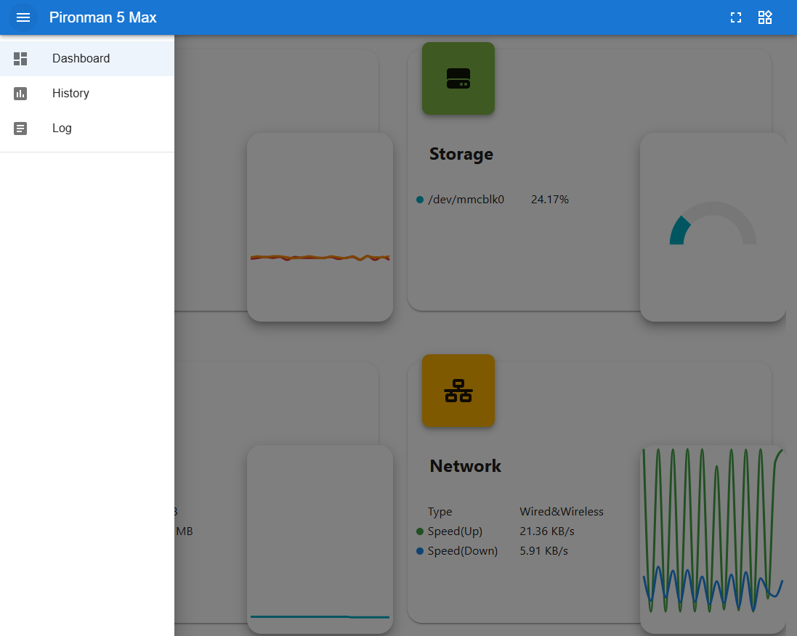
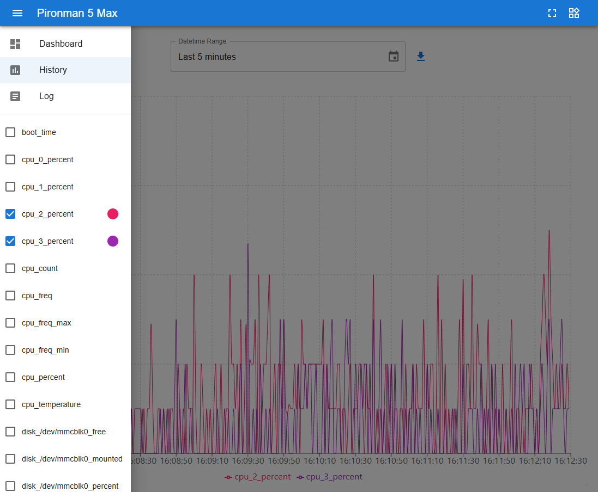
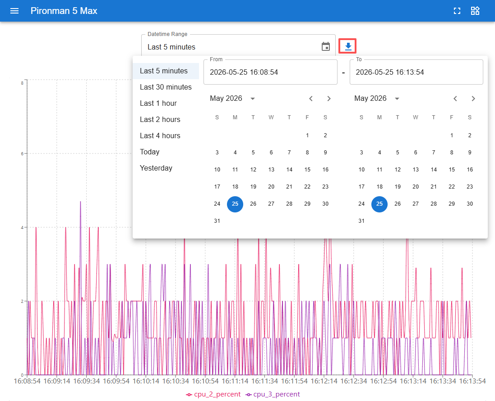
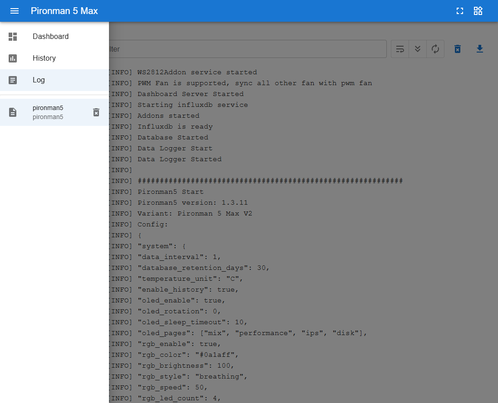
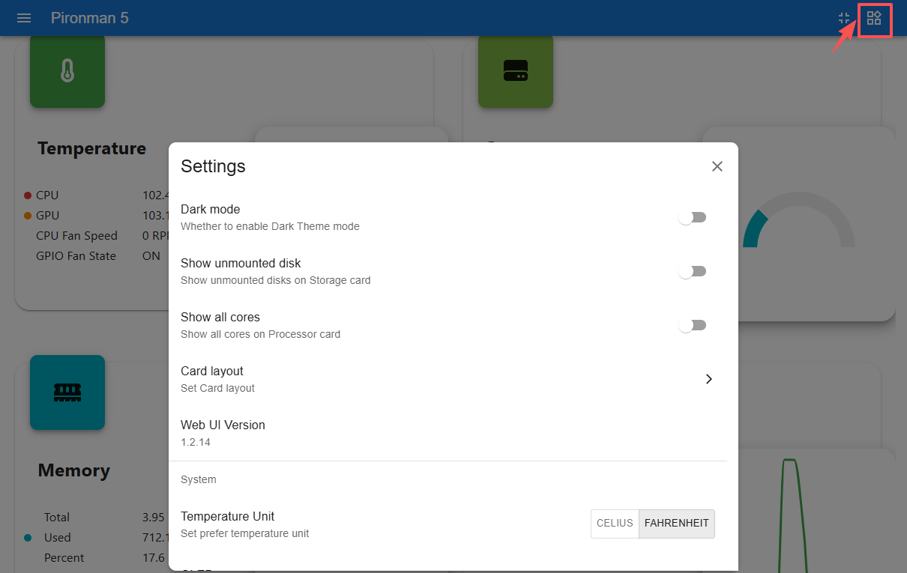

.. include:: /index.rst
   :start-after: start_hello_message
   :end-before: end_hello_message

.. _view_control_dashboard:

Afficher et contrôler depuis le tableau de bord
=================================================

Une fois que vous avez installé le module ``pironman5`` avec succès, le service ``pironman5.service`` démarrera automatiquement au redémarrage.

Vous pouvez maintenant ouvrir la page de surveillance dans votre navigateur pour consulter les informations sur votre Raspberry Pi, configurer les LED RGB et contrôler le ventilateur. Le lien de la page est : ``http://<ip>:34001``.

Cette page comprend les pages **Tableau de bord**, **Historique**, **Journal** et **Paramètres**.

Tableau de bord
-----------------------

Plusieurs cartes permettent de consulter l'état du Raspberry Pi, notamment :

* **Température** : Affiche la température CPU/GPU du Raspberry Pi et la vitesse du ventilateur CPU. L'**État des ventilateurs GPIO** indique l'état des deux ventilateurs GPIO latéraux.

  .. image:: img/dashboard_tem.png
    :width: 90%

* **Stockage** : Affiche la capacité de stockage du Raspberry Pi, avec les différentes partitions de disque, leur espace utilisé et disponible.

  .. image:: img/dashboard_storage.png
    :width: 90%

* **Mémoire** : Affiche l'utilisation de la RAM du Raspberry Pi et son pourcentage.

  .. image:: img/dashboard_memory.png
    :width: 90%

* **Réseau** : Affiche le type de connexion réseau actuel, les vitesses de téléchargement et d'envoi.

  .. image:: img/dashboard_network.png
    :width: 90%

* **Processeur** : Illustre les performances du CPU du Raspberry Pi, y compris l'état de ses quatre cœurs, les fréquences de fonctionnement et le pourcentage d'utilisation du CPU.

  .. image:: img/dashboard_processor.png
    :width: 90%

Historique
--------------

La page Historique vous permet de consulter les données historiques. Cochez les données que vous souhaitez afficher dans la barre latérale gauche, puis sélectionnez la plage de temps pour voir les données correspondantes. Vous pouvez également les télécharger.

Journal
------------

La page Journal affiche le journal d'exécution du service Pironman5.

* Les entrées du journal peuvent être filtrées par niveau (Debug, Info, Warning, Error ou Critical).
* Le fichier journal peut également être téléchargé localement.

Paramètres
------------

La page Paramètres vous permet de personnaliser l'affichage du tableau de bord, les préférences système, l'écran OLED, l'éclairage RGB et le comportement des ventilateurs. Elle affiche également des informations réseau de base telles que l'adresse MAC et l'adresse IP.

* **Interface**

  Configurez l'apparence du tableau de bord et le comportement d'affichage.

  .. image:: img/dashboard_setting_interface.png
      :width: 600

  * **Mode sombre** : Activer ou désactiver le thème sombre.
  * **Afficher les disques non montés** : Afficher les périphériques de stockage non montés sur la carte Stockage.
  * **Afficher tous les cœurs** : Afficher tous les cœurs du CPU sur la carte Processeur.
  * **Disposition des cartes** : Personnaliser la disposition des cartes du tableau de bord.
  * **Unité de température** : Basculer entre Celsius et Fahrenheit.
  * **Version de l'interface web** : Affiche la version actuelle du tableau de bord.

* **OLED**

  Configurez l'affichage et le comportement de l'écran OLED.

  .. image:: img/dashboard_setting_oled.png
      :width: 600

  * **Activer OLED** : Activer ou désactiver l'écran OLED.
  * **Rotation OLED** : Faire pivoter l'affichage OLED entre ``0°`` et ``180°``.
  * **Délai de veille OLED** : Définir la durée pendant laquelle l'écran OLED reste allumé avant de s'éteindre automatiquement.
  * **Pages OLED** : Configurer les pages affichées sur l'écran OLED et ajuster leur ordre d'affichage.

    Pages disponibles :

    * **Adresses IP** : Affiche les adresses IP de toutes les interfaces réseau physiques.
    * **Utilisation du disque** : Affiche les informations d'utilisation du disque pour tous les disques.
    * **Mesures de performance** : Affiche l'utilisation du CPU, la température du CPU, l'utilisation de la RAM et la vitesse du ventilateur.
    * **Mix système** : Affiche l'utilisation du CPU, la température du CPU et l'adresse IP.

* **RGB**

  Configurez les effets d'éclairage et le comportement des LED RGB.

  .. image:: img/dashboard_setting_rgb.png
      :width: 600

  * **Activer RGB** : Activer ou désactiver les LED RGB.
  * **Couleur RGB** : Définir la couleur des LED RGB.
  * **Luminosité RGB** : Régler la luminosité des LED RGB.
  * **Style RGB** : Sélectionner l'effet d'éclairage RGB, parmi ``Aucun``, ``Fixe``, ``Respiration``, ``Défilement``, ``Défilement inversé``, ``Arc-en-ciel``, ``Arc-en-ciel inversé`` et ``Cycle de teinte``.
  * **Vitesse RGB** : Ajuster la vitesse d'animation de l'effet RGB sélectionné.
  * **LED RGB** : Définir le nombre de LED RGB actives.

* **Ventilateurs GPIO**

  Configurez le mode de fonctionnement et le comportement des LED des deux ventilateurs GPIO.

  .. image:: img/dashboard_setting_fan.png
      :width: 600

  * **LED du ventilateur**

    Contrôle le comportement d'éclairage RGB des ventilateurs GPIO.

    * **ON** : Les LED du ventilateur restent toujours allumées.
    * **OFF** : Les LED du ventilateur restent éteintes.
    * **FOLLOW** : Les LED du ventilateur suivent les effets d'éclairage RGB du système.

  * **Mode des ventilateurs GPIO**

    Le mode sélectionné détermine quand les ventilateurs GPIO s'activeront.

    * **Silencieux** : Les ventilateurs GPIO s'activent à 70°C.
    * **Équilibré** : Les ventilateurs GPIO s'activent à 67,5°C.
    * **Frais** : Les ventilateurs GPIO s'activent à 60°C.
    * **Performance** : Les ventilateurs GPIO s'activent à 50°C.
    * **Toujours activé** : Les ventilateurs GPIO restent toujours actifs.

* **Système**

  Configurez le comportement du système et consultez les informations de l'appareil.

  .. image:: img/dashboard_setting_system.png
      :width: 600

  * **Niveau de débogage** : Définir le niveau de journalisation du service Pironman 5.
  * **Adresse MAC** : Affiche les adresses MAC des interfaces réseau du Raspberry Pi.
  * **Adresse IP** : Affiche les adresses IP des interfaces réseau du Raspberry Pi.
  * **Rétention de l'historique** : Définir le nombre de jours de conservation des données historiques.
  * **Effacer toutes les données** : Effacer toutes les données d'historique enregistrées.
  * **Redémarrer** : Redémarrer le Raspberry Pi à distance depuis le tableau de bord.
  * **Éteindre** : Éteindre le Raspberry Pi en toute sécurité à distance depuis le tableau de bord.
