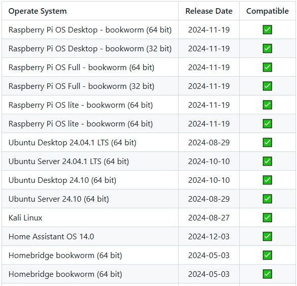
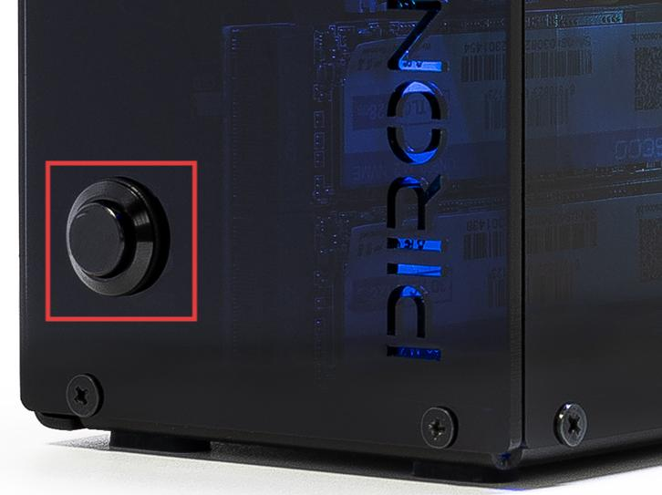

.. note::

    Ciao! Benvenuto nella community di appassionati di Raspberry Pi, Arduino ed ESP32 di SunFounder su Facebook! Approfondisci le tue competenze su Raspberry Pi, Arduino ed ESP32 insieme ad altri appassionati come te.

    **Perché unirsi?**

    - **Supporto esperto**: Risolvi problemi post-vendita e sfide tecniche con l’aiuto della nostra community e del nostro team.
    - **Impara e condividi**: Scambia consigli e tutorial per migliorare le tue competenze.
    - **Anteprime esclusive**: Accedi in anteprima ai nuovi annunci e alle anticipazioni sui prodotti.
    - **Sconti speciali**: Approfitta di sconti esclusivi sui nostri prodotti più recenti.
    - **Promozioni festive e giveaway**: Partecipa a promozioni festive e giveaway riservati.

    👉 Pronto a esplorare e creare con noi? Clicca su [|link_sf_facebook|] e unisciti subito!

FAQ
============

1. Sistemi compatibili
-------------------------------

Sistemi che hanno superato il test su Raspberry Pi 5:

2. Informazioni sul pulsante di accensione
----------------------------------------------------

Il pulsante di accensione estende il pulsante Power del Raspberry Pi 5 e funziona allo stesso modo.

* **Spegnimento**

  * Se utilizzi il sistema **Raspberry Pi OS Desktop**, premi due volte rapidamente il pulsante di accensione per spegnere.
  * Se utilizzi il sistema **Raspberry Pi OS Lite**, premi una volta il pulsante per iniziare lo spegnimento.
  * Per uno spegnimento forzato, tieni premuto il pulsante di accensione.

* **Accensione**

  * Se la scheda Raspberry Pi è spenta ma ancora alimentata, premi una volta il pulsante per riaccenderla.

* Se utilizzi un sistema che non supporta il pulsante di spegnimento, tienilo premuto per 5 secondi per eseguire uno spegnimento forzato e premi una volta per riaccendere.

3. Informazioni su Raspberry Pi AI HAT+
----------------------------------------------------------

Il Raspberry Pi AI HAT+ non è compatibile con il Pironman 5.

   .. image::  img/output3.png
        :width: 400

Il Raspberry Pi AI Kit combina il Raspberry Pi M.2 HAT+ e il modulo acceleratore AI Hailo.

   .. image::  img/output2.jpg
        :width: 400

Puoi rimuovere il modulo acceleratore AI Hailo dal Raspberry Pi AI Kit e inserirlo direttamente nel modulo NVMe PIP del Pironman 5 MAX.

   .. .. image::  img/output4.png
   ..      :width: 800

4. Informazioni sulle estremità dei tubi in rame del dissipatore Tower
------------------------------------------------------------------------------

I tubi di calore a forma di U nella parte superiore del dissipatore Tower sono schiacciati per consentire ai tubi di rame di passare attraverso le alette di alluminio. Questo fa parte del normale processo produttivo dei tubi di rame.

   .. image::  img/tower_cooler1.png

5. PI5 non si avvia (LED rosso)?
-------------------------------------------

Questo problema può essere causato da un aggiornamento del sistema, modifiche all’ordine di avvio o un bootloader danneggiato. Puoi provare i seguenti passaggi per risolvere il problema:

#. Controlla la connessione dell’adattatore USB-HDMI

   * Verifica attentamente che l’adattatore USB-HDMI sia correttamente collegato al PI5.
   * Prova a scollegare e ricollegare l’adattatore USB-HDMI.
   * Quindi ricollega l’alimentazione e verifica se il PI5 si avvia correttamente.

#. Testa il PI5 fuori dal case

   * Se ricollegare l’adattatore non risolve il problema:
   * Rimuovi il PI5 dal case Pironman 5.
   * Alimenta il PI5 direttamente con l’alimentatore (senza il case).
   * Verifica se si avvia normalmente.

#. Ripristina il bootloader

   * Se il PI5 non si avvia ancora, il bootloader potrebbe essere corrotto. Puoi seguire questa guida: :ref:`update_bootloader_max` e scegliere se avviare da SD card o da NVMe/USB.
   * Inserisci la scheda SD preparata nel PI5, accendilo e attendi almeno 10 secondi. Una volta completato il ripristino, rimuovi e riformatta la scheda SD.
   * Poi utilizza Raspberry Pi Imager per installare l’ultima versione del Raspberry Pi OS, reinserisci la scheda e prova ad avviare nuovamente.

6. Lo schermo OLED non funziona?
------------------------------------------

.. note:: Lo schermo OLED può spegnersi automaticamente dopo un periodo di inattività per risparmiare energia. Puoi toccare leggermente il case per attivare il sensore di vibrazione e riaccendere lo schermo.

Se lo schermo OLED non mostra nulla o mostra dati errati, segui questi passaggi per la risoluzione dei problemi:

1. **Controlla la connessione dello schermo OLED**

   Assicurati che il cavo FPC dello schermo OLED sia correttamente collegato.

   .. raw:: html

       

           <video center loop autoplay muted style="max-width:90%">
               <source src="../_static/video/Oled-11.mp4" type="video/mp4">
               Il tuo browser non supporta il tag video.
           </video>
       

2. **Verifica la compatibilità del sistema operativo**

   Assicurati di utilizzare un sistema operativo compatibile sul tuo Raspberry Pi.

3. **Controlla l’indirizzo I2C**

   Esegui il seguente comando per verificare se l’indirizzo I2C (0x3C) dell’OLED viene rilevato:

   .. code-block:: shell

      sudo i2cdetect -y 1

   Se l’indirizzo non viene rilevato, abilita I2C con il comando:

   .. code-block:: shell

      sudo raspi-config

4. **Riavvia il servizio pironman5**

   Riavvia il servizio `pironman5` per verificare se il problema si risolve:

   .. code-block:: shell

      sudo systemctl restart pironman5.service

5. **Controlla il file di log**

   Se il problema persiste, controlla il file di log per eventuali messaggi di errore e invia le informazioni all’assistenza clienti per ulteriori analisi:

   .. code-block:: shell

      cat /var/log/pironman5/pm_auto.oled.log

7. Il modulo NVMe PIP non funziona?
---------------------------------------

1. Assicurati che il cavo FPC che collega il modulo NVMe PIP al Raspberry Pi 5 sia correttamente inserito.  

   .. raw:: html

       

           <video center loop autoplay muted style="max-width:90%">
               <source src="../_static/video/Nvme(1)-11.mp4" type="video/mp4">
               Il tuo browser non supporta il tag video.
           </video>
       

   .. raw:: html

       

           <video center loop autoplay muted style="max-width:90%">
               <source src="../_static/video/Nvme(2)-11.mp4" type="video/mp4">
               Il tuo browser non supporta il tag video.
           </video>
       

2. Assicurati che l’SSD sia correttamente fissato all’interno del modulo NVMe PIP.  

3. Controlla lo stato dei LED del modulo NVMe PIP:

   Dopo aver confermato tutte le connessioni, accendi il Pironman 5 MAX e osserva i due indicatori sul modulo NVMe PIP:  

   * **PWR-LED**: Deve essere acceso.  
   * **STA-LED**: Deve lampeggiare per indicare il normale funzionamento.  

   .. image:: img/dual_nvme_pip_leds.png  

   * Se il **PWR-LED** è acceso ma lo **STA-LED** non lampeggia, significa che l’SSD NVMe non è stato rilevato dal Raspberry Pi.  
   * Se il **PWR-LED** è spento, ponticella i pin “Force Enable” sul modulo. Se il **PWR-LED** si accende, potrebbe trattarsi di un cavo FPC allentato o di una configurazione di sistema non supportata per NVMe.

   .. image:: img/dual_nvme_pip_j4.png  

4. Assicurati che sull’SSD NVMe sia installato correttamente un sistema operativo. Consulta: :ref:`install_the_os_max`.

5. Se il cablaggio è corretto e il sistema operativo è installato ma l’SSD NVMe non si avvia, prova ad avviare da una scheda microSD per verificare il funzionamento delle altre componenti. Una volta confermato, prosegui con: :ref:`configure_boot_ssd_max`.

Se il problema persiste dopo questi passaggi, invia un’e-mail a service@sunfounder.com. Ti risponderemo il prima possibile.

8. I LED RGB non funzionano?
------------------------------------

#. I due pin sull’IO Expander sopra J9 vengono utilizzati per collegare i LED RGB a GPIO10. Assicurati che il jumper sia correttamente inserito su questi due pin.

   .. image:: hardware/img/io_board_rgb_pin.png
      :width: 300
      :align: center

#. Verifica che il Raspberry Pi stia eseguendo un sistema operativo compatibile. Il Pironman 5 supporta solo le seguenti versioni OS:

   .. image:: img/compitable_os.png
      :width: 600
      :align: center

   Se hai installato un sistema operativo non supportato, segui la guida per installarne uno compatibile: :ref:`install_the_os_max`.

#. Esegui il comando ``sudo raspi-config`` per aprire il menu di configurazione. Vai su **3 Interfacing Options** -> **I3 SPI** -> **YES**, quindi clicca su **OK** e **Finish** per abilitare SPI. Dopo aver abilitato SPI, riavvia il Pironman 5.

Se il problema persiste dopo questi passaggi, invia un’e-mail a service@sunfounder.com. Ti risponderemo il prima possibile.

9. La ventola della CPU non funziona?
----------------------------------------------

Se la temperatura della CPU non ha ancora raggiunto la soglia impostata, la ventola della CPU non si attiverà.

**Controllo della velocità della ventola in base alla temperatura**

La ventola PWM funziona in modo dinamico e regola la velocità in base alla temperatura del Raspberry Pi 5:

* **Sotto i 50°C**: la ventola resta spenta (0%).  
* **A 50°C**: la ventola gira a bassa velocità (30%).  
* **A 60°C**: la ventola passa a velocità media (50%).  
* **A 67,5°C**: la ventola passa ad alta velocità (70%).  
* **A 75°C e oltre**: la ventola gira alla massima velocità (100%).  

Per ulteriori dettagli consulta: :ref:`fan_max`

10. Come riattivare lo schermo OLED?
---------------------------------------------------------------------------------

Per risparmiare energia e prolungare la durata dello schermo, lo schermo OLED si spegne automaticamente dopo un periodo di inattività. Questo comportamento è parte del design normale e non influisce sulla funzionalità del prodotto.

Puoi toccare leggermente il case per attivare il sensore di vibrazione e riaccendere lo schermo.

.. note::

   Per la configurazione dello schermo OLED (ad esempio accensione/spegnimento, tempo di sospensione, rotazione, ecc.), consulta: :ref:`max_view_control_dashboard` oppure :ref:`max_view_control_commands`.

11. Come disabilitare la dashboard web?
------------------------------------------------------

Una volta completata l’installazione del modulo ``pironman5``, potrai accedere alla :ref:`max_view_control_dashboard`.
      
Se non hai bisogno di questa funzione e vuoi ridurre l’utilizzo di CPU e RAM, puoi disabilitare la dashboard durante l’installazione di ``pironman5`` aggiungendo il flag ``--disable-dashboard``.
      
.. code-block:: shell
      
   cd ~/pironman5
   sudo python3 install.py --disable-dashboard
      
Se hai già installato ``pironman5``, puoi rimuovere il modulo ``dashboard`` e ``influxdb``, quindi riavviare pironman5 per applicare le modifiche:
      
.. code-block:: shell
      
   /opt/pironman5/venv/bin/pip3 uninstall pm-dashboard influxdb
   sudo apt purge influxdb
   sudo systemctl restart pironman5

12. Come controllare i componenti con il comando ``pironman5``
----------------------------------------------------------------------

Puoi fare riferimento al seguente tutorial per controllare i componenti del Pironman 5 MAX usando il comando ``pironman5``.

* :ref:`max_view_control_commands`

13. Come modificare l’ordine di avvio del Raspberry Pi tramite comandi
-----------------------------------------------------------------------------

Se hai già effettuato l’accesso al tuo Raspberry Pi, puoi modificare l’ordine di avvio tramite comandi. Le istruzioni dettagliate sono le seguenti:

* :ref:`configure_boot_ssd_max`

14. Come modificare l’ordine di avvio con Raspberry Pi Imager
---------------------------------------------------------------

Oltre a modificare ``BOOT_ORDER`` nella configurazione EEPROM, puoi anche utilizzare **Raspberry Pi Imager** per cambiare l’ordine di avvio del tuo Raspberry Pi.

Si consiglia di utilizzare una scheda di riserva per questo passaggio.

* :ref:`update_bootloader_max`

15. Come copiare il sistema dalla scheda SD a un SSD NVMe
-------------------------------------------------------------

Se disponi di un SSD NVMe ma non hai un adattatore per collegarlo al computer, puoi prima installare il sistema sulla scheda Micro SD. Dopo che il Pironman 5 MAX si sarà avviato correttamente, potrai copiare il sistema dalla scheda Micro SD all’SSD NVMe. Le istruzioni dettagliate sono le seguenti:

* :ref:`copy_sd_to_nvme_max`

16. Come rimuovere la pellicola protettiva dalle lastre acriliche
-----------------------------------------------------------------

Nel pacco sono incluse due pannelli acrilici, entrambi coperti su entrambi i lati da una pellicola protettiva gialla/trasparente per evitare graffi. La pellicola protettiva può essere un po’ difficile da rimuovere. Usa un cacciavite per grattare delicatamente negli angoli, quindi rimuovi con attenzione l’intera pellicola.

.. image:: img/peel_off_film.jpg
    :width: 500
    :align: center

.. _max_openssh_powershell:

17. Come installare OpenSSH tramite Powershell
--------------------------------------------------

Quando usi ``ssh <username>@<hostname>.local`` (o ``ssh <username>@<IP address>``) per connetterti al tuo Raspberry Pi, ma appare il seguente messaggio di errore:

    .. code-block::

        ssh: The term 'ssh' is not recognized as the name of a cmdlet, function, script file, or operable program. Check the
        spelling of the name, or if a path was included, verify that the path is correct and try again.

Significa che il sistema del tuo computer è troppo vecchio e non ha `OpenSSH <https://learn.microsoft.com/en-us/windows-server/administration/openssh/openssh_install_firstuse?tabs=gui>`_ preinstallato. Devi seguire il tutorial seguente per installarlo manualmente.

#. Digita ``powershell`` nella barra di ricerca del desktop Windows, fai clic con il tasto destro su ``Windows PowerShell`` e seleziona ``Esegui come amministratore`` dal menu.

   .. image:: img/powershell_ssh.png
      :width: 90%
      
#. Usa il seguente comando per installare ``OpenSSH.Client``:

   .. code-block::

        Add-WindowsCapability -Online -Name OpenSSH.Client~~~~0.0.1.0

#. Dopo l’installazione, verrà restituito il seguente output:

   .. code-block::

        Path          :
        Online        : True
        RestartNeeded : False

#. Verifica l’installazione con il seguente comando:

   .. code-block::

        Get-WindowsCapability -Online | Where-Object Name -like 'OpenSSH*'

#. Ora ti verrà mostrato che ``OpenSSH.Client`` è stato installato correttamente:

   .. code-block::

        Name  : OpenSSH.Client~~~~0.0.1.0
        State : Installed

        Name  : OpenSSH.Server~~~~0.0.1.0
        State : NotPresent

   .. warning:: 

        Se il messaggio sopra non appare, significa che il tuo sistema Windows è ancora troppo vecchio. In questo caso, ti consigliamo di installare uno strumento SSH di terze parti, come |link_putty|.

#. Ora riavvia PowerShell ed eseguilo nuovamente come amministratore. A questo punto potrai accedere al tuo Raspberry Pi utilizzando il comando ``ssh``, dove ti verrà chiesta la password impostata in precedenza.

   .. image:: img/powershell_login.png

18. Se configuro OMV, posso comunque utilizzare le funzioni di Pironman5?
--------------------------------------------------------------------------------------------------------

Sì, OpenMediaVault è configurato sul sistema Raspberry Pi. Segui i passaggi di :ref:`max_set_up_pi_os` per continuare la configurazione.

