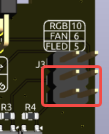

.. include:: /index.rst
   :start-after: start_hello_message
   :end-before: end_hello_message

FAQ
============

Schnelle Fehlerbehebung
-------------------------------

* OLED-Bildschirm funktioniert nicht -> :ref:`faq_oled_max`
* RGB-LEDs funktionieren nicht -> :ref:`faq_rgb_max`
* GPIO-Lufter funktionieren nicht -> :ref:`faq_gpio_fans_max`
* CPU-Lufter dreht sich nicht -> :ref:`faq_pwm_fan_max`
* Dashboard zeigt keine Daten an -> :ref:`faq_dashboard_max`
* NVMe-SSD wird nicht erkannt -> :ref:`faq_nvme_max`

1. Hardware
-----------

.. include:: ../pironman5/faq.rst
   :start-after: start_faq_com_os
   :end-before: end_faq_com_os

.. include:: ../pironman5/faq.rst
   :start-after: start_faq_power_button
   :end-before: end_faq_power_button

.. include:: ../pironman5/faq.rst
   :start-after: start_faq_airflow_direction
   :end-before: end_faq_airflow_direction

.. include:: ../pironman5/faq.rst
   :start-after: start_faq_copper_pipe_ends
   :end-before: end_faq_copper_pipe_ends

.. include:: ../pironman5/faq.rst
   :start-after: start_faq_ai_hat
   :end-before: end_faq_ai_hat

Kann ich die Vibrationsschalterfunktion des Pironman5 Max verwenden?
^^^^^^^^^^^^^^^^^^^^^^^^^^^^^^^^^^^^^^^^^^^^^^^^^^^^^^^^^^^^^^^^^^^^^^^

Ab Version v1.3.6 verwendet das OLED-Aufwecken den Netzschalter. Sie mussen die Brucke des Vibrationsschalters entfernen, um eine Belegung der GPIO-Pins des Raspberry Pi und mogliche Konflikte zu vermeiden. Bitte prufen Sie, ob diese Brucke vorhanden ist; falls nicht, ignorieren Sie bitte diesen Hinweis.

.. image:: /pironman5_max/img/remove_vib_jumper.jpg

2. Kuhlung und Lufter
---------------------

.. include:: ../pironman5/faq.rst
   :start-after: start_faq_pwm_fan
   :end-before: end_faq_pwm_fan

.. include:: ../pironman5/faq.rst
   :start-after: start_faq_gpio_fans
   :end-before: end_faq_gpio_fans

3. OLED und RGB
---------------

.. _faq_oled_max:

OLED-Bildschirm funktioniert nicht?
^^^^^^^^^^^^^^^^^^^^^^^^^^^^^^^^^^^^^

Wenn der OLED-Bildschirm nichts anzeigt oder falsch anzeigt, folgen Sie diesen Schritten zur Fehlerbehebung:

#. **Uberprufen Sie die Verbindung des OLED-Bildschirms**

   Stellen Sie sicher, dass das FPC-Kabel des OLED-Bildschirms richtig angeschlossen ist.

   .. raw:: html

       

           <video center loop autoplay muted style="max-width:90%">
               <source src="../_static/video/Oled-11.mp4" type="video/mp4">
               Ihr Browser unterstutzt das Video-Tag nicht.
           </video>
       

#. **Uberprufen Sie die OS-Kompatibilitat**

   Stellen Sie sicher, dass Sie ein kompatibles Betriebssystem auf Ihrem Raspberry Pi verwenden.

#. **Uberprufen Sie die I2C-Adresse**

   Fuhren Sie den folgenden Befehl aus, um zu prufen, ob die I2C-Adresse (0x3C) des OLED erkannt wird:

   .. code-block:: shell

      sudo i2cdetect -y 1

   Wenn die Adresse nicht erkannt wird, aktivieren Sie I2C mit folgendem Befehl:

   .. code-block:: shell

      sudo raspi-config

#. **Starten Sie den pironman5-Dienst neu**

   Starten Sie den ``pironman5``-Dienst neu, um zu sehen, ob das Problem behoben ist:

   .. code-block:: shell

      sudo systemctl restart pironman5.service

#. **Uberprufen Sie die Protokolldatei**

   Wenn das Problem weiterhin besteht, uberprufen Sie die Protokolldatei auf Fehlermeldungen:

   .. code-block:: shell

      cat /var/log/pironman5/pm_auto.oled.log

.. _faq_rgb_max:

RGB-LEDs funktionieren nicht?
^^^^^^^^^^^^^^^^^^^^^^^^^^^^^^^

#. Die beiden Pins am IO-Expander oberhalb von J9 werden verwendet, um die RGB-LEDs mit GPIO10 zu verbinden. Stellen Sie sicher, dass die Jumperkappe korrekt auf diesen beiden Pins sitzt.

   .. image:: hardware/img/io_board_rgb_pin.png
      :width: 300
      :align: center

#. Uberprufen Sie, ob der Raspberry Pi ein kompatibles Betriebssystem ausfuhrt.

#. Fuhren Sie den Befehl ``sudo raspi-config`` aus, um das Konfigurationsmenu zu offnen. Navigieren Sie zu **3 Interfacing Options** -> **I3 SPI** -> **YES**, klicken Sie dann auf **OK** und **Finish**, um SPI zu aktivieren. Starten Sie nach dem Aktivieren von SPI den Pironman 5 neu.

Wenn das Problem weiterhin besteht, senden Sie uns bitte die folgende Protokolldatei:

   .. code-block:: shell

      cat /var/log/pironman5/pironman5.log

.. _faq_pwm_fan_max:

CPU-Lufter funktioniert nicht?
------------------------------

Wenn die CPU-Temperatur die eingestellte Schwelle nicht erreicht hat, funktioniert der CPU-Lufter nicht.

**Lufterdrehzahlsteuerung basierend auf Temperatur**

Der PWM-Lufter arbeitet dynamisch und passt seine Drehzahl entsprechend der Temperatur des Raspberry Pi 5 an:

* **Unter 50 °C**: Lufter bleibt aus (0 % Drehzahl).
* **Bei 50 °C**: Lufter lauft mit niedriger Geschwindigkeit (30 %).
* **Bei 60 °C**: Lufter erhoht auf mittlere Geschwindigkeit (50 %).
* **Bei 67,5 °C**: Lufter erhoht auf hohe Geschwindigkeit (70 %).
* **Bei 75 °C und hoher**: Lufter lauft mit voller Geschwindigkeit (100 %).

Weitere Details finden Sie unter: :ref:`fan_max`

Sie konnen den CPU-Lufter mit den folgenden Befehlen manuell steuern:

.. code-block:: shell

   pinctrl FAN_PWM op dl   # Lufter einschalten (low active)
   pinctrl FAN_PWM op dh   # Lufter ausschalten (high active)
   pinctrl FAN_PWM a0      # Auto mode

Sie konnen die CPU-Lufter-Temperaturschwellen auch durch Bearbeiten der folgenden Datei anpassen:

.. code-block:: shell

   nano /boot/firmware/config.txt

Fugen Sie hinzu:

.. code-block:: text

   dtparam=cooling_fan=on
   dtparam=fan_temp0=40000
   dtparam=fan_temp0_hyst=10000
   dtparam=fan_temp0_speed=125

Diese Konfiguration startet den CPU-Lufter bei 40 °C mit PWM-Drehzahlstufe 125.

Starten Sie nach dem Speichern der Datei den Raspberry Pi neu, damit die Anderungen wirksam werden.

.. _faq_gpio_fans_max:

GPIO-Lufter funktionieren nicht?
--------------------------------

Uberprufen Sie zunachst, ob die FAN-Jumperkappe auf dem IO-Erweiterungsboard korrekt installiert ist.

Stellen Sie dann die GPIO-Lufter auf den Modus ``Always On`` und prufen Sie, ob die Lufter zu laufen beginnen.

.. code-block:: shell

   sudo pironman5 -gm 0

Sie konnen die GPIO-Lufter auch direkt an die ``5V``- und ``GND``-Pins des Raspberry Pi anschlieen, um sie zu testen.

Wenn die Lufter bei direktem Anschluss normal laufen, liegt das Problem moglicherweise am IO-Erweiterungsboard. Bitte kontaktieren Sie uns fur weitere Unterstutzung.

Wenn das Problem weiterhin besteht, offnen Sie die **Log**-Seite des Dashboards und prufen Sie auf Fehlermeldungen. Sie konnen uns auch die folgende Protokolldatei senden:

.. code-block:: shell

   cat /var/log/pironman5/pironman5.log

.. _faq_dashboard_max:

Dashboard zeigt keine Daten an
^^^^^^^^^^^^^^^^^^^^^^^^^^^^^^^^

Wenn das Dashboard keine Daten anzeigt, offnen Sie zunachst die **Log**-Seite des Dashboards und prufen Sie, ob Fehlermeldungen im Zusammenhang mit ``influxdb`` angezeigt werden.

Haufige Fehler sind:

* ``database not found``
* ``failed to connect to influxdb``
* ``connection refused``
* ``timeout``

Sie konnen die folgenden Schritte zur Behebung des Problems versuchen.

#. Leeren Sie den Browser-Cache oder offnen Sie die Dashboard-Seite im **Inkognito-/Privatmodus**.

#. Uberprufen Sie, ob die folgenden Dienste ordnungsgemas ausgefuhrt werden:

   .. code-block:: shell

      sudo systemctl status pironman5 --no-pager
      sudo systemctl status influxdb --no-pager

   Beide Dienste sollten Folgendes anzeigen:

   .. code-block:: text

      active (running)

#. Wenn einer der Dienste nicht ordnungsgemas lauft, starten Sie ihn neu:

   .. code-block:: shell

      sudo systemctl restart influxdb
      sudo systemctl restart pironman5

   Warten Sie dann etwa 30 Sekunden und aktualisieren Sie die Dashboard-Seite.

#. Uberprufen Sie, ob die Datenbank ``pironman5`` existiert:

   .. code-block:: shell

      influx

   Fuhren Sie dann Folgendes aus:

   .. code-block:: text

      SHOW DATABASES;

   Sie sollten Folgendes sehen:

   .. code-block:: text

      pironman5
      _internal

#. Wenn die Datenbank fehlt oder beschaftigt ist, konnen Sie versuchen, die historischen Daten uber das Dashboard zu loschen:

   ``Settings -> Clear All Data``

#. Wenn das Problem nach allen oben genannten Schritten weiterhin besteht, empfehlen wir eine Neuinstallation des Raspberry Pi OS und der Pironman-5-Software.

.. _faq_nvme_max:

NVMe PIP-Modul funktioniert nicht?
^^^^^^^^^^^^^^^^^^^^^^^^^^^^^^^^^^^^

#. Stellen Sie sicher, dass das FPC-Kabel, das das NVMe PIP-Modul mit dem Raspberry Pi 5 verbindet, korrekt angeschlossen ist.

   .. raw:: html

       

           <video center loop autoplay muted style="max-width:90%">
               <source src="../_static/video/Nvme(1)-11.mp4" type="video/mp4">
               Ihr Browser unterstutzt das Video-Tag nicht.
           </video>
       

   .. raw:: html

       

           <video center loop autoplay muted style="max-width:90%">
               <source src="../_static/video/Nvme(2)-11.mp4" type="video/mp4">
               Ihr Browser unterstutzt das Video-Tag nicht.
           </video>
       

#. Bestatigen Sie, dass Ihre SSD korrekt im NVMe PIP-Modul befestigt ist.

#. Uberprufen Sie den Status der LEDs des NVMe PIP-Moduls:

   * **PWR-LED**: Sollte leuchten.
   * **STA-LED**: Sollte blinken, um den normalen Betrieb anzuzeigen.

   .. image:: img/dual_nvme_pip_leds.png

   * Wenn die **PWR-LED** leuchtet, die **STA-LED** jedoch nicht blinkt, wird die NVMe-SSD nicht erkannt.
   * Wenn die **PWR-LED** aus ist, uberbrucken Sie die ``Force Enable``-Pins am Modul.

     .. image:: img/dual_nvme_pip_j4.png

#. Stellen Sie sicher, dass auf Ihrer NVMe SSD ein korrekt installiertes Betriebssystem vorhanden ist. Siehe: :ref:`install_the_os_max`.

#. Wenn die SSD immer noch nicht bootet, versuchen Sie zunachst, von einer Micro-SD-Karte zu booten, und konfigurieren Sie dann den NVMe-Start:

   * :ref:`configure_boot_ssd_max`

#. Wenn das Problem weiterhin besteht, senden Sie uns bitte die folgende Protokolldatei:

   .. code-block:: shell

      cat /var/log/pironman5/pironman5.log

PI5 startet nicht (rote LED)?
-----------------------------

Dieses Problem kann durch ein Systemupdate, Anderungen der Boot-Reihenfolge oder einen beschaftigten Bootloader verursacht werden. Sie konnen die folgenden Schritte zur Behebung des Problems versuchen:

#. USB-HDMI-Adapter-Verbindung prufen

   * Bitte prufen Sie sorgfaltig, ob der USB-HDMI-Adapter korrekt mit dem PI5 verbunden ist.
   * Versuchen Sie, den USB-HDMI-Adapter zu entfernen und wieder anzuschlieen.
   * Schlieen Sie dann die Stromversorgung wieder an und prufen Sie, ob der PI5 erfolgreich startet.

#. PI5 auerhalb des Gehauses testen

   * Wenn das erneute Anschlieen des Adapters das Problem nicht lost:
   * Entfernen Sie den PI5 aus dem Pironman-5-Gehause.
   * Versorgen Sie den PI5 direkt mit dem Netzteil (ohne Gehause).
   * Prufen Sie, ob er normal starten kann.

#. Bootloader wiederherstellen

   * Wenn der PI5 immer noch nicht startet, ist moglicherweise der Bootloader beschaftigt. Sie konnen dieser Anleitung folgen: :ref:`update_bootloader_max` und wahlen, ob von SD-Karte oder NVMe/USB gebootet werden soll.
   * Legen Sie die vorbereitete SD-Karte in den PI5 ein, schalten Sie ihn ein und warten Sie mindestens 10 Sekunden. Sobald die Wiederherstellung abgeschlossen ist, entfernen und formatieren Sie die SD-Karte erneut.
   * Verwenden Sie dann Raspberry Pi Imager, um das neueste Raspberry Pi OS zu flashen und versuchen Sie erneut zu starten.

Wie weckt man den OLED-Bildschirm auf?
--------------------------------------

Um Strom zu sparen und die Lebensdauer des Bildschirms zu verlangern, schaltet sich der OLED-Bildschirm nach einer gewissen Inaktivitat automatisch ab. Dies ist Teil des normalen Designs und beeintrachtigt die Funktionalitat des Produkts nicht.

Sie konnen die Taste drucken und den Bildschirm aktivieren.

.. note::

   Fur die Konfiguration des OLED-Bildschirms (z. B. Ein/Aus, Schlafzeit, Drehung usw.) siehe bitte: :ref:`view_control_dashboard` oder :ref:`max_view_control_commands`.

Wie deaktiviere ich das Web-Dashboard?
^^^^^^^^^^^^^^^^^^^^^^^^^^^^^^^^^^^^^^^^

Nach Abschluss der Installation des ``pironman5``-Moduls konnen Sie auf das :ref:`view_control_dashboard` zugreifen.

Wenn Sie diese Funktion nicht benotigen und die CPU- und RAM-Auslastung reduzieren mochten, konnen Sie das Dashboard wahrend der Installation mit dem Flag ``--disable-dashboard`` deaktivieren.

.. code-block:: shell

   cd ~/pironman5
   sudo python3 install.py --disable-dashboard

Wenn Sie ``pironman5`` bereits installiert haben, konnen Sie das ``dashboard``-Modul und ``influxdb`` entfernen:

.. code-block:: shell

   /opt/pironman5/venv/bin/pip3 uninstall pm-dashboard influxdb
   sudo apt purge influxdb
   sudo systemctl restart pironman5

Wie steuert man Komponenten mit dem ``pironman5``-Befehl?
^^^^^^^^^^^^^^^^^^^^^^^^^^^^^^^^^^^^^^^^^^^^^^^^^^^^^^^^^^^^^

Sie konnen das folgende Tutorial verwenden, um die Komponenten des Pironman 5 MAX mit dem ``pironman5``-Befehl zu steuern.

* :ref:`max_view_control_commands`

Wie andere ich die Boot-Reihenfolge des Raspberry Pi mit Befehlen?
------------------------------------------------------------------

Wenn Sie bereits in Ihrem Raspberry Pi eingeloggt sind, konnen Sie die Boot-Reihenfolge mit Befehlen andern.

* :ref:`configure_boot_ssd_max`

Wie andere ich die Boot-Reihenfolge mit Raspberry Pi Imager?
------------------------------------------------------------

Zusatzlich zur Anderung des ``BOOT_ORDER`` in der EEPROM-Konfiguration konnen Sie auch den **Raspberry Pi Imager** verwenden, um die Boot-Reihenfolge zu andern.

* :ref:`update_bootloader_max`

Wie kopiere ich das System von der SD-Karte auf eine NVMe-SSD?
--------------------------------------------------------------

Wenn Sie eine NVMe-SSD haben, aber keinen Adapter, um Ihre NVMe mit Ihrem Computer zu verbinden, konnen Sie das System zunachst auf Ihrer Micro-SD-Karte installieren. Sobald der Pironman 5 MAX erfolgreich gestartet ist, konnen Sie das System von Ihrer Micro-SD-Karte auf Ihre NVMe-SSD kopieren.

* :ref:`copy_sd_to_nvme_max`

Wie entfernt man die Schutzfolie von den Acrylplatten?
------------------------------------------------------

Im Paket sind zwei Acrylplatten enthalten, die auf beiden Seiten mit einer gelben/transparenten Schutzfolie uberzogen sind, um Kratzer zu vermeiden. Die Schutzfolie kann etwas schwer zu entfernen sein. Verwenden Sie einen Schraubendreher, um vorsichtig an den Ecken zu kratzen, und ziehen Sie dann die gesamte Folie ab.

.. image:: img/peel_off_film.jpg
    :width: 500
    :align: center

Wenn ich OMV einrichte, kann ich dann trotzdem die Funktionen des Pironman5 nutzen?
^^^^^^^^^^^^^^^^^^^^^^^^^^^^^^^^^^^^^^^^^^^^^^^^^^^^^^^^^^^^^^^^^^^^^^^^^^^^^^^^^^^^^^^

Ja, OpenMediaVault wird auf dem Raspberry-Pi-System eingerichtet. Bitte folgen Sie den Schritten in :ref:`set_up_os_max`, um die Konfiguration fortzusetzen.