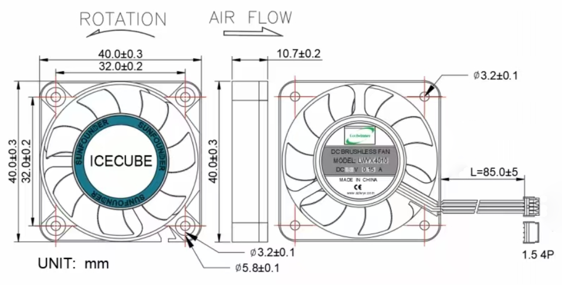

.. include:: /index.rst
   :start-after: start_hello_message
   :end-before: end_hello_message

.. _fan_max:

ファン
============

CPUファン
-----------

Pironman 5 MAX に搭載された PWM ファンは、Raspberry Pi システムによって制御されています。

Raspberry Pi 5 を高負荷で運用する際の冷却対策として、Pironman 5 MAX にはスマートな冷却システムが採用されています。メインの PWM ファンに加え、補助として2基の GPIO ファンを搭載。冷却設計は Raspberry Pi 5 の熱管理機構と密接に連携しています。

PWM ファンは Raspberry Pi 5 の温度に応じて動作します：

* 50℃未満：ファンは停止（0%）
* 50℃：低速回転開始（30%）
* 60℃：中速（50%）
* 67.5℃：高速（70%）
* 75℃以上：全速（100%）

この温度制御は下降時にも適用され、各閾値から5℃低下すると次の速度段階に切り替わります（ヒステリシス制御）。

* CPUファンの状態を確認するコマンド：

  .. code-block:: shell
  
    cat /sys/class/thermal/cooling_device0/cur_state

* CPUファンの回転数を確認するには：

  .. code-block:: shell

    cat /sys/devices/platform/cooling_fan/hwmon/*/fan1_input

Pironman 5 MAX において PWM ファンは、特に高負荷時の安定した動作を確保する上で重要な冷却コンポーネントです。Raspberry Pi 5 のパフォーマンスを最大限に引き出すための信頼性ある設計です。

GPIOファン
-------------------

* **外形寸法**：40×40×10mm  
* **重量**：13.5±5g/個  
* **寿命**：30,000時間（室温25℃基準）  
* **最大風量**：2.46CFM  
* **最大静圧**：0.62mm-H2O  
* **動作音**：22.31dBA  
* **定格入力電力**：5V/0.15A  
* **定格回転数**：3500±10%RPM  
* **動作温度範囲**：-10℃～+60℃  
* **保存温度範囲**：-20℃～+70℃

