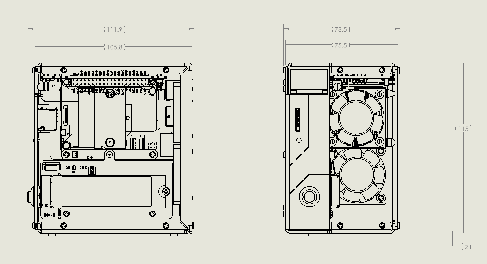

.. include:: /index.rst
   :start-after: start_hello_message
   :end-before: end_hello_message

Features
======================

**Parameters**

* Dimension: 111.9x78.5x117mm
* Material
    * Main body: aluminum alloy
    * Two side panel: acrylic
* Support Platform: Raspberry Pi 5
* Power Input: USB Type C, 5V/5A
* Interfaces
    * Raspberry Pi standard 40-Pin GPIO
    * spring-loaded Micro SD socket
    * USB Type C power input
    * 2 x USB 2.0
    * 2 x USB 3.0
    * Gigabit LAN port
    * 2 x 4Kp60 HDMI Type A
* Metal Power button
* OLED screen: 0.96'' 128x64 resolution
* 1 x CPU Fan, 2 x GPIO Fans: 40x40x10mm
* 4 x WS2812-5050 RGB LED
* 38KHz IR Receiver
* Tower Cooler
* 2 x PCIe 2.0 x1 M.2 M key 2230, 2242, 2260, 2280 for NVMe SSD or AI accelerator
* 1220 Battery for RTC

**Dimensional Drawing**

