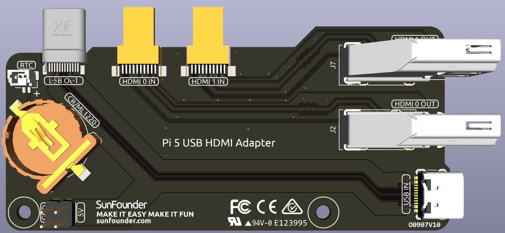

.. note:: 

    こんにちは！SunFounder の Facebook コミュニティ「Raspberry Pi & Arduino & ESP32 愛好者グループ」へようこそ！Raspberry Pi、Arduino、ESP32 の世界を、情熱を分かち合う仲間たちと共にさらに深く学びましょう。

    **参加するメリット**

    - **専門サポート**：購入後の課題や技術的な問題を、コミュニティと当社チームが協力してサポートします。
    - **学びと共有**：ヒントやチュートリアルを交換し、知識とスキルを磨き合いましょう。
    - **新製品の先行プレビュー**：発売前の新製品情報や内部プレビューをいち早くチェックできます。
    - **限定割引**：最新製品に適用される会員限定の特別割引をご利用いただけます。
    - **イベント & プレゼント企画**：季節ごとのキャンペーンやプレゼントに参加してお楽しみいただけます。

    👉 私たちと一緒に、探究と創造の旅を始めましょう！[|link_sf_facebook|] をクリックして今すぐ参加！

USB HDMIアダプター
==========================================

このUSB HDMIアダプターボードは、Raspberry Pi 5専用に設計されています。主な機能は、USBおよびHDMIの接続端子をRaspberry PiのUSB側に配置し直すことで、ケーブルの取り回しやアクセス性を向上させることです。

さらに、HDMIポートは標準のHDMI Type Aインターフェースに変換されており、より幅広いデバイスとの互換性を実現しています。

**NVMe用 追加電源供給**

このボードには、NVMe PIP用の5V電源ヘッダーが搭載されています。拡張ヘッダーと組み合わせることで、NVMe側の追加電源端子に接続し、安定した電力供給が可能になります。

**1220RTCバッテリーホルダー**

RTCバッテリーの取り付けを容易にするため、1220サイズ対応のバッテリーホルダーを備えています。SH1.0 2P リバースケーブルを使用して、Raspberry PiのRTCインターフェースに接続します。

このバッテリーホルダーは、CR1220およびML1220の両バッテリーに対応しています。ML1220（マンガン系リチウム充電池）を使用する場合は、Raspberry Pi側で充電設定を行うことが可能です。ただし、CR1220は充電非対応のため、注意が必要です。

**トリクル充電の有効化**

.. warning::

  CR1220バッテリーを使用している場合は、トリクル充電を絶対に有効化しないでください。バッテリーの破損や基板への深刻なダメージの原因となります。

トリクル充電機能はデフォルトで無効になっています。現在の充電電圧や制限値は、以下の ``sysfs`` ファイルから確認できます：

.. code-block:: shell

    pi@raspberrypi:~ $ cat /sys/devices/platform/soc/soc:rpi_rtc/rtc/rtc0/charging_voltage
    0
    pi@raspberrypi:~ $ cat /sys/devices/platform/soc/soc:rpi_rtc/rtc/rtc0/charging_voltage_max
    4400000
    pi@raspberrypi:~ $ cat /sys/devices/platform/soc/soc:rpi_rtc/rtc/rtc0/charging_voltage_min
    1300000

トリクル充電を有効にするには、 ``/boot/firmware/config.txt`` に ``rtc_bbat_vchg`` を追記します：

  * ``/boot/firmware/config.txt`` を開きます。
  
    .. code-block:: shell
    
      sudo nano /boot/firmware/config.txt
      
  * ``/boot/firmware/config.txt`` に ``rtc_bbat_vchg`` を追加します。
  
    .. code-block:: shell
    
      dtparam=rtc_bbat_vchg=3000000

再起動後、システムに以下のように表示されます：

.. code-block:: shell

    pi@raspberrypi:~ $ cat /sys/devices/platform/soc/soc:rpi_rtc/rtc/rtc0/charging_voltage
    3000000
    pi@raspberrypi:~ $ cat /sys/devices/platform/soc/soc:rpi_rtc/rtc/rtc0/charging_voltage_max
    4400000
    pi@raspberrypi:~ $ cat /sys/devices/platform/soc/soc:rpi_rtc/rtc/rtc0/charging_voltage_min
    1300000

この出力が表示されれば、バッテリーに対してトリクル充電が有効になっていることを示します。無効化するには、 ``config.txt`` から ``dtparam`` の行を削除してください。

