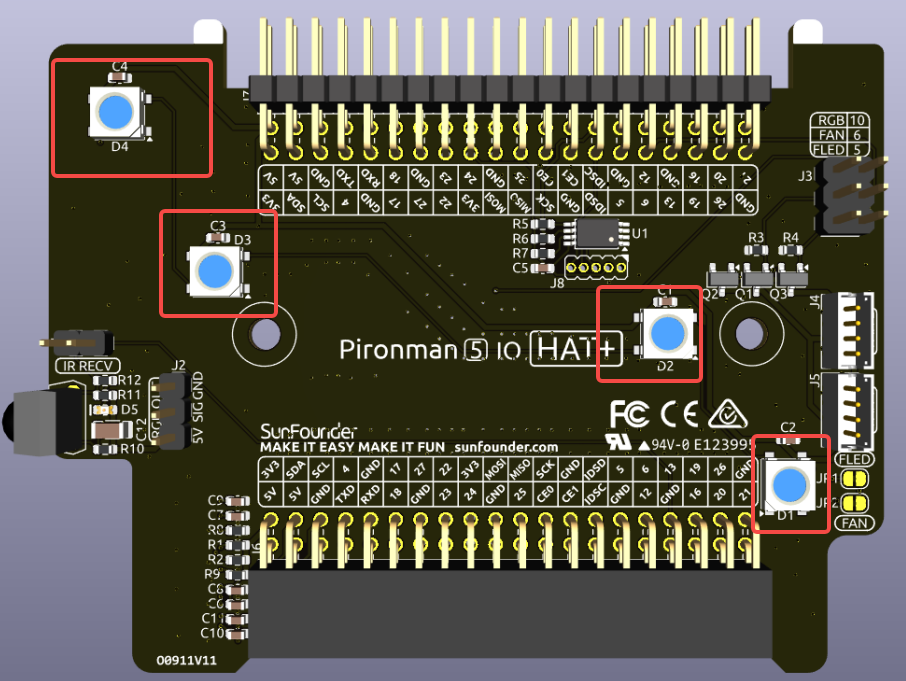
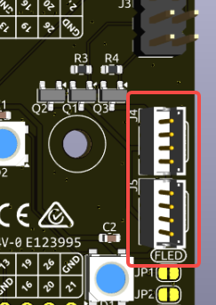
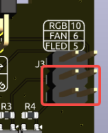
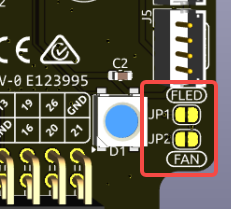

.. note:: 

    こんにちは！SunFounder の Facebook コミュニティ「Raspberry Pi & Arduino & ESP32 愛好者グループ」へようこそ！同じ情熱を持つ仲間たちと一緒に、Raspberry Pi、Arduino、ESP32 の世界をさらに深く探求しましょう。

    **参加するメリット**

    - **専門サポート**：購入後の問題や技術的課題を、コミュニティと当社チームが連携して解決します。
    - **学びと共有**：チュートリアルやヒントを通じてスキルを高め合いましょう。
    - **新製品の先行プレビュー**：開発中製品や最新情報をいち早くチェックできます。
    - **限定割引**：最新製品に適用される会員限定の特別割引をご利用いただけます。
    - **イベント＆プレゼント企画**：プレゼント抽選や季節ごとのプロモーションをお楽しみください。

    👉 私たちと一緒にものづくりを探求しましょう！[|link_sf_facebook|] をクリックして今すぐ参加！

IOエクスパンダー
===================

RGB LED
--------------

このボードには、カスタマイズ可能な4つの WS2812 RGB LED が搭載されています。LED の点灯／消灯、色変更、明るさ調整、表示モードの切り替え、変化速度の設定が可能です。

* RGB LED をオン／オフするには、 ``true`` （オン）または ``false`` （オフ）を設定します。

.. code-block:: shell

  sudo pironman5 -re true

* 任意のカラーコード（16進数）を指定して色を変更できます。例： ``fe1a1a``

.. code-block:: shell

  sudo pironman5 -rc fe1a1a

* 明るさを設定するには、0〜100の範囲で指定します（単位：%）：

.. code-block:: shell

  sudo pironman5 -rb 100

* 表示モードを以下のいずれかに変更できます： ``solid/breathing/flow/flow_reverse/rainbow/rainbow_reverse/hue_cycle``

.. note::

  表示モードに ``rainbow``、 ``rainbow_reverse``、 ``hue_cycle`` を選んだ場合、 ``pironman5 -rc`` による色設定は無効になります。

.. code-block:: shell

  sudo pironman5 -rs breathing

* 表示変化の速度を 0～100% の範囲で設定：

.. code-block:: shell

  sudo pironman5 -rp 80

RGB制御ピン
-------------------------

RGB LED は SPI 経由で制御されており、 **GPIO10** （SPI MOSI）に接続されています。ジャンパーピンはGPIO10に接続するためのもので、使用しない場合は取り外せます。

  .. image:: img/io_board_rgb_pin.png

RGB出力ピン
-------------------------

.. image:: img/io_board_rgb_out.png

WS2812 RGB LED は直列接続に対応しており、外部の RGB LED ストリップを接続可能です。 **SIG** ピンを外部LEDの **DIN** に接続してください。

デフォルトでは4つのRGB LEDが搭載されていますが、追加接続後に以下のコマンドでLED数を指定します：

.. code-block:: shell

  sudo pironman5 --rgb-led-count [quantity]

例：

.. code-block:: shell

  sudo pironman5 --rgb-led-count 12

OLEDスクリーンコネクタ
----------------------------

OLED スクリーン（I2C アドレス：0x3C）の接続部です。

.. image:: img/io_board_oled.png

表示されない、または異常がある場合は、以下の手順で確認してください：

FPC ケーブルがしっかり接続されているか確認してください。

#. ログを確認し、エラーの有無をチェック：

    .. code-block:: shell

        cat /var/log/pironman5/pm_auto.oled.log

#. OLED の I2C アドレス（0x3C）が認識されているか確認：

    .. code-block:: shell
        
        sudo i2cdetect -y 1

#. 問題が解決しない場合は、サービスを再起動してください：

    .. code-block:: shell

        sudo systemctl restart pironman5.service

OLED画面の省電力モードと振動起動
---------------------------------------------

.. image:: img/io_board_vib.png

オンボードの振動スイッチは、OLEDディスプレイをスリープモードから復帰させるために使用されます。振動を検出すると信号を送信し、OLEDを再起動します。これにより、アイドル時にはディスプレイをオフにし、動きを感知したときに自動で表示が再開されます。

振動スイッチ用にラベル付けされたジャンパーキャップを取り外すと、ウェイクアップ機能は無効になります。一度OLEDがスリープモードに入ると、再びオンにすることはできなくなります。このオプションは、対応するGPIOピンを他の用途に再利用したい上級ユーザー向けです。

.. note::

  ジャンパー装着時：振動によるウェイクアップが有効です。

  ジャンパー未装着時：OLEDが一度オフになると再起動できません。このピンは他の用途に使用可能になります。

赤外線受信モジュール
---------------------------

.. image:: img/io_board_receiver.png

* **型番**：IRM-56384（38KHz動作）
* **接続ピン**： **GPIO13**
* **D1**：受信時に点滅する赤外線インジケーター
* **J8**：赤外線機能の有効化ピン。デフォルトでジャンパーキャップが装着されており、使用しない場合は取り外すことでGPIO13が開放されます。

IR受信機能を利用するには、以下を実施してください：

* 接続確認：

  .. code-block:: shell

    sudo ls /dev |grep lirc

* ``lirc`` モジュールのインストール：

  .. code-block:: shell

    sudo apt-get install lirc -y

* リモコンボタンを押し、コードを確認：

  .. code-block:: shell

    mode2 -d /dev/lirc0

* コマンドを実行した後、リモコンのボタンを押すと、そのボタンに対応するコードが表示されます。

RGBファン接続ピン
--------------------

IO拡張ボードは最大2基の5V非PWMファンに対応し、同時制御されます。

**FAN1** および **FAN2** に、ファンの赤線を「+」、黒線を「-」に接続します。

2つの2ピンコネクタと2つのジャンパーで、ファンおよびLEDの制御が可能です。
ジャンパーが装着されている場合、GPIO6（ファン）とGPIO5（LED）で制御できます。
制御不要の場合はジャンパーを外し、GPIO5/6 を他用途に使用可能です。

ジャンパーを外すと、ファンおよびLEDはオフの状態になります。
常時オンにしたい場合は、下部の2つのパッドをハンダでショートさせてください。
システム起動時にオン、シャットダウン時にオフとなりますが、IOポートでの制御はできなくなります。

.. **D2**：ファン作動時に点灯するインジケーター

.. .. image:: img/io_board_fan_d2.png

ファン動作モードはコマンドで設定可能です。動作温度に応じて自動起動します：

例） **1: パフォーマンス** モード：50℃で起動

.. code-block:: shell

  sudo pironman5 -gm 3

* **4: 静音モード**：70℃で起動
* **3: バランスモード**：67.5℃
* **2: 冷却重視モード**：60℃
* **1: パフォーマンスモード**：50℃
* **0: 常時オン**：常に動作

ファンの制御ピンを変更した場合は、以下でピン番号を設定：

.. code-block:: shell

  sudo pironman5 -gp 18

GPIOヘッダー
--------------

.. image:: img/io_board_pin_header.png

Raspberry Pi のGPIOを拡張するL字型ピンヘッダー2列を装備。ただしIR受信機、RGB LED、ファンなどが一部のピンを使用しているため、他の用途で使用する際は該当ジャンパーキャップを取り外してください。

.. list-table:: 
  :widths: 25 25
  :header-rows: 1

  * - Pironman 5 MAX
    - Raspberry Pi 5
  * - 赤外線受信機（オプション）
    - GPIO13
  * - OLED SDA
    - SDA
  * - OLED SCL
    - SCL
  * - ファン（オプション）
    - GPIO6
  * - ファンLED（オプション）
    - GPIO5  
  * - RGB（オプション）
    - GPIO10
